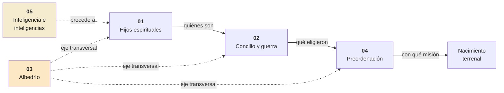

# La vida preterrenal — panorama

**Territorio:** El período desde la existencia como inteligencias hasta el nacimiento terrenal. Este dossier panorámico orienta y conecta los cinco dossiers específicos que cubren el territorio en profundidad.

---

## Estructura del territorio

La vida preterrenal se divide en cinco subtemas, cada uno con su propio dossier:

| # | Dossier | Territorio | Pregunta central |
|---|---------|------------|------------------|
| 01 | [Hijos espirituales](0001-dp01-hijos-espirituales.md) | Identidad y filiación divina | ¿Quiénes somos y de dónde venimos? |
| 02 | [El concilio y la guerra](0001-dp02-concilio-y-guerra.md) | El plan, las dos propuestas, el conflicto | ¿Qué se decidió y qué se perdió? |
| 03 | [El albedrío](0001-dp03-albedrio.md) | Principio eterno, eje del conflicto | ¿Por qué el albedrío importa tanto? |
| 04 | [La preordenación](0001-dp04-preordenacion.md) | Universal, femenina, no predestinación | ¿Qué trajimos como misión? |
| 05 | [Inteligencia e inteligencias](0001-dp05-inteligencia-e-inteligencias.md) | Singular vs. plural, atributo vs. ser | ¿Qué distingue a la «inteligencia» de las «inteligencias»? |

## Secuencia narrativa

El albedrío (03) no es secuencial sino transversal: opera en cada fase y en cada dossier.

## Formas T relacionadas

| Forma T | Dossier que la cubre |
|---------|---------------------|
| 01: Hijos espirituales | dp01 |
| 02: Concilio de los cielos | dp02 |
| 03: Cristo elegido Salvador | dp02 |
| 04: Guerra en los cielos | dp02 |
| 05: Albedrío, principio eterno | dp03 |
| 06: Preordenación | dp04 |

## Dossiers contiguos

| Dirección | Dossier | Nodo de conexión |
|-----------|---------|-----------------|
| Siguiente | *La Creación y la Caída* (pendiente) | El nacimiento terrenal (Abraham 3:25) |
| Siguiente | *La Expiación* (pendiente) | Cristo «elegido desde el principio» (Moisés 4:2) |
| Paralelo | [Inteligencia e inteligencias](0001-dp05-inteligencia-e-inteligencias.md) | DyC 93:29 vs. Abraham 3:22 |
