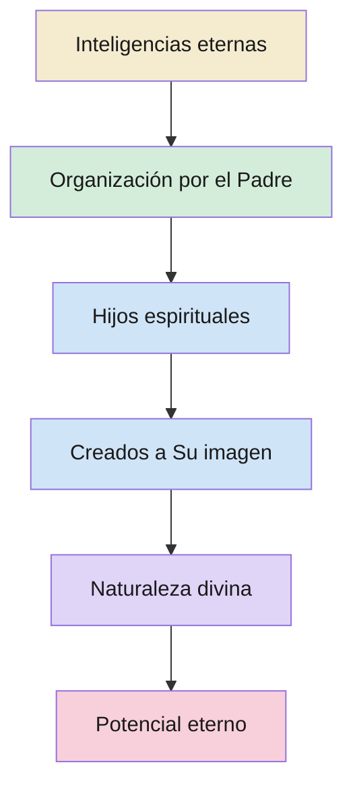

# Hijos espirituales del Padre Celestial

**Territorio:** La identidad fundamental del ser humano como hijo procreado en espíritu por padres celestiales, la creación espiritual que precede a la mortalidad, y la naturaleza divina que define nuestro origen y potencial eterno. Pregunta central: *¿Quiénes somos y de dónde venimos?*

---

## 1. Panorama

La doctrina de la filiación divina es el cimiento sobre el que descansa toda la teología de la Restauración. No se trata de una metáfora ni de un recurso retórico: la Iglesia enseña que «todos los hombres y las mujeres son literalmente hijos e hijas de Dios» y que, como tales, poseen «una naturaleza y un destino divinos» (La Familia: Una Proclamación para el Mundo, 1995). Esta relación padre-hijo determina nuestra identidad, nuestro valor intrínseco y la dirección de nuestro progreso eterno.

La respuesta a «¿quiénes somos?» se despliega en tres capas doctrinales:

1. **Identidad**: somos hijos e hijas del Padre Celestial, creados a Su imagen.
2. **Creación espiritual**: antes de la tierra, todas las cosas fueron creadas espiritualmente.
3. **Inteligencias eternas**: la esencia inteligente del hombre es coeterna con Dios, sin principio ni fin.

Cada capa amplía la anterior. La Biblia establece la paternidad divina; la Restauración la profundiza con la creación espiritual; y las revelaciones sobre la inteligencia la anclan en la eternidad. El resultado es una visión del ser humano radicalmente distinta de la teología tradicional: no somos criaturas ex nihilo, sino descendientes literales de Dios, con capacidad inherente de llegar a ser como Él.

---

## 2. Escrituras clave

### 2.1 Identidad: somos hijos de Dios

La Biblia ofrece el testimonio más antiguo de nuestra filiación divina. Pablo, predicando ante filósofos griegos en el Areópago, apela a la intuición universal de que pertenecemos a Dios:

> **Hechos 17:28-29**
> «Porque en él vivimos, y nos movemos y somos; como algunos de vuestros propios poetas también dijeron: Porque linaje suyo somos. Siendo, pues, linaje de Dios, no debemos pensar que la Divinidad sea semejante a oro, o a plata, o a piedra, escultura de arte y de imaginación de hombres.»

El argumento paulino es directo: si somos «linaje» (en griego, *genos*) de Dios, entonces Dios no puede ser inferior a nosotros: no es piedra ni metal. La lógica opera en ambas direcciones: si Él es un ser glorificado, nosotros compartimos esa naturaleza.

El mismo Pablo, escribiendo a los santos de Roma, invoca el testimonio interno del Espíritu:

> **Romanos 8:16-17**
> «Porque el Espíritu mismo da testimonio a nuestro espíritu de que somos hijos de Dios. Y si hijos, también herederos; herederos de Dios, y coherederos con Cristo, si es que padecemos juntamente con él, para que juntamente con él seamos glorificados.»

El pasaje establece tres verdades encadenadas: somos hijos, luego herederos, luego coherederos con Cristo. La filiación no es honorífica; conlleva herencia real. Pablo añade una condición: «si es que padecemos juntamente con él», vinculando la identidad divina con la prueba terrenal.

En Hebreos, el apóstol distingue explícitamente entre la paternidad terrenal y la celestial, y asigna a Dios el título de «Padre de los espíritus»:

> **Hebreos 12:9**
> «Por otra parte, tuvimos a nuestros padres terrenales que nos disciplinaban y los reverenciábamos, ¿por qué no obedeceremos mucho mejor al Padre de los espíritus, y viviremos?»

El contraste «padres terrenales» versus «Padre de los espíritus» es deliberado. El autor de Hebreos no dice «Creador de los espíritus» sino «Padre», un término que implica relación filial, no manufactura.

El Antiguo Testamento complementa este testimonio. En un salmo mesiánico, Dios mismo declara a los justos su condición:

> **Salmos 82:6**
> «Yo dije: Vosotros sois dioses, y todos vosotros hijos del Altísimo.»

Y en el libro de Job, el Señor describe la creación de la tierra con un detalle revelador: los hijos de Dios ya existían y celebraban:

> **Job 38:4, 7**
> «¿Dónde estabas tú cuando yo fundaba la tierra? [...] cuando alababan todas las estrellas del alba, y se regocijaban todos los hijos de Dios?»

Los «hijos de Dios» se regocijan al contemplar la fundación de la tierra. Esto sitúa su existencia *antes* de la creación del mundo, un dato que la teología tradicional tiende a pasar por alto pero que la Restauración toma literalmente.

### 2.2 La creación espiritual

La revelación de Moisés dada a José Smith afirma que toda creación tuvo una fase espiritual previa a la física. Este principio transforma la comprensión de la vida preterrenal:

> **Moisés 3:5**
> «Porque yo, Dios el Señor, creé espiritualmente todas las cosas de que he hablado, antes que existiesen físicamente sobre la faz de la tierra. Pues yo, Dios el Señor, no había hecho llover sobre la faz de la tierra. Y yo, Dios el Señor, había creado a todos los hijos de los hombres; y no había hombre todavía para que labrase la tierra; porque los había creado en el cielo; y aún no había carne sobre la tierra, ni en el agua, ni en el aire.»

El texto es categórico: «los había creado en el cielo». La humanidad entera tuvo una existencia espiritual anterior a la mortalidad. No se trata de un plan abstracto; los hijos de los hombres fueron «creados» como seres espirituales reales.

En el mismo libro, Moisés 3:7 amplía la idea al describir a Adán como «alma viviente» compuesta de polvo terrenal y aliento divino, pero aclara que «todas las cosas fueron creadas con anterioridad; pero fueron creadas espiritualmente y hechas conforme a mi palabra».

La visión dada al hermano de Jared confirma que el cuerpo espiritual tiene forma definida, a imagen de Dios:

> **Éter 3:15-16**
> «¿Ves que eres creado a mi propia imagen? Sí, en el principio todos los hombres fueron creados a mi propia imagen. He aquí, este cuerpo que ves ahora es el cuerpo de mi espíritu; y he creado al hombre a semejanza del cuerpo de mi espíritu; y así como me aparezco a ti en el espíritu, apareceré a mi pueblo en la carne.»

Cristo revela que el cuerpo espiritual es el modelo del cuerpo físico, no al revés. Cada ser humano, en su forma espiritual, lleva la imagen de Dios.

La gran visión de la gloria celestial registrada en Doctrina y Convenios 76 declara la relación filial como consecuencia directa de la obra de Cristo:

> **DyC 76:24**
> «Que por él, por medio de él y de él los mundos son y fueron creados, y sus habitantes son engendrados hijos e hijas para Dios.»

El verbo «engendrados» refuerza que la relación no es adoptiva ni figurativa: los habitantes de los mundos son, literalmente, hijos e hijas de Dios.

### 2.3 Inteligencias eternas

La doctrina avanza un paso más al revelar que la esencia inteligente del hombre es eterna, sin principio. Doctrina y Convenios 93 lo establece con claridad meridiana:

> **DyC 93:29-30**
> «También el hombre fue en el principio con Dios. La inteligencia, o sea, la luz de verdad, no fue creada ni hecha, ni tampoco lo puede ser. Toda verdad es independiente para obrar por sí misma en aquella esfera en que Dios la ha colocado, así como toda inteligencia; de otra manera, no hay existencia.»

Dos afirmaciones cardinales: (1) el hombre existió «en el principio con Dios» y (2) la inteligencia no fue creada ni puede serlo. La inteligencia es coeterna con Dios. El versículo 30 añade que toda inteligencia posee capacidad de obrar por sí misma, lo cual fundamenta el albedrío como atributo eterno, no concedido.

El versículo 23 del mismo capítulo personaliza esta doctrina dirigiéndose a los santos: «Vosotros también estuvisteis en el principio con el Padre; lo que es Espíritu, sí, el Espíritu de verdad.»

Abraham recibió una visión que muestra las inteligencias ya organizadas antes de la creación del mundo:

> **Abraham 3:22-23**
> «Y el Señor me había mostrado a mí, Abraham, las inteligencias que fueron organizadas antes que existiera el mundo; y entre todas estas había muchas de las nobles y grandes; y vio Dios que estas almas eran buenas, y estaba en medio de ellas, y dijo: A estos haré mis gobernantes; pues estaba entre aquellos que eran espíritus, y vio que eran buenos; y me dijo: Abraham, tú eres uno de ellos; fuiste escogido antes de nacer.»

El texto utiliza «inteligencias», «almas» y «espíritus» de forma casi intercambiable, pero con un matiz revelador: las inteligencias «fueron organizadas», no creadas de la nada. La organización implica un material preexistente al que se le da forma y propósito.

Abraham 3:18-19 establece además una gradación entre las inteligencias:

> **Abraham 3:18-19**
> «Si hay dos espíritus, y uno es más inteligente que el otro, sin embargo estos dos espíritus, a pesar de ser uno más inteligente que el otro, no tienen principio; existieron antes, no tendrán fin, existirán después, porque son gnolaum o eternos. Y el Señor me dijo: Estos dos hechos existen: Hay dos espíritus, y uno es más inteligente que el otro; habrá otro más inteligente que ellos; yo soy el Señor tu Dios, soy más inteligente que todos ellos.»

La gradación es real: hay diferencias de capacidad entre las inteligencias. Dios mismo se declara «más inteligente que todos ellos», pero el principio de eternidad se aplica a todas: «no tienen principio [...] son gnolaum o eternos».

### 2.4 Naturaleza divina y potencial eterno

El llamamiento de Jeremías revela que Dios conoce a sus hijos antes de su nacimiento mortal, lo que implica una relación personal preterrenal:

> **Jeremías 1:5**
> «Antes que te formase en el vientre, te conocí; y antes que nacieses, te santifiqué; te di por profeta a las naciones.»

El verbo «conocí» (en hebreo *yada*) denota conocimiento íntimo y relacional, no mera presciencia. Dios conocía a Jeremías como persona, no como concepto.

La visión de José F. Smith confirma que esta preordenación se extendió a muchos:

> **DyC 138:55-56**
> «Observé que también ellos se hallaban entre los nobles y grandes que fueron escogidos en el principio para ser gobernantes en la Iglesia de Dios. Aun antes de nacer, ellos, con muchos otros, recibieron sus primeras lecciones en el mundo de los espíritus, y fueron preparados para venir en el debido tiempo del Señor a obrar en su viña en bien de la salvación de las almas de los hombres.»

Los espíritus no solo existían antes de nacer: recibían instrucción. La vida preterrenal era activa, formativa y orientada a un propósito.

Romanos 8:29 añade la dimensión del potencial:

> **Romanos 8:29**
> «Porque a los que antes conoció, también predestinó para que fuesen hechos conforme a la imagen de su Hijo, a fin de que él sea el primogénito entre muchos hermanos.»

El destino de los hijos es ser «hechos conforme a la imagen de su Hijo». Cristo es el «primogénito entre muchos hermanos», no un ser de otra especie. La divinización no es anomalía sino destino previsto.

---

## 3. Voces proféticas

La Primera Presidencia de 1909 (Joseph F. Smith, John R. Winder y Anthon H. Lund) declaró en un pronunciamiento oficial que la doctrina de la filiación literal es central a la fe restaurada:

> «El hombre es hijo de Dios, formado a la imagen divina y dotado de atributos divinos, y así como el hijo infante de un padre y una madre terrenales es capaz, con el tiempo, de llegar a ser un hombre, así también el hijo no desarrollado de padres celestiales es capaz, por medio de la experiencia a través de edades y eones, de evolucionar hasta llegar a ser un Dios» (Primera Presidencia, *Messages of the First Presidency*, 4:205-206).

El presidente Joseph F. Smith enseñó que la existencia espiritual precede a la mortal de forma literal: «El hombre, como espíritu, fue engendrado por padres celestiales, nació de ellos y se crio hasta la madurez en las mansiones eternas del Padre antes de venir a la tierra en un cuerpo temporal» (*Enseñanzas de los Presidentes de la Iglesia: Joseph F. Smith*, pag. 360).

El presidente Gordon B. Hinckley, al presentar la Proclamación sobre la Familia en 1995, puso la identidad divina como punto de partida doctrinal: «Cada uno es un amado hijo o hija procreado como espíritu por padres celestiales y, como tal, cada uno tiene una naturaleza y un destino divinos» (La Familia: Una Proclamación para el Mundo).

El presidente Russell M. Nelson ha hecho de la identidad divina un eje central de su ministerio. En 2018 y 2019, recorrió el mundo con un mensaje singular:

> «Mis queridos amigos, ustedes son literalmente hijos procreados como espíritus de Dios. Ustedes han cantado esta verdad desde que aprendieron las palabras del himno "Soy un hijo de Dios". Pero ¿ha quedado esa verdad eterna grabada en sus corazones? [...] La manera en la que piensan sobre quiénes son realmente ustedes afecta a casi toda decisión que tomarán» (*Enseñanzas de los Presidentes de la Iglesia: Russell M. Nelson*, cap. 6).

El presidente Nelson también ha declarado: «Hay una partícula de divinidad en cada uno de nosotros», y ha enseñado que la primera identidad de toda persona es ser «hijo de Dios, hijo del convenio y discípulo de Jesucristo».

El presidente Nelson ha vinculado la identidad divina con el potencial de herencia eterna: «Como hijos engendrados de Padres Celestiales, estamos investidos con el potencial de llegar a ser como Ellos, de la misma forma que a los hijos terrenales les es posible llegar a ser como sus padres terrenales. [...] El plan del Padre Celestial para Sus hijos nos permite vivir donde y como Él vive y, finalmente, llegar a ser cada vez más semejantes a Él» (*Enseñanzas de los Presidentes de la Iglesia: Russell M. Nelson*, cap. 6).

El presidente Boyd K. Packer citó la Proclamación para enseñar que la identidad de genero es eterna y esta enraizada en la creación espiritual: «Todos los seres humanos, hombres y mujeres, son creados a la imagen de Dios. Cada uno es un amado hijo o hija espiritual de padres celestiales y, como tal, cada uno tiene una naturaleza y un destino divinos. El ser hombre o mujer es una característica esencial de la identidad y el propósito eternos de los seres humanos en la vida premortal, mortal y eterna» (Conferencia General, octubre 2000).

El profeta José Smith enseñó directamente sobre la eternidad del espíritu en el discurso King Follett. Utilizó su anillo como analogía:

> «Tomo el anillo de mi dedo y lo comparo con la mente del hombre, la parte inmortal, porque no tiene principio. Supongamos que lo cortamos en dos; entonces tiene un principio y un fin; pero unidlo otra vez y continua siendo un anillo eterno. Así es con el espíritu del hombre. [...] Dios nunca tuvo el poder de crear el espíritu del hombre. Dios mismo no podría crearse a sí mismo. La inteligencia es eterna y existe sobre un principio autoexistente» (José Smith, citado en B. H. Roberts, *The Mormon Doctrine of Deity*, cap. 3).

El presidente Spencer W. Kimball enseñó que el proceso de filiación divina implica organización: «Dios ha tomado estas inteligencias, les ha dado cuerpos espirituales, y les ha dado instrucciones y entrenamiento. Luego procedió a crear un mundo para ellos y los envió como espíritus a obtener un cuerpo mortal» (Conferencia General, abril 1977).

El élder Takashi Wada resumió la doctrina de forma sencilla y personal: «Dios es nuestro Padre Celestial. Somos Sus hijos procreados como espíritus y hemos sido creados a Su imagen. Por lo tanto, cada uno de nosotros, como hijos de Dios, tiene un potencial divino para llegar a ser como Él» (Conferencia General, octubre 2024).

---

## 4. Voces académicas y otros autores

**B. H. Roberts** desarrolló la teología de las inteligencias con una precisión notable en *Seventy's Course in Theology* (Segunda Parte, cap. 1). Roberts identificó cuatro estados de existencia en lugar de los tres tradicionales:

> «Las inteligencias autoexistentes, increadas y no engendradas, coeternas con Dios; segundo, inteligencias engendradas de Dios como espíritus; tercero, espíritus convertidos en hombres y mujeres, aún hijos e hijas de Dios; cuarto, seres resucitados, espíritus inmortales que habitan cuerpos imperecederos, aún hijos e hijas de Dios, y en la línea de progresión eterna, hasta la obtención de atributos y poderes divinos.»

Roberts distinguió entre «inteligencias» (entidades no corporadas) y «espíritus» (inteligencias que habitan un cuerpo espiritual). La organización del espíritu no es creación ex nihilo sino la dotación de un cuerpo espiritual a una entidad inteligente ya existente.

En *Seventy's Course in Theology* (Cuarta Parte, cap. 1 y 4), Roberts profundizó en las propiedades de las inteligencias: autoconciencia, capacidad de discriminar entre el bien y el mal, voluntad o libertad, poder de generalización y razonamiento. Atribuir a una entidad «inteligencia» sin estas propiedades sería, en sus palabras, «un solecismo».

**James E. Talmage**, en *Articles of Faith* (cap. 2), argumentó desde la lógica de la existencia eterna:

> «La existencia eterna de algo es un hecho fuera de toda disputa; y la pregunta que requiere respuesta es: ¿qué es ese algo eterno? [...] La inteligencia es de carácter eterno, coeva con la existencia misma. La naturaleza por sí sola es una declaración de un Ser superior, cuya voluntad y propósito ella retrata en todos sus variados aspectos.»

Talmage estableció que la materia no es vital ni activa por sí misma, y que la fuerza no es inteligente; sin embargo, la vitalidad y la inteligencia son universalmente presentes en la creación, lo cual exige un Director inteligente y eterno.

**John Taylor**, en *The Government of God* (citado en Roberts), enseñó que los espíritus celebraron la creación de la tierra, retomando la imagen de Job 38:7. La vida preterrenal no era pasiva sino una existencia activa donde los hijos de Dios participaban, aprendían y se preparaban.

La Primera Presidencia de 1909 utilizó un lenguaje deliberadamente evolutivo pero teológico al describir al hijo no desarrollado de padres celestiales como «capaz, por medio de la experiencia a través de edades y eones, de evolucionar hasta llegar a ser un Dios». No se trata de evolución biológica sino de un proceso de crecimiento y desarrollo espiritual que abarca la eternidad.

El élder D. Todd Christofferson sintetizó la enseñanza académica y profética: «Los profetas han revelado que primero existimos como inteligencias y que Dios nos dio forma, o cuerpos espirituales, convirtiéndonos así en Sus hijos espirituales: hijos e hijas de padres celestiales» (citado en materiales de estudio de Abraham 3).

---

## 5. Diagrama

---

## 6. Conexiones

| Dossier / Producto | Relación con dp01 |
|---|---|
| **dp00** — Vida preterrenal (panorama) | dp01 es la primera subdivisión del panorama preterrenal |
| **dp02** — El concilio de los cielos | Las inteligencias organizadas (dp01) participan en el concilio (dp02) |
| **dp03** — Albedrío preterrenal | La capacidad de obrar por sí misma (DyC 93:30) fundamenta el albedrío |
| **dp04** — Preordenación | Los «nobles y grandes» (Abraham 3:22) son preordenados tras ser organizados |
| **Forma T** — 0001-plan-salvacion-01 | Versión didáctica condensada de este dossier |
| *Futuro:* **Inteligencia e inteligencias** | Dossier monográfico sobre la distinción singular/plural y las gradaciones |
| *Futuro:* **Naturaleza de Dios** | La paternidad literal de Dios depende de Su corporalidad glorificada |
| *Futuro:* **Madre Celestial** | La Proclamación menciona «padres celestiales»; la creación espiritual involucra a ambos |

---

## 7. Lagunas y preguntas abiertas

1. **Inteligencia (singular) vs. inteligencias (plural).** DyC 93:29 habla de «la inteligencia» como sustancia o principio; Abraham 3:22 habla de «inteligencias» como entidades individuales. ¿Son el mismo concepto en diferentes fases, o categorías distintas? Candidato a dossier independiente.

2. **Mecanismo de la creación espiritual.** ¿Fueron los espíritus «organizados» (a partir de inteligencia preexistente) o «engendrados» (nacidos de padres celestiales)? El lenguaje escriturario usa ambos términos. La Primera Presidencia de 1909 usó «engendrado»; DyC 93 y Abraham 3 usan «organizado». La tensión no está resuelta doctrinalmente.

3. **Papel de la Madre Celestial en la creación espiritual.** La Proclamación afirma que somos «hijos procreados como espíritus por padres celestiales» (plural). El ensayo del Evangelio sobre la Madre Celestial confirma Su existencia y participación, pero «poco se ha revelado» más allá de esto.

4. **Gradación de inteligencias vs. igualdad de oportunidades.** Abraham 3:18-19 establece que las inteligencias difieren en grado. ¿Cómo se reconcilia esto con la universalidad de la oferta de exaltación? ¿Es la gradación de capacidad o de desarrollo? B. H. Roberts distinguió entre diferencias de «inteligencia, nobleza, grandeza y calidad moral».

5. **Inocencia original de los espíritus.** DyC 93:38 declara que «todos los espíritus de los hombres fueron inocentes en el principio». ¿Cómo se relaciona esta inocencia con la gradación de Abraham 3? ¿Puede haber diferencias de capacidad sin diferencias morales previas?

6. **Relación entre inteligencia y luz.** DyC 93:36 iguala la gloria de Dios con «la inteligencia, o en otras palabras, luz y verdad». ¿Es la inteligencia una forma de energía divina, una sustancia, o una propiedad emergente de la conciencia?

---

**Fuentes citadas**

- Hechos 17:28-29
- Romanos 8:16-17, 29
- Hebreos 12:9
- Salmos 82:6
- Job 38:4, 7
- Jeremías 1:5
- Moisés 3:5, 7
- Éter 3:15-16
- DyC 76:24
- DyC 93:23, 29-30, 33, 36, 38
- DyC 138:55-56
- Abraham 3:18-19, 22-23
- La Familia: Una Proclamación para el Mundo (1995)
- Primera Presidencia (Joseph F. Smith, John R. Winder, Anthon H. Lund), «The Origin of Man», *Messages of the First Presidency*, 4:205-206 (1909)
- Joseph F. Smith, *Enseñanzas de los Presidentes de la Iglesia: Joseph F. Smith*, pag. 360
- Russell M. Nelson, *Enseñanzas de los Presidentes de la Iglesia: Russell M. Nelson*, cap. 6 («La identidad divina»)
- Boyd K. Packer, «Sois templo de Dios», Conferencia General, octubre 2000
- Spencer W. Kimball, «Our Great Potential», Conferencia General, abril 1977
- Takashi Wada, «Las palabras de Cristo y el Espíritu Santo nos conducirán a la verdad», Conferencia General, octubre 2024
- José Smith, discurso King Follett (1844), citado en B. H. Roberts, *The Mormon Doctrine of Deity*, cap. 3
- B. H. Roberts, *Seventy's Course in Theology*, Segunda Parte, cap. 1; Cuarta Parte, caps. 1 y 4
- James E. Talmage, *Articles of Faith*, cap. 2
- «Madre Celestial», Ensayo sobre Temas del Evangelio, La Iglesia de Jesucristo de los Santos de los Últimos Días
- «Hijos procreados como espíritus por padres celestiales», Temas del Evangelio, La Iglesia de Jesucristo de los Santos de los Últimos Días
- «Padres celestiales», Temas del Evangelio, La Iglesia de Jesucristo de los Santos de los Últimos Días
