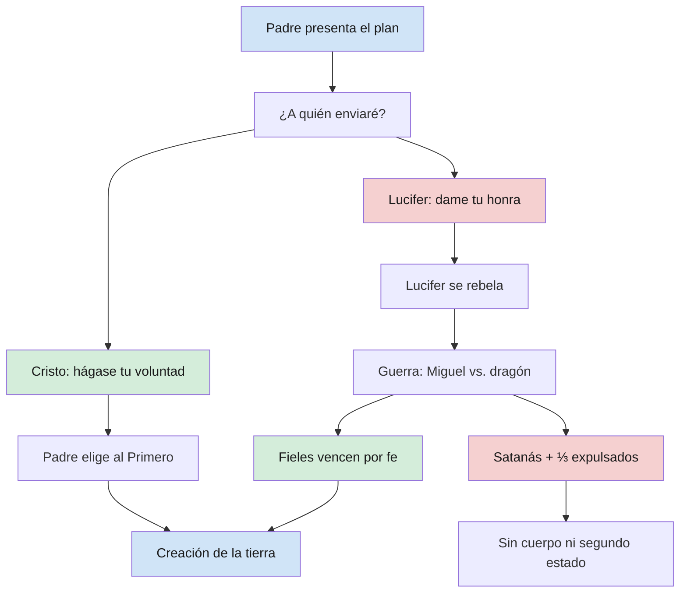
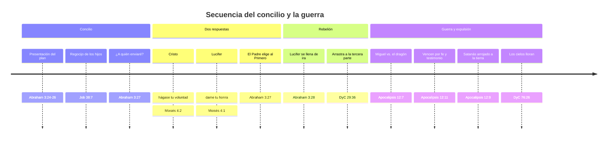

# El concilio en los cielos y la guerra

**Territorio:** El concilio preterrenal donde el Padre presentó Su plan, las dos respuestas al llamado de un Salvador, la rebelión de Lucifer, la guerra en los cielos y la expulsión de la tercera parte de las huestes. No abarca la identidad y filiación de los espíritus (dp01), el albedrío como principio abstracto (dp03) ni la preordenación de los fieles (dp04).

**Pregunta central:** *¿Qué se decidió en el concilio y qué se perdió en la guerra?*

---

## 1. Panorama

Antes de que existiera la tierra, los hijos espirituales de Dios se reunieron en un gran concilio. El Padre presentó un plan que requeriría una experiencia mortal: un mundo donde Sus hijos recibirían cuerpos, serían probados y podrían progresar eternamente. Ese plan exigía un Redentor que pagara el precio del pecado y la muerte. Dos respondieron al llamado. El Primogénito ofreció ejecutar la voluntad del Padre y devolver toda la gloria a Dios. Lucifer propuso garantizar la salvación de todos, pero a cambio de la honra del Padre y a costa de destruir el albedrío del hombre. El Padre eligió al primero. Lucifer se rebeló, arrastrando consigo a una tercera parte de las huestes del cielo. Hubo guerra, y los rebeldes fueron expulsados. Los que permanecieron fieles obtuvieron el derecho de nacer en la tierra: su «segundo estado».

El concilio no fue un mero debate parlamentario. Fue el momento en que se definieron las condiciones de la existencia mortal, se reveló la necesidad de una Expiación y se trazó la linea divisoria entre quienes aceptaron vivir por fe y quienes exigieron certezas a costa de la libertad.

---

## 2. Escrituras clave

### 2.1 El plan presentado

La visión de Abraham registra el momento en que «uno que era semejante a Dios» propuso la creación de la tierra y las condiciones de la prueba mortal.

> «Y estaba entre ellos uno que era semejante a Dios, y dijo a los que se hallaban con él: Descenderemos, pues hay espacio allá, y tomaremos de estos materiales y haremos una tierra sobre la cual estos puedan morar; y con esto los probaremos, para ver si harán todas las cosas que el Señor su Dios les mandare; y a los que guarden su primer estado les será añadido; y aquellos que no guarden su primer estado no tendrán gloria en el mismo reino con los que guarden su primer estado; y a quienes guarden su segundo estado, les será aumentada gloria sobre su cabeza para siempre jamás.» (Abraham 3:24-26)

El texto establece dos estados con consecuencias distintas: el primero, preterrenal; el segundo, mortal. Guardar cada estado es condicion de progreso. El «primer estado» que Lucifer y los suyos no guardaron los excluyó de la mortalidad. El «segundo estado» es la vida terrenal donde se juega la exaltación.

En el libro de Job, Dios pregunta retoricamente al patriarca donde se hallaba cuando la creacion tuvo lugar, y deja entrever el jubilo de los espiritus preexistentes.

> «¿Dónde estabas tú cuando yo fundaba la tierra? Házmelo saber, si tienes entendimiento. [...] cuando alababan todas las estrellas del alba, y se regocijaban todos los hijos de Dios?» (Job 38:4, 7)

El regocijo colectivo presupone conocimiento y consentimiento. Los hijos de Dios no fueron espectadores pasivos: celebraron porque entendieron lo que se les ofrecía.

Alma explica a Coriantón que la caída de Adán formaba parte del diseño, no fue un accidente que el plan debiera corregir.

> «Porque he aquí, si Adán hubiese extendido su mano inmediatamente, y comido del árbol de la vida, habría vivido para siempre, según la palabra de Dios, sin tener un tiempo para arrepentirse; sí, y también habría sido vana la palabra de Dios, y se habría frustrado el gran plan de salvación.» (Alma 42:5)

> «Mas he aquí, no era prudente que el hombre fuese rescatado de esta muerte temporal, porque esto habría destruido el gran plan de felicidad.» (Alma 42:8)

Aarón enseñó al padre de Lamoni el resumen mas compacto del plan, conectando creación, caída y redención en una sola cadena.

> «Y Aarón le explicó las Escrituras, desde la creación de Adán, exponiéndole la caída del hombre, y su estado carnal, y también el plan de redención que fue preparado desde la fundación del mundo, por medio de Cristo, para cuantos quisieran creer en su nombre.» (Alma 22:13)

### 2.2 Cristo elegido Salvador

Dos voces respondieron al llamado del Padre. Abraham registra la pregunta y las dos respuestas.

> «Y el Señor dijo: ¿A quién enviaré? Y respondió uno semejante al Hijo del Hombre: Heme aquí; envíame. Y otro contestó, y dijo: Heme aquí; envíame a mí. Y el Señor dijo: Enviaré al primero.» (Abraham 3:27)

La revelación a Moisés amplía el contraste entre las dos propuestas, poniendo en boca de cada uno las palabras que revelan su intención real.

> «Pero, he aquí, mi Hijo Amado, que fue mi Amado y mi Escogido desde el principio, me dijo: Padre, hágase tu voluntad, y sea tuya la gloria para siempre.» (Moisés 4:2)

La respuesta de Cristo es un acto de subordinación perfecta: acepta el sufrimiento, renuncia a la gloria propia y honra el albedrío del Padre y de los hombres. No ofrece modificar el plan, sino ejecutarlo.

Pedro testifica que la designación de Cristo como Redentor no fue una decisión reactiva, sino anterior a la creación.

> «Sino con la sangre preciosa de Cristo, como de un cordero sin mancha y sin contaminación, ya ordenado desde antes de la fundación del mundo, pero manifestado en los postreros tiempos por amor a vosotros.» (1 Pedro 1:19-20)

El propio Jesucristo confirma esta preordenación al hermano de Jared, siglos antes de Su nacimiento mortal.

> «He aquí, yo soy el que fue preparado desde la fundación del mundo para redimir a mi pueblo. He aquí, soy Jesucristo. Soy el Padre y el Hijo. En mí todo el género humano tendrá vida, y la tendrá eternamente, sí, aun cuantos crean en mi nombre.» (Éter 3:14)

Juan registra las propias palabras del Salvador durante Su ministerio terrenal, confirmando que Su venida fue un acto de obediencia al Padre, no una iniciativa autónoma.

> «Porque he descendido del cielo, no para hacer mi voluntad, sino la voluntad del que me envió.» (Juan 6:38)

Y en Su oración intercesora, Jesús alude a la gloria compartida con el Padre antes de la existencia del mundo, evidencia de Su estatus preterrenal.

> «Ahora pues, Padre, glorifícame tú en tu presencia con aquella gloria que tuve contigo antes que el mundo fuese.» (Juan 17:5)

> «Padre, aquellos que me has dado, quiero que donde yo estoy, también ellos estén conmigo, para que vean mi gloria que me has dado, por cuanto me has amado desde antes de la fundación del mundo.» (Juan 17:24)

### 2.3 La propuesta de Lucifer

La propuesta de Lucifer no fue simplemente un plan alternativo: fue una usurpación. Moisés registra tres elementos: la destrucción del albedrío, la exigencia de la honra del Padre y la pretensión de garantía total.

> «Y yo, Dios el Señor, le hablé a Moisés, diciendo: Ese Satanás, a quien tú has mandado en el nombre de mi Unigénito, es el mismo que existió desde el principio; y vino ante mí, diciendo: Heme aquí, envíame a mí. Seré tu hijo y redimiré a todo el género humano, de modo que no se perderá ni una sola alma, y de seguro lo haré; dame, pues, tu honra.» (Moisés 4:1)

> «Pues, por motivo de que Satanás se rebeló contra mí, y pretendió destruir el albedrío del hombre que yo, Dios el Señor, le había dado, y que también le diera mi propio poder, hice que fuese echado abajo por el poder de mi Unigénito.» (Moisés 4:3)

Isaías, en un pasaje que los profetas de la Restauración han identificado consistentemente con Lucifer, registra las cinco declaraciones de soberbia ascendente.

> «¡Cómo caíste del cielo, oh Lucifer, hijo de la mañana! Derribado fuiste a tierra, tú que debilitabas a las naciones. Tú que decías en tu corazón: Subiré al cielo. Levantaré mi trono por encima de las estrellas de Dios y me sentaré sobre el monte de la congregación, hacia los lados del norte; sobre las alturas de las nubes subiré; seré semejante al Altísimo. Pero tú has sido derribado hasta el Seol, a los lados del abismo.» (Isaías 14:12-15)

La progresión es notable: «subiré», «levantaré mi trono», «me sentaré», «subiré» de nuevo, «seré semejante al Altísimo». Cada paso es una apropiación mayor, hasta reclamar igualdad con Dios. El contraste con Cristo es total: donde Cristo dice «hágase tu voluntad», Lucifer dice «subiré».

### 2.4 La guerra y la expulsión

La guerra en los cielos no fue metafórica. Apocalipsis la describe como una batalla real entre ejércitos espirituales.

> «Y hubo una gran batalla en el cielo: Miguel y sus ángeles luchaban contra el dragón; y luchaban el dragón y sus ángeles, pero no prevalecieron, ni fue hallado más su lugar en el cielo. Y fue lanzado fuera aquel gran dragón, la serpiente antigua, que se llama Diablo y Satanás, quien engaña a todo el mundo; fue arrojado a la tierra, y sus ángeles fueron arrojados con él.» (Apocalipsis 12:7-9)

La proporción de la derrota fue devastadora. Un tercio de los hijos de Dios perdió toda oportunidad de progreso.

> «Y su cola arrastraba la tercera parte de las estrellas del cielo, y las arrojó sobre la tierra.» (Apocalipsis 12:4)

Pero Apocalipsis tambien revela el mecanismo de la victoria: no fue fuerza bruta, sino testimonio y disposición al sacrificio.

> «Y ellos le han vencido por medio de la sangre del Cordero y de la palabra de su testimonio, y no amaron sus vidas, ni aun hasta sufrir la muerte.» (Apocalipsis 12:11)

La revelación moderna amplía el relato, confirmando que la rebelión fue un acto de albedrío, no de ignorancia.

> «Y aconteció que Adán, habiendo sido tentado por el diablo, pues, he aquí, este existió antes que Adán, porque se rebeló contra mí, diciendo: Dame tu honra, la cual es mi poder; y también alejó de mí a la tercera parte de las huestes del cielo, a causa de su albedrío; y fueron arrojados abajo, y así llegaron a ser el diablo y sus ángeles.» (DyC 29:36-37)

La frase «a causa de su albedrío» es crucial: los que siguieron a Lucifer no fueron engañados involuntariamente. Eligieron. Su caída fue consecuencia de su libertad, no de su debilidad.

La visión de los grados de gloria revela el rango que Lucifer tenía antes de su caída y el duelo celestial que produjo su expulsión.

> «Y esto también vimos, de lo cual damos testimonio, que un ángel de Dios que tenía autoridad delante de Dios, el cual se rebeló en contra del Hijo Unigénito, a quien el Padre amaba y el cual estaba en el seno del Padre, fue arrojado de la presencia de Dios y del Hijo, y fue llamado Perdición, porque los cielos lloraron por él; y era Lucifer, un hijo de la mañana. Y vimos; y he aquí, ¡ha caído, un hijo de la mañana ha caído!» (DyC 76:25-27)

«Los cielos lloraron por él.» No fue una expulsión fría. Hubo duelo. Lucifer había sido un ser de autoridad y luz, y su pérdida fue sentida en todo el reino celestial.

El relato de Abraham resume la caída del «segundo» con una economía de palabras que subraya la enormidad de lo ocurrido.

> «Y el segundo se llenó de ira, y no guardó su primer estado; y muchos lo siguieron ese día.» (Abraham 3:28)

Judas y Pedro añaden el testimonio del Nuevo Testamento sobre la caída de los ángeles rebeldes.

> «Y a los ángeles que no guardaron su estado original, sino que dejaron su propia morada, los ha guardado bajo oscuridad, en prisiones eternas, hasta el juicio del gran día.» (Judas 1:6)

> «Porque si Dios no perdonó a los ángeles que pecaron, sino que, habiéndolos arrojado al infierno, los entregó a cadenas de oscuridad, para ser reservados para el juicio.» (2 Pedro 2:4)

---

## 3. Voces proféticas

### El presidente Ezra Taft Benson

El presidente Benson identificó el albedrío como el eje central de la disputa preterrenal, no simplemente como uno de varios temas en discusión.

> «La cuestión central en el concilio preterrenal era: ¿Deben los hijos de Dios tener albedrío ilimitado para escoger el camino a la vida eterna, o se les debe obligar a ser obedientes? Cristo y todos los que lo siguieron estuvieron a favor del albedrío; el diablo y los que lo siguieron estuvieron a favor de la compulsión. No ha cambiado nada.» (Ezra Taft Benson, *Enseñanzas de los Presidentes de la Iglesia: Ezra Taft Benson*, cap. 3)

Para Benson, la guerra en los cielos no terminó con la expulsión de Satanás: continúa en cada generación, en cada intento de restringir la libertad moral del hombre.

### El presidente Brigham Young

Brigham Young reconstruyó el diálogo del concilio con una vivacidad dramática que busca hacer presente la escena a los Santos.

> «El Padre dijo: "¿Quién redimirá la tierra? ¿Quién irá y hará el sacrificio por la tierra y por estos mis hijos?" Entonces el Hijo dijo: "Aquí estoy"; y luego añadió: "Envíame". Pero el primero en hablar fue Lucifer, que dijo: "Señor, aquí estoy, envíame a mí, yo redimiré a cada hijo e hija tuya que vive sobre la faz de la tierra, y no se perderá ni una sola alma, y yo lo haré seguro; dame tu honra y tu gloria". Pero Jesús dijo: "Padre, tu voluntad se hará, y la gloria sea tuya para siempre". Entonces el Padre dijo: "Enviaré al Primero".» (Brigham Young, *Discourses of Brigham Young*, comp. John A. Widtsoe, p. 54; traducción propia)

### El presidente Boyd K. Packer (2009)

El presidente Packer conectó tres elementos que suelen tratarse por separado: el concilio preterrenal, la Luz de Cristo que todo ser humano recibe al nacer, y la continuación de la guerra en la mortalidad.

> «Cuando nacemos en la mortalidad, se nos da la Luz de Cristo. [...] En la vida premortal, estuvimos presentes en el gran concilio y elegimos seguir el plan del Padre. La guerra que comenzó en los cielos no ha terminado. El adversario no ha abandonado su intento de destruir el albedrío.» (Boyd K. Packer, «La oración y las señales», conferencia general, octubre 2009; traducción propia)

### El élder Claudio R. M. Costa y el élder Robert D. Hales (2015)

El élder Hales vinculó el ejercicio del albedrío en la vida preterrenal con la libertad religiosa en la mortalidad, argumentando que quienes defendieron la libertad de elegir antes del nacimiento tienen la responsabilidad de defenderla ahora.

> «En nuestra vida preterrenal, nos pusimos de pie junto al Señor y dijimos: "Ejerceremos nuestro albedrío y vendremos a la tierra". Esa elección no fue pasiva. Fue una declaración. Y esa misma declaración la debemos hacer ahora, defendiendo la libertad religiosa para todos los hijos de Dios.» (Robert D. Hales, «Preservemos el albedrío, protejamos la libertad religiosa», conferencia general, abril 2015; traducción propia)

### El élder L. Tom Perry (1990)

El élder Perry retomó el relato de Brigham Young para subrayar que la libertad no es un derecho secular moderno, sino una raíz espiritual anterior a la creación del mundo.

> «Brigham Young nos dio una representación poderosa de lo que ocurrió en el concilio de los cielos. [...] La libertad que ahora gozamos tiene una raíz espiritual. Fue defendida antes de que la tierra existiera. Satanás no solo ofreció un plan distinto: ofreció esclavitud disfrazada de seguridad. El Padre lo rechazó y eligió al Hijo que honraría la voluntad de cada alma.» (L. Tom Perry, «El albedrío y la libertad», Liahona, noviembre 1990; traducción propia)

### El élder M. Russell Ballard (2019)

El élder Ballard recordó que los fieles ya vencieron una vez, y que esa victoria preterrenal es fuente de confianza para la batalla presente.

> «Ustedes ya vencieron una vez. No olviden eso. En aquella primera batalla, cuando Lucifer quiso destruir el plan del Padre, ustedes estuvieron del lado correcto. Vencieron por la sangre del Cordero y la palabra de su testimonio. Y pueden vencer de nuevo.» (M. Russell Ballard, «Esperanza en Cristo», devocional BYU, 2019; traducción propia)

### El élder Marcos A. Aidukaitis, citando al presidente Gordon B. Hinckley (2003)

El presidente Hinckley, en el contexto de conflictos bélicos terrenales, invocó Apocalipsis 12 para recordar que la primera guerra fue espiritual y que la paz verdadera solo viene por seguir al Príncipe de Paz.

> «La guerra no es algo nuevo. Se remonta al gran conflicto en los cielos, cuando Lucifer y una tercera parte fueron expulsados. Pero la respuesta a la guerra siempre ha sido la misma: seguir a Cristo, el Príncipe de Paz.» (Gordon B. Hinckley, «La guerra y la paz», conferencia general, abril 2003; traducción propia)

### El élder Bruce C. Hafen, citando al élder Neal A. Maxwell

El élder Maxwell articuló la rebelión de Lucifer como una oferta de tiranía disfrazada de compasión, un patrón que se repite en la mortalidad cada vez que alguien ofrece seguridad a cambio de libertad.

> «La propuesta de Lucifer no era meramente un plan alternativo. Era una forma de tiranía cósmica. Prometía que nadie se perdería, pero el precio era la destrucción de lo que hacía posible que alguien se salvara: la capacidad de elegir.» (Neal A. Maxwell, parafraseado en múltiples discursos; traducción propia)

---

## 4. Voces académicas y otros autores

### James E. Talmage

Talmage desarrolló el contraste entre las dos propuestas como una confrontación entre autocracia y libertad. Para Talmage, la oferta de Lucifer era fundamentalmente política: un gobierno absoluto donde el monarca garantiza resultados a cambio de la soberanía de los gobernados.

> «Lucifer propuso la redención de toda la humanidad, de modo que no se perdiera ni una sola alma. Esta propuesta, examinada con cuidado, contemplaba la destrucción del libre albedrío, la anulación de la capacidad de elegir que constituye la esencia misma de la individualidad del hombre. El plan de Satanás era un plan de compulsión, según el cual todos serían forzados a obedecer. [...] La adopción del plan de Satanás habría convertido la existencia humana en un orden de autómatas, seres que actúan sin voluntad propia.» (James E. Talmage, *Jesús el Cristo*, cap. 2; traducción propia)

### B. H. Roberts

Roberts exploró la dimensión de la ambición personal de Lucifer, distinguiendo entre el plan que proponía y el poder que reclamaba. Para Roberts, el verdadero problema no era solo la compulsión, sino la soberbia: Lucifer quería ser Dios.

> «La ambición de Lucifer no se limitaba a modificar el plan de salvación. Quería la honra del Padre: quería ser adorado. Y su plan para salvar sin albedrío era el medio para conseguir ese fin. La compulsión garantizaba que todos regresaran, y que todos regresaran le garantizaba el crédito universal. Era, en palabras modernas, un monopolio de la salvación.» (B. H. Roberts, *Seventy's Course in Theology*, Fourth Year, caps. 5-6; traducción propia)

Roberts también introdujo la idea de que la mortalidad fue diseñada como una «oportunidad de lucha» (*fighting chance*): no una garantía de victoria, sino la posibilidad genuina de triunfar o fracasar, que es lo único que hace significativo el triunfo.

---

## 5. Diagramas

### 5.1 Estructura del concilio y la guerra

### 5.2 Linea temporal del concilio

---

## 6. Conexiones

| Dossier / Forma T | Relación |
|---|---|
| **dp00 — Vida preterrenal** | Marco general: el concilio ocurre durante la existencia preterrenal |
| **dp01 — Identidad y filiación** | ¿Quiénes eran los espíritus reunidos? Su identidad como hijos de Dios es presupuesto del concilio |
| **dp03 — El albedrío** | El albedrío es lo que Lucifer pretendió destruir y lo que los fieles ejercieron al elegir el plan del Padre |
| **dp04 — Preordenación** | Los que fueron fieles en el concilio recibieron llamamientos y asignaciones para la mortalidad |
| **Forma T 02 — Concilio de los cielos** | Herramienta didáctica derivada de este dossier |
| **Forma T 03 — Cristo elegido Salvador** | Enfoque específico en la elección del Redentor |
| **Forma T 04 — Guerra en los cielos** | Enfoque específico en la batalla y la expulsión |
| **Futuro: Expiación** | La Expiación fue la razón del concilio: sin Redentor, el plan no podía funcionar |
| **Futuro: La Creación** | La creación de la tierra fue el paso siguiente al concilio: el escenario del «segundo estado» |
| **Futuro: La Caída** | La Caída fue la condición prevista por el plan que el concilio aprobó |

---

## 7. Lagunas y preguntas abiertas

1. **El mecanismo de la guerra.** Apocalipsis 12:11 dice que los fieles vencieron «por medio de la sangre del Cordero», pero la Expiación aún no había ocurrido. ¿En qué sentido la sangre del Cordero operó retroactivamente en un conflicto preterrenal? ¿Se refiere a la fe en una Expiación futura, o a un poder inherente al compromiso del Primogénito?

2. **La autoridad previa de Lucifer.** DyC 76:25 dice que Lucifer «tenía autoridad delante de Dios». ¿Qué tipo de autoridad? ¿Era un cargo de gobierno entre los espíritus? ¿Su caída fue más grave por su posición, como sugiere el título «hijo de la mañana»?

3. **Isaías 14 y Ezequiel 28 como paralelos.** La tradición profética de la Restauración aplica Isaías 14 a Lucifer, aunque el contexto inmediato es el rey de Babilonia. Ezequiel 28 (el rey de Tiro) presenta un paralelo similar: un ser «perfecto en hermosura» que estuvo «en el Edén» y cayó por soberbia. ¿Son ambos textos tipológicos de la caída de Satanás, o solo uno?

4. **El proceso de la rebelión.** Abraham 3:28 dice «muchos lo siguieron ese día», pero DyC 29:36 habla de «la tercera parte de las huestes del cielo». ¿Fue la rebelión instantánea o un proceso gradual de reclutamiento? El texto sugiere un evento concentrado, pero la cifra masiva implica una campaña prolongada de persuasión.

5. **La naturaleza de la «guerra».** ¿Fue combate espiritual, argumentación, testimonio, influencia? Apocalipsis 12:11 apunta al testimonio como arma. ¿Hubo «indecisos» que solo se definieron con la guerra, o la línea estaba trazada antes de que Miguel tomara las armas?

6. **El llanto de los cielos.** DyC 76:26 dice que «los cielos lloraron por él». ¿Quién lloró? ¿Los ángeles fieles? ¿El propio Dios? ¿Es este el primer duelo del universo?

7. **La propuesta de Lucifer como sistema.** Si el albedrío fuera destruido, ¿cómo operaría la compulsión en la práctica? ¿Sería un mundo sin tentación, sin opciones, o un mundo con opciones pero sin consecuencias? Las escrituras no detallan la mecánica del plan rechazado.

---

**Fuentes citadas**

- Abraham 3:22-28, Perla de Gran Precio.
- Moisés 4:1-4, Perla de Gran Precio.
- Job 38:4, 7, Antiguo Testamento.
- Isaías 14:12-15, Antiguo Testamento.
- Alma 22:13, Libro de Mormón.
- Alma 42:5, 8, Libro de Mormón.
- Éter 3:14, Libro de Mormón.
- Juan 6:38, Nuevo Testamento.
- Juan 17:5, 24, Nuevo Testamento.
- 1 Pedro 1:19-20, Nuevo Testamento.
- 2 Pedro 2:4, Nuevo Testamento.
- Judas 1:6, Nuevo Testamento.
- Apocalipsis 12:4, 7-9, 11, Nuevo Testamento.
- Doctrina y Convenios 29:36-39.
- Doctrina y Convenios 76:25-28.
- Ezra Taft Benson, *Enseñanzas de los Presidentes de la Iglesia: Ezra Taft Benson*, cap. 3, La Iglesia de Jesucristo de los Santos de los Últimos Días, 2014.
- Brigham Young, en *Discourses of Brigham Young*, comp. John A. Widtsoe, Deseret Book, 1954, p. 54.
- Boyd K. Packer, «La oración y las señales», conferencia general, octubre 2009.
- Robert D. Hales, «Preservemos el albedrío, protejamos la libertad religiosa», conferencia general, abril 2015.
- L. Tom Perry, «El albedrío y la libertad», Liahona, noviembre 1990.
- M. Russell Ballard, «Esperanza en Cristo», devocional BYU, 2019.
- Gordon B. Hinckley, «La guerra y la paz», conferencia general, abril 2003.
- Neal A. Maxwell, citado en múltiples discursos del élder Bruce C. Hafen.
- James E. Talmage, *Jesús el Cristo*, cap. 2, Deseret Book, 1915.
- B. H. Roberts, *Seventy's Course in Theology*, Fourth Year, caps. 5-6, Deseret News Press, 1911.
