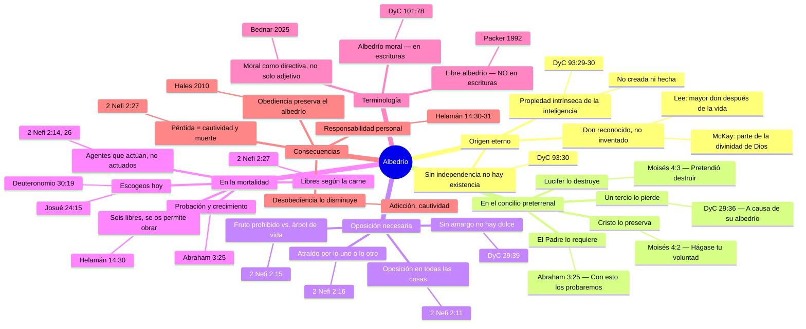

# El albedrío: principio eterno

**Territorio:** El albedrío como propiedad eterna de la inteligencia, eje del plan de salvación. No se trata aquí de la narrativa del concilio (dp02) ni de la identidad espiritual (dp01) ni de la preordenación (dp04), sino del principio en sí: su naturaleza, su origen, su operación en la mortalidad y las consecuencias de rechazarlo. Pregunta central: *¿Por qué el albedrío importa tanto que Dios prefirió perder a un tercio de Sus hijos antes que destruirlo?*

---

## 1. Panorama

El albedrío no es un accesorio del plan de salvación: es su columna vertebral. Sin la capacidad de elegir, no hay prueba; sin prueba, no hay progreso; sin progreso, no hay exaltación. Toda la arquitectura del evangelio --mandamientos, expiación, arrepentimiento, juicio-- presupone seres que actúan y no meramente objetos sobre los cuales se actúa.

La revelación moderna ilumina algo que la teología cristiana tradicional rara vez articula: el albedrío no fue concedido por primera vez en el Edén. Es una propiedad constitutiva de la inteligencia misma, tan eterna como ella. Cuando Dios dice que dio al hombre su albedrío, no describe una creación ex nihilo de libertad, sino el reconocimiento formal de una capacidad que ya existía en la inteligencia premortal y su extensión a un nuevo estado de existencia.

Esta distinción tiene consecuencias enormes. Si el albedrío fuera un mero don revocable, Lucifer habría tenido un argumento plausible: cancelar temporalmente la libertad para garantizar la salvación universal. Pero porque la libertad es intrínseca a la existencia inteligente, destruirla equivale a destruir a la persona misma. De ahí que el Padre no negoció: rechazó la propuesta de Satanás y lo expulsó.

El albedrío opera dentro de un sistema de condiciones necesarias: conocimiento (la ley revelada), alternativas (la oposición en todas las cosas) y consecuencias (responsabilidad ante la justicia). Sin cualquiera de ellas, la elección se reduce a azar o coerción. La mortalidad está diseñada para proporcionar las tres en grado máximo.

---

## 2. Escrituras clave

### 2.1 Naturaleza eterna del albedrío

La sección 93 de Doctrina y Convenios contiene la declaración doctrinal más profunda sobre la relación entre inteligencia, verdad y albedrío.

El versículo 29 establece que la inteligencia es coextensiva con Dios, no creada por Él:

> «También el hombre fue en el principio con Dios. La inteligencia, o sea, la luz de verdad, no fue creada ni hecha, ni tampoco lo puede ser» (DyC 93:29).

El versículo 30 vincula esa eternidad de la inteligencia con la capacidad de actuar, y declara que sin esa independencia no hay existencia posible:

> «Toda verdad es independiente para obrar por sí misma en aquella esfera en que Dios la ha colocado, así como toda inteligencia; de otra manera, no hay existencia» (DyC 93:30).

Y el versículo 31 identifica explícitamente esta independencia como la raíz del albedrío humano:

> «He aquí, esto constituye el albedrío del hombre y la condenación del hombre; porque claramente les es manifestado lo que existió desde el principio, y no reciben la luz» (DyC 93:31).

El pasaje de Abraham sobre las inteligencias preexistentes refuerza esta enseñanza. Las inteligencias no son iguales, pero todas son libres:

> «Y el Señor me había mostrado a mí, Abraham, las inteligencias que fueron organizadas antes que existiera el mundo; y entre todas estas había muchas de las nobles y grandes» (Abraham 3:22).

Y la prueba mortal se formula precisamente como ejercicio de esa libertad:

> «Y con esto los probaremos, para ver si harán todas las cosas que el Señor su Dios les mandare; y a los que guarden su primer estado les será añadido; y aquellos que no guarden su primer estado no tendrán gloria en el mismo reino con los que guarden su primer estado; y a quienes guarden su segundo estado, les será aumentada gloria sobre su cabeza para siempre jamás» (Abraham 3:25-26).

### 2.2 El albedrío y la inteligencia

La conexión entre albedrío e inteligencia no es incidental. Doctrina y Convenios 93:36 declara: «La gloria de Dios es la inteligencia, o en otras palabras, luz y verdad.» Si la inteligencia es la gloria divina, y la inteligencia es inherentemente libre, entonces el albedrío participa de la naturaleza misma de Dios.

En el Jardín de Edén, Dios formalizó esa libertad en el contexto mortal. El Señor le explicó a Enoc:

> «He allí a estos, tus hermanos; son la obra de mis propias manos, y les di su conocimiento el día en que los creé; y en el Jardín de Edén le di al hombre su albedrío; y a tus hermanos he dicho, y también he dado mandamiento, que se amen el uno al otro, y que me prefieran a mí, su Padre, mas he aquí, no tienen afecto y aborrecen su propia sangre» (Moisés 7:32-33).

El lamento de Dios en este pasaje es revelador: dio el albedrío y el mandamiento, pero los hombres eligieron odio en lugar de amor. El albedrío hace posible tanto la nobleza como la tragedia.

### 2.3 Oposición necesaria

Sin oposición, la elección es una ilusión. Lehi enseñó a Jacob el principio más fundamental de la metafísica del plan:

> «Porque es preciso que haya una oposición en todas las cosas. Pues de otro modo, mi primer hijo nacido en el desierto, no se podría llevar a efecto la rectitud ni la iniquidad, ni tampoco la santidad ni la miseria, ni el bien ni el mal. De modo que todas las cosas necesariamente serían un solo conjunto; por tanto, si fuese un solo cuerpo, habría de permanecer como muerto, no teniendo ni vida ni muerte, ni corrupción ni incorrupción, ni felicidad ni miseria, ni sensibilidad ni insensibilidad» (2 Nefi 2:11).

Lehi lleva el argumento hasta sus últimas consecuencias lógicas: sin oposición, Dios mismo carecería de propósito:

> «Y si decís que no hay ley, decís también que no hay pecado. Si decís que no hay pecado, decís también que no hay rectitud. Y si no hay rectitud, no hay felicidad. Y si no hay rectitud ni felicidad, tampoco hay castigo ni miseria. Y si estas cosas no existen, Dios no existe. Y si no hay Dios, nosotros no existimos, ni la tierra; porque no habría habido creación de cosas, ni para actuar ni para que se actúe sobre ellas; por consiguiente, todo se habría desvanecido» (2 Nefi 2:13).

La creación deliberada de condiciones de oposición confirma que no son un defecto del plan sino su diseño:

> «Y para realizar sus eternos designios en cuanto al objeto del hombre, después que hubo creado a nuestros primeros padres, y los animales del campo, y las aves del cielo, y en fin, todas las cosas que se han creado, era menester una oposición; sí, el fruto prohibido en oposición al árbol de la vida, siendo dulce el uno y amargo el otro» (2 Nefi 2:15).

La conclusión: el albedrío requiere alternativas reales.

> «Por lo tanto, el Señor Dios le concedió al hombre que obrara por sí mismo. De modo que el hombre no podía actuar por sí a menos que lo atrajera lo uno o lo otro» (2 Nefi 2:16).

Y en Doctrina y Convenios, el Señor confirma que hasta la existencia de Satanás como tentador cumple esta función:

> «Y es menester que el diablo tiente a los hijos de los hombres, de otra manera estos no podrían ser sus propios agentes; porque si nunca tuviesen lo amargo, no podrían conocer lo dulce» (DyC 29:39).

La Biblia, sin emplear la misma terminología teológica, afirma el mismo principio con urgencia:

> «A los cielos y a la tierra llamo por testigos hoy contra vosotros, de que os he puesto delante la vida y la muerte, la bendición y la maldición; escoge, pues, la vida, para que vivas tú y tu descendencia» (Deuteronomio 30:19).

Y Josué confrontó a Israel con la realidad desnuda de la elección:

> «Y si mal os parece servir a Jehová, escogeos hoy a quién sirváis; si a los dioses a quienes sirvieron vuestros padres, cuando estuvieron al otro lado del río, o a los dioses de los amorreos en cuya tierra habitáis; pero yo y mi casa serviremos a Jehová» (Josué 24:15).

### 2.4 El albedrío en la mortalidad

La mortalidad transforma el albedrío de un principio abstracto en una experiencia vivida. Lehi lo resume en una de las declaraciones más celebradas del Libro de Mormón:

> «Adán cayó para que los hombres existiesen; y existen los hombres para que tengan gozo. Y el Mesías vendrá en la plenitud de los tiempos, a fin de redimir a los hijos de los hombres de la caída. Y porque son redimidos de la caída, han llegado a quedar libres para siempre, discerniendo el bien del mal, para actuar por sí mismos, y no para que se actúe sobre ellos, a menos que sea por el castigo de la ley en el grande y último día, según los mandamientos que Dios ha dado» (2 Nefi 2:25-26).

La libertad mortal es genuina, no nominal:

> «Así pues, los hombres son libres según la carne; y les son dadas todas las cosas que para ellos son propias. Y son libres para escoger la libertad y la vida eterna, por medio del gran Mediador de todos los hombres, o escoger la cautividad y la muerte, según la cautividad y el poder del diablo; pues él busca que todos los hombres sean miserables como él» (2 Nefi 2:27).

Samuel el Lamanita reafirmó esta libertad con igual claridad:

> «He aquí, sois libres; se os permite obrar por vosotros mismos; pues he aquí, Dios os ha dado el conocimiento y os ha hecho libres. Él os ha concedido que discernáis el bien del mal, y os ha concedido que escojáis la vida o la muerte; y podéis hacer lo bueno, y ser restaurados a lo que es bueno, es decir, que os sea restituido lo que es bueno; o podéis hacer lo malo, y hacer que lo que es malo os sea restituido» (Helamán 14:30-31).

La vida preterrenal ya fue escenario de elecciones reales. Alma enseñó que los sacerdotes del orden de Dios fueron escogidos precisamente por sus decisiones previas:

> «Habiendo sido llamados y preparados desde la fundación del mundo de acuerdo con la presciencia de Dios, por causa de su fe excepcional y buenas obras, habiéndoseles concedido primeramente escoger el bien o el mal; por lo que, habiendo escogido el bien y ejercido una fe sumamente grande, son llamados con un santo llamamiento» (Alma 13:3).

### 2.5 Consecuencias de rechazar el albedrío

Satanás pretendió destruir el albedrío, y la respuesta divina fue definitiva:

> «Pues, por motivo de que Satanás se rebeló contra mí, y pretendió destruir el albedrío del hombre que yo, Dios el Señor, le había dado, y que también le diera mi propio poder, hice que fuese echado abajo por el poder de mi Unigénito; y llegó a ser Satanás, sí, el diablo, el padre de todas las mentiras, para engañar y cegar a los hombres y llevarlos cautivos según la voluntad de él, sí, a cuantos no quieran escuchar mi voz» (Moisés 4:3-4).

La tercera parte de los espíritus fue alejada, no por decreto arbitrario, sino como consecuencia de su propia elección:

> «Se rebeló contra mí, diciendo: Dame tu honra, la cual es mi poder; y también alejó de mí a la tercera parte de las huestes del cielo, a causa de su albedrío; y fueron arrojados abajo, y así llegaron a ser el diablo y sus ángeles» (DyC 29:36-37).

En la revelación, Adán recibe la misma advertencia: fue constituido «su propio agente» y recibió mandamientos. La desobediencia, aun con el albedrío intacto, produce sujeción:

> «He aquí, yo le concedí que fuese su propio agente; y le di mandamientos; pero ningún mandamiento temporal le di, porque mis mandamientos son espirituales; no son naturales ni temporales, ni tampoco son carnales ni sensuales» (DyC 29:35).

---

## 3. Voces proféticas

### El élder Robert D. Hales (conferencia general, octubre 2010)

El discurso del élder Hales «El albedrío: esencial para el plan de la vida» es la exposición más completa sobre el tema en el canon moderno de conferencia general. Hales definió el albedrío y lo situó en el centro del plan:

> «Nosotros enseñamos que el albedrío es la facultad y el privilegio que Dios nos da para escoger y actuar por nosotros mismos y no para que se actúe sobre nosotros. El albedrío es actuar con responsabilidad y dar cuenta de nuestras acciones. Nuestro albedrío es esencial para el plan de salvación. Con él, somos libres para escoger la libertad y la vida eterna, por medio del gran Mediador de todos los hombres, o escoger la cautividad y la muerte, según la cautividad y el poder del diablo» (Robert D. Hales, "El albedrío: esencial para el plan de la vida", conferencia general, octubre 2010).

Hales enseñó que las elecciones rectas preservan el albedrío mientras que las decisiones pecaminosas lo disminuyen:

> «Mediante Su vida perfecta, nos enseñó que cuando elegimos hacer la voluntad de nuestro Padre Celestial, se preserva nuestro albedrío, nuestras oportunidades aumentan, y progresamos. [...] Cuando no guardamos los mandamientos ni los susurros del Espíritu Santo, se reducen nuestras oportunidades; nuestras facultades para actuar y progresar disminuyen» (Hales, octubre 2010).

Y ofreció una observación práctica de profundo valor: la obediencia protege el albedrío porque la desobediencia conduce a esclavitudes (adicción, deuda, ignorancia) que destruyen la capacidad de elegir.

### El élder David A. Bednar (conferencia general, abril 2025)

En «Son sus propios jueces», Bednar ofreció una aportación terminológica notable: «moral» en «albedrío moral» no es solo un adjetivo, sino una directiva divina sobre cómo debemos usar el albedrío.

> «Permítanme sugerir que, en las Escrituras, el calificativo "moral" no es solo un adjetivo, sino quizás también una directiva divina sobre cómo debemos usar el albedrío. [...] No se nos ha bendecido con albedrío moral para que hagamos lo que queramos y cuando queramos; más bien, de conformidad con el plan del Padre, hemos recibido el albedrío moral para buscar la verdad eterna y actuar de acuerdo con ella» (David A. Bednar, "Son sus propios jueces", conferencia general, abril 2025).

Bednar identificó los dos propósitos fundamentales del albedrío: amarnos unos a otros y escoger a Dios, en perfecta correspondencia con los dos grandes mandamientos.

### El élder Quentin L. Cook (conferencia general, abril 2024)

Cook dedicó parte significativa de «Ser uno con Cristo» a defender la realidad del albedrío frente al determinismo contemporáneo:

> «Una doctrina fundamental de nuestra religión es que sí tenemos albedrío moral, que incluye la propia voluntad. El albedrío es el poder de elegir y actuar; es esencial para el Plan de Salvación. Sin albedrío moral no podríamos aprender, progresar o elegir ser uno con Cristo» (Quentin L. Cook, "Ser uno con Cristo", conferencia general, abril 2024).

Cook confrontó directamente la afirmación académica de que «no hay lugar para la propia voluntad», subrayando que negar el albedrío equivale a negar a Dios.

### El presidente Dallin H. Oaks (conferencia general, abril 2016)

El discurso «Oposición en todas las cosas» es la exposición moderna definitiva del vínculo entre oposición y albedrío:

> «Con el fin de ser probados, debemos disponer del albedrío para elegir entre varias alternativas. Para proporcionar alternativas sobre las cuales podamos ejercer nuestro albedrío, debemos tener oposición» (Dallin H. Oaks, "Oposición en todas las cosas", conferencia general, abril 2016).

Oaks explicó cómo la propuesta de Satanás habría destruido el albedrío: al garantizar que ningún alma se perdería, eliminaba toda alternativa real y con ella toda posibilidad de prueba o progreso.

> «La propuesta de Satanás habría garantizado una igualdad perfecta: redimiría a todo el género humano, de modo que no se perdería ni una sola alma. Nadie dispondría de albedrío ni de libertad de elección, por lo cual no se requeriría ninguna oposición. No existiría ninguna prueba, ningún fracaso ni ningún éxito. No habría ningún progreso para lograr el propósito que el Padre deseaba para Sus hijos» (Oaks, abril 2016).

### El élder Boyd K. Packer (conferencia general, abril 1992)

En «Nuestro medio moral», Packer realizó una distinción terminológica que sigue siendo citada décadas después:

> «La frase "libre albedrío" no aparece en las Escrituras. El único albedrío del que se habla allí es el albedrío moral, "el cual," dijo el Señor, "he dado al hombre, para que todo hombre sea responsable de sus propios pecados en el día del juicio"» (Boyd K. Packer, "Our Moral Environment", conferencia general, abril 1992, traducción propia).

Packer denunció la distorsión del albedrío como justificación del vicio: quienes claman «libertad de elección» para proteger conductas destructivas invocan una virtud (la libertad) para derribar otra (la rectitud).

### El presidente David O. McKay

McKay enseñó que el albedrío es parte de la divinidad que Dios compartió con el hombre, tan inherente como la inteligencia misma:

> «El libre albedrío es un don de Dios. Es parte de Su divinidad. [...] Es tan inherente como la inteligencia, la cual, se nos dice, nunca fue creada ni puede serlo. [...] Después de la concesión de la vida misma, el derecho a dirigir esa vida es el mayor don de Dios al hombre. [...] La libertad de elección es algo que debe apreciarse más que cualquier posesión terrenal» (David O. McKay, en Enseñanzas de los Presidentes de la Iglesia: David O. McKay, cap. 22, traducción propia).

### El presidente Harold B. Lee

Lee articuló la jerarquía de los dones divinos con una frase que se ha vuelto proverbial:

> «Después de la vida misma, el albedrío es el mayor don de Dios al género humano» (Harold B. Lee, citado en múltiples manuales de la Iglesia, traducción propia).

### El élder M. Russell Ballard (conferencia general, abril 1995)

Ballard ofreció una perspectiva que amplía la comprensión del albedrío más allá de lo individual: las decisiones de otros nos afectan, y Dios permite que así sea porque proteger el albedrío de todos es más importante que evitar el sufrimiento de algunos:

> «Tenemos la tendencia a pensar en el albedrío como un asunto personal. [...] Muchas veces se pasa por alto el hecho de que las decisiones tienen consecuencias, y se olvida que el albedrío ofrece también el mismo privilegio de elección a los demás. En ocasiones, la forma en que otras personas optan por ejercer su albedrío nos afecta en forma adversa. Es tan importante para nuestro Padre Celestial proteger el albedrío de Sus hijos, que les permite ejercerlo, ya sea para bien o para mal» (M. Russell Ballard, "Las respuestas a los interrogantes de la vida", conferencia general, abril 1995).

### El presidente Ezra Taft Benson

Benson identificó el albedrío como la cuestión central del concilio preterrenal. Para Benson, toda la guerra en los cielos se reduce a una sola pregunta: ¿tendrán los hijos de Dios libertad genuina para elegir, con el riesgo real de perderse, o serán forzados a la salvación? El Padre eligió la libertad, con todo su costo.

---

## 4. Voces académicas y otros autores

### B. H. Roberts, *Seventy's Course in Theology* (4th Year, cap. 6)

Roberts ofreció la exposición teológica más rigurosa del siglo XIX sobre la eternidad del albedrío. Su argumento es filosófico y escritural a la vez:

> «La libertad moral de las inteligencias es algo tan eterno como ellas mismas. La libertad es un atributo de las inteligencias y no puede serles quitada sin despojarlas de todo gozo, gloria y dignidad de existencia. [...] La libertad del hombre significa la libertad de la inteligencia que constituye el hecho principal del hombre; libertad en todos los estados por los que sea llamado a pasar, en todas las esferas en las que Dios lo coloque para actuar; la cualidad de la libertad nunca lo abandona» (B. H. Roberts, Seventy's Course in Theology, 4th Year, cap. 6, traducción propia).

Roberts analizó la propuesta de Lucifer como un universo donde todo es «sí» y nunca hay un «no» genuino: sin riesgo real, sin sacrificio real, sin pérdida real. Un juego sin apuestas. Bajo tal plan, el hombre sería pasivo, algo sobre lo cual se actúa y no un agente que actúa. Roberts argumentó que esto habría destruido la existencia misma, en concordancia con DyC 93:30: sin independencia para actuar, «no hay existencia».

### La Guía de Temas del Evangelio (churchofjesuschrist.org)

La entrada oficial «Albedrío y responsabilidad» sintetiza la doctrina:

> «El albedrío es la capacidad y el privilegio que Dios nos da de escoger y actuar por nosotros mismos. El albedrío es esencial en el Plan de Salvación; sin él, no podríamos aprender, progresar ni seguir al Salvador. [...] En nuestra vida preterrenal poseíamos el albedrío moral. Uno de los propósitos de la vida terrenal es mostrar la clase de decisiones que tomaremos. Si se nos forzara a escoger lo correcto, no podríamos demostrar qué habríamos escogido por nosotros mismos» (Guía de Temas del Evangelio, "Albedrío y responsabilidad").

---

## 5. Diagrama

---

## 6. Conexiones

- **dp00 — Panorama del plan de salvación:** El albedrío es el principio operativo que convierte el plan en algo más que un diseño teórico; es lo que permite que los espíritus realmente sean probados.
- **dp01 — Identidad espiritual:** La inteligencia eterna (dp01) es el sustrato del albedrío. Sin la doctrina de la preexistencia de la inteligencia, el albedrío queda reducido a un don arbitrario.
- **dp02 — El concilio en los cielos:** El concilio es el escenario donde el albedrío fue la cuestión en disputa. Este dossier trata el principio; dp02 trata la narrativa.
- **dp04 — Preordenación:** Si el albedrío es eterno, entonces las elecciones preterrenales (Alma 13:3) fundamentan la preordenación. No hay contradicción entre predestinación y libertad cuando se entiende que Dios preordena basado en elecciones previas libremente hechas.
- **Forma T 05 — El albedrío: principio eterno:** Versión didáctica condensada de este dossier, organizada por concepto/referencia.
- **Futuro dossier: La Caída:** La Caída es la primera gran demostración del albedrío en acción mortal; Adán y Eva eligieron, y su elección hizo posible todo lo demás.
- **Futuro dossier: Oposición:** Merece tratamiento propio como principio metafísico que trasciende el contexto del albedrío (aplica a crecimiento, justicia, expiación).

---

## 7. Lagunas y preguntas abiertas

1. **«Libre albedrío» vs. «albedrío moral»:** Packer señaló en 1992 que «libre albedrío» no aparece en las Escrituras; solo «albedrío moral» (DyC 101:78). Sin embargo, múltiples profetas --incluido McKay-- usaron «libre albedrío» extensamente. ¿Es una distinción doctrinal real o una cuestión de registro lingüístico? Bednar (2025) avanza la tesis de que «moral» es prescriptivo, no descriptivo. Esta línea merece desarrollo.

2. **Cómo opera el albedrío sin cuerpo físico:** Si el albedrío es intrínseco a la inteligencia, operaba en la vida preterrenal. Pero los espíritus carecían de cuerpo físico. ¿Cómo se experimentaba la oposición necesaria en ese contexto? La guerra en los cielos demuestra que había alternativas reales, pero los mecanismos permanecen revelados solo parcialmente.

3. **Albedrío y adicción / salud mental:** Hales (2010) enseñó que la adicción «literalmente nos roba la capacidad para actuar por nosotros mismos». La Iglesia reconoce que condiciones de salud mental pueden afectar la capacidad de elección. ¿Cómo se reconcilia la doctrina del albedrío con la realidad neurobiológica de la adicción, la depresión o el trauma? El principio de que Dios juzga según el conocimiento y la capacidad de cada persona (DyC 82:3; Lucas 12:48) ofrece un marco, pero su aplicación pastoral sigue siendo un área de desarrollo activo.

4. **Albedrío vs. determinismo en tradiciones filosóficas:** La teología de la Restauración se posiciona firmemente contra el determinismo (tanto calvinista como materialista). Cook (2024) confrontó explícitamente al determinismo científico moderno. Sin embargo, falta en el corpus un tratamiento sistemático que dialogue con las tradiciones filosóficas del compatibilismo, el libertarianismo metafísico y el hard determinism desde la perspectiva de DyC 93.

5. **El albedrío de otros como fuente de sufrimiento:** Ballard (1995) tocó este tema: el albedrío de otros nos afecta adversamente, y Dios lo permite. ¿Cómo se relaciona esto con la teodicea? Si Dios pudiera intervenir para evitar el daño causado por la elección ajena, pero no lo hace para preservar el albedrío, ¿cuáles son los límites de esa no-intervención? La doctrina sugiere que la expiación compensa toda injusticia no causada por el propio pecado, pero el desarrollo teológico de este punto es incipiente.

---

**Fuentes citadas**

- Doctrina y Convenios 29:35-39
- Doctrina y Convenios 93:29-31, 36
- Doctrina y Convenios 101:78
- Moisés 4:1-4
- Moisés 7:32-33
- Abraham 3:22, 25-26
- 2 Nefi 2:11, 13-16, 22-27
- Alma 13:3
- Helamán 14:30-31
- Deuteronomio 30:19
- Josué 24:15
- Robert D. Hales, "El albedrío: esencial para el plan de la vida", conferencia general, octubre 2010
- David A. Bednar, "Son sus propios jueces", conferencia general, abril 2025
- Quentin L. Cook, "Ser uno con Cristo", conferencia general, abril 2024
- Dallin H. Oaks, "Oposición en todas las cosas", conferencia general, abril 2016
- Boyd K. Packer, "Our Moral Environment", conferencia general, abril 1992
- David O. McKay, en Enseñanzas de los Presidentes de la Iglesia: David O. McKay, cap. 22
- Harold B. Lee, citado en manuales de la Iglesia
- M. Russell Ballard, "Las respuestas a los interrogantes de la vida", conferencia general, abril 1995
- B. H. Roberts, Seventy's Course in Theology, 4th Year, cap. 6
- Guía de Temas del Evangelio, "Albedrío y responsabilidad", churchofjesucristo.org
