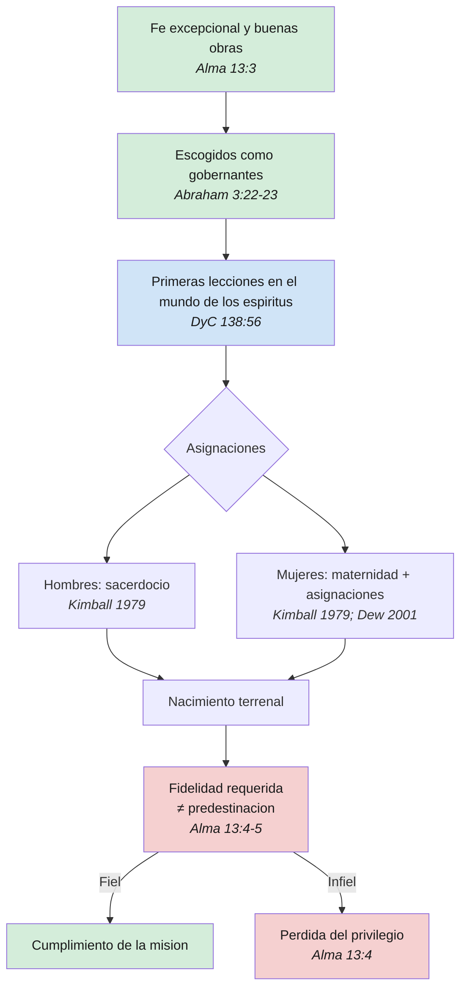

# La preordenacion

**Territorio:** La preordenacion como doctrina distintiva de la Restauracion: su universalidad (no solo profetas), su aplicacion a las mujeres, la distincion con la predestinacion calvinista y su relacion inseparable con el albedrio. Pregunta central: *Que trajimos como mision?*

---

## 1. Panorama

La preordenacion es la doctrina de que Dios, en el mundo preterrenal de los espiritus, designo a ciertos hijos e hijas para cumplir misiones especificas durante la vida terrenal. No se limita a profetas ni a varones con llamamientos del sacerdocio: abarca a toda alma fiel que demostro fe excepcional y buenas obras antes de nacer. La distincion critica es que la preordenacion no es predestinacion. Ser escogido "alla y entonces" no garantiza nada "aqui y ahora"; la fidelidad terrenal es condicion sine qua non. El concepto descansa sobre tres pilares: (1) la realidad de una existencia premortal consciente, (2) la gradacion de inteligencias y la diferenciacion de asignaciones, y (3) la preservacion del albedrio como principio inviolable.

La doctrina aparece en la Biblia de forma tangencial (Jeremias, Efesios, Romanos), pero es la revelacion de la Restauracion la que la articula plenamente. Abraham 3, Alma 13 y DyC 138 constituyen los tres textos fundacionales que permiten reconstruir la secuencia completa: fe premortal, seleccion, preparacion, asignacion y prueba terrenal.

---

## 2. Escrituras clave

### 2.1 El precedente biblico

La Biblia ofrece indicios poderosos de que Dios conoce y llama a sus siervos antes de que nazcan, aunque sin el marco doctrinal completo que aporta la Restauracion.

Jeremias recibio del Senor una declaracion inequivoca de conocimiento y llamamiento prenatal:

> "Antes que te formase en el vientre, te conoci; y antes que nacieses, te santifique; te di por profeta a las naciones." (Jeremias 1:5)

El texto hebreo emplea *yada* (conocer) en un sentido relacional profundo: no es mera omnisciencia, sino intimidad. Dios no solo previo a Jeremias; lo conocio como persona, lo aparto y le asigno una mision concreta entre las naciones. La respuesta del propio Jeremias ("no se hablar, porque soy nino", v. 6) revela la tension inherente a la preordenacion: el llamado divino precede a la capacidad humana percibida.

Isaias aporta un testimonio paralelo, en voz del Siervo mesianico:

> "Oídme, oh islas, y escuchad, pueblos lejanos: Jehova me llamo desde el vientre; desde las entranas de mi madre tuvo mi nombre en memoria." (Isaias 49:1)

> "Ahora pues, dice Jehova, el que me formo desde el vientre para ser su siervo, para hacer volver a el a Jacob. Aunque Israel no sea congregado, aun asi sere estimado ante los ojos de Jehova, y mi Dios sera mi fortaleza." (Isaias 49:5)

La formulacion "desde el vientre" y "desde las entranas" situa el llamamiento en un momento anterior al nacimiento. Para la teologia de la Restauracion, estos pasajes no son mera hiperbole poetica: son ventanas literales a la vida premortal.

### 2.2 Nobles y grandes

El texto mas explicito sobre la preordenacion es la vision de Abraham:

> "Y el Senor me habia mostrado a mi, Abraham, las inteligencias que fueron organizadas antes que existiera el mundo; y entre todas estas habia muchas de las nobles y grandes; y vio Dios que estas almas eran buenas, y estaba en medio de ellas, y dijo: A estos hare mis gobernantes; pues estaba entre aquellos que eran espiritus, y vio que eran buenos; y me dijo: Abraham, tu eres uno de ellos; fuiste escogido antes de nacer." (Abraham 3:22-23)

Varios elementos doctrinales emergen de este pasaje. Primero, la gradacion: habia "muchas de las nobles y grandes", lo cual implica diversidad de capacidades entre las inteligencias. Segundo, la base de la seleccion: Dios vio que "eran buenas", un juicio moral sobre su caracter previo. Tercero, la naturaleza del llamado: "gobernantes" no se refiere a dominio politico, sino a liderazgo en el plan de salvacion. Cuarto, la inclusion personal: Abraham recibio la noticia de su propia preordenacion como dato experiencial, no como abstraccion teologica.

### 2.3 Fe y obras como condicion

Alma 13 es el tratado doctrinal mas profundo sobre la preordenacion en todas las Escrituras. El pasaje establece que la seleccion premortal no fue arbitraria, sino meritoria:

> "Y esta es la manera conforme a la cual fueron ordenados, habiendo sido llamados y preparados desde la fundacion del mundo de acuerdo con la presciencia de Dios, por causa de su fe excepcional y buenas obras, habiendoseles concedido primeramente escoger el bien o el mal; por lo que, habiendo escogido el bien y ejercido una fe sumamente grande, son llamados con un santo llamamiento, si, con ese santo llamamiento que, con una redencion preparatoria y de conformidad con ella, se dispuso para tales seres." (Alma 13:3)

> "Y asi, por motivo de su fe, han sido llamados a este santo llamamiento, mientras que otros rechazaban el Espiritu de Dios a causa de la dureza de sus corazones y la ceguedad de su mente, cuando de no haber sido por esto, hubieran podido tener tan grande privilegio como sus hermanos." (Alma 13:4)

> "O en una palabra, al principio se hallaban en la misma posicion que sus hermanos; asi se preparo este santo llamamiento desde la fundacion del mundo para aquellos que no endurecieran sus corazones, haciendose en la expiacion y por medio de la expiacion del Hijo Unigenito, que fue preparado." (Alma 13:5)

La secuencia doctrinal de Alma 13 es precisa: (a) todos los espiritus comenzaron en la misma posicion, (b) se les concedio escoger entre el bien y el mal, (c) algunos ejercieron fe excepcional, (d) esos fueron llamados y preparados. El versiculo 5 es la refutacion mas directa de cualquier forma de predestinacion: "al principio se hallaban en la misma posicion que sus hermanos". La diferencia fue la eleccion, no el favoritismo.

### 2.4 Preparados antes de nacer

La vision de Joseph F. Smith sobre la redencion de los muertos extiende la preordenacion hasta los lideres de la ultima dispensacion:

> "El profeta Jose Smith y mi padre Hyrum Smith, y Brigham Young, John Taylor, Wilford Woodruff y otros espiritus selectos que fueron reservados para nacer en el cumplimiento de los tiempos, a fin de participar en la colocacion de los cimientos de la gran obra de los ultimos dias, incluso la construccion de templos y la efectuacion en ellos de las ordenanzas para la redencion de los muertos, tambien estaban en el mundo de los espiritus." (DyC 138:53-54)

> "Observe que tambien ellos se hallaban entre los nobles y grandes que fueron escogidos en el principio para ser gobernantes en la Iglesia de Dios. Aun antes de nacer, ellos, con muchos otros, recibieron sus primeras lecciones en el mundo de los espiritus, y fueron preparados para venir en el debido tiempo del Senor a obrar en su vina en bien de la salvacion de las almas de los hombres." (DyC 138:55-56)

El detalle de que recibieron "primeras lecciones" en el mundo de los espiritus sugiere un proceso formativo real, no una mera asignacion administrativa. La preordenacion incluyo preparacion: instruccion, desarrollo de capacidades, internalizacion de la mision.

### 2.5 Preordenacion =/= predestinacion

Pablo emplea un lenguaje que, fuera del marco de la Restauracion, ha sido historicamente malinterpretado:

> "Segun nos escogio en el antes de la fundacion del mundo, para que fuesemos santos y sin mancha delante de el, en amor, habiendonos predestinado para ser adoptados hijos suyos por medio de Jesucristo, segun la complacencia de su voluntad." (Efesios 1:4-5)

> "Porque a los que antes conocio, tambien predestino para que fuesen hechos conforme a la imagen de su Hijo, a fin de que el sea el primogenito entre muchos hermanos; y a los que predestino, a estos tambien llamo; y a los que llamo, a estos tambien justifico; y a los que justifico, a estos tambien glorifico." (Romanos 8:29-30)

La tradicion calvinista leyo estos textos como decreto irresistible: Dios elige soberanamente quien se salva y quien se condena, sin participacion del individuo. La Restauracion ofrece una lectura radicalmente distinta. El "antes conocio" (*proginosko*) de Romanos 8:29 adquiere sentido literal: Dios conocio a estos espiritus en la vida premortal. El "predestino" (*proorizo*) no significa determinismo, sino proposito previo. Dios tenia un plan para ellos, pero el cumplimiento de ese plan depende del ejercicio fiel del albedrio. Alma 13:5 es la clave hermeneutica: "al principio se hallaban en la misma posicion que sus hermanos". Donde Calvino vio eleccion incondicional, la Restauracion ve seleccion condicional basada en la fe premortal.

---

## 3. Voces profeticas

El presidente Spencer W. Kimball ofrecio la ensenanza mas explicita sobre la universalidad de la preordenacion, incluyendo a las mujeres:

> "Recuerden, en el mundo antes de venir aqui, a las mujeres fieles se les dieron ciertas asignaciones, mientras que a los hombres fieles se los preordeno para determinados deberes en el sacerdocio. Aunque ahora no recordemos los detalles, esto no altera la gloriosa realidad de lo que una vez acordamos." (Spencer W. Kimball, *Enseñanzas de los Presidentes de la Iglesia: Spencer W. Kimball*, cap. 20)

Esta declaracion es notable por varias razones. Primera, equipara la preordenacion femenina con la masculina en terminos de realidad y relevancia. Segunda, emplea el verbo "acordamos" (*agreed to*), que sugiere consentimiento, no imposicion. Tercera, reconoce la paradoja del olvido: no recordamos los detalles, pero la realidad persiste. El presidente Kimball tambien enmarco la mision de las mujeres justas de los ultimos dias como un llamamiento de alcance historico:

> "Ser una mujer justa durante estas finales etapas de la tierra, antes de la segunda venida de nuestro Salvador, es un llamamiento especialmente noble. La fortaleza e influencia de una mujer justa hoy puede ser diez veces superior a lo que seria en tiempos mas tranquilos." (Spencer W. Kimball, *Enseñanzas de los Presidentes de la Iglesia: Spencer W. Kimball*, cap. 20)

El presidente Wilford Woodruff extendio la preordenacion mas alla de los profetas canonicos, aplicandola a toda la dispensacion:

> "Jose Smith fue nombrado por el Senor antes de nacer, asi como lo fue Jeremias. Y ese mismo es el caso con decenas de miles de elderes de esta Iglesia." (Wilford Woodruff, *Conference Report*, abril de 1898)

La frase "decenas de miles de elderes" democratiza radicalmente la doctrina. No se trata de un puñado de hijos predilectos, sino de una multitud de espiritus preparados y asignados.

El elder Neal A. Maxwell advirtio contra la pasividad teologica derivada de una lectura comoda de la preordenacion:

> "La doctrina de la vida premortal no abre paso a la pasividad. El haber sido escogidos 'alla y entonces' no significa en modo alguno que podamos ser indiferentes 'aqui y ahora'." (Neal A. Maxwell, *Notwithstanding My Weakness*, 1981)

Maxwell puso el dedo en la llaga de un riesgo doctrinal real: que la preordenacion se convierta en una excusa para la inercia espiritual, un equivalente mormon de "una vez salvo, siempre salvo". La preordenacion establece un potencial, no una garantia.

Sheri Dew, como autora y lider de la Sociedad de Socorro, articulo la dimension femenina de la doctrina con una formulacion que se ha vuelto clasica:

> "Al igual que los varones justos fueron preordenados para recibir el sacerdocio en la vida terrenal, las mujeres justas fueron dotadas en la existencia preterrenal del privilegio de la maternidad." (Sheri Dew, discurso de conferencia general, octubre de 2001)

La ensenanza de Dew no reduce la preordenacion femenina a la maternidad biologica, sino que la presenta como un privilegio espiritual paralelo al sacerdocio. Sin embargo, como se examinara en la seccion de lagunas, el desarrollo teologico posterior de esta idea ha sido limitado.

El presidente Russell M. Nelson, en multiples ocasiones, ha enmarcado la generacion actual como preordenada para un momento especifico de la historia:

> "Ustedes fueron escogidos por El para venir a la tierra precisamente en esta epoca." (Russell M. Nelson, discurso a las mujeres jovenes, conferencia general, octubre de 2013)

El elder David B. Haight, al sostener al presidente Gordon B. Hinckley como nuevo Presidente de la Iglesia en 1995, invoco Alma 13:3 y la cita de Jose Smith sobre la preordenacion como marco para entender la sucesion profetica: los llamados no son accidentales, sino preparados "desde la fundacion del mundo".

El elder Steven R. Bangerter, en su discurso de conferencia general de abril de 2024 titulado "Preordenados para servir", ofrecio un tratamiento comprehensivo de la doctrina, subrayando que la preordenacion se aplica a todo tipo de servicio en el reino, no solo a llamamientos de liderazgo visible.

---

## 4. Voces academicas y otros autores

El elder James E. Talmage, en *Jesus el Cristo*, dedico el capitulo 2 a la preexistencia y preordenacion de Cristo, estableciendo el principio de la gradacion de inteligencias como fundamento de la doctrina:

> "Muestrase con toda claridad, mediante una revelacion divina dada a Abraham, que los espiritus de los hombres existieron como inteligencias individuales con distintos grados de habilidad y poder, antes de la inauguracion del estado terrenal sobre esta tierra y aun antes de la creacion del mundo como morada adecuada para los seres humanos." (James E. Talmage, *Jesus el Cristo*, cap. 2, nota 1)

Talmage argumento que si las inteligencias tenian grados distintos de capacidad, era natural que el Padre discerniera y escogiera a los mas dignos para misiones especificas. Esta linea de razonamiento fundamenta la preordenacion no en el capricho divino, sino en el merito premortal, en perfecta armonia con Alma 13.

El articulo "Foreordination" del manual oficial *Gospel Topics* sintetiza la posicion institucional de la Iglesia:

> "La doctrina de la preordenacion se aplica a todos los miembros de la Iglesia, no solo al Salvador y a sus profetas. Antes de la creacion de la tierra, a las mujeres fieles se les dieron ciertas responsabilidades y los varones fieles fueron preordenados a ciertos deberes del sacerdocio. Conforme las personas demuestren que son dignas, tendran oportunidades de cumplir las asignaciones que alli recibieron." (*Temas del Evangelio*, "Preordenacion")

El manual *Leales a la Fe* complementa: "La preordenacion no garantiza que esas personas reciban ciertos llamamientos o responsabilidades, sino que esas oportunidades se reciben en esta vida como resultado de ejercer con rectitud el albedrio."

Joseph Fielding Smith, en *The Way to Perfection*, describio la escena premortal:

> "Bajo tales condiciones era natural que nuestro Padre discerniera y escogiera a aquellos que eran mas dignos y evaluara los talentos de cada individuo. El conocia no solo lo que cada uno de nosotros podia hacer, sino tambien lo que cada uno haria cuando se le pusiera a prueba y se le diera responsabilidad." (Joseph Fielding Smith, *The Way to Perfection*, pags. 50-51)

La distincion entre "podia hacer" y "haria" es fundamental: la omnisciencia divina no anula el albedrio. Dios preve las decisiones libres sin causarlas.

---

## 5. Diagrama

---

## 6. Conexiones

| Dossier / Forma T | Relacion |
|---|---|
| dp00 — Vida preterrenal | La preordenacion presupone la existencia premortal; sin vida antes del nacimiento, no hay base para la doctrina |
| dp01 — Identidad divina | Saber que fuimos preordenados redefine la identidad: no somos almas aleatorias, sino seres con mision |
| dp02 — El gran concilio | El concilio es el escenario donde se presentaron las asignaciones; la preordenacion es el resultado de las decisiones tomadas alli |
| dp03 — El albedrio | Relacion de tension creativa: la preordenacion establece el plan, el albedrio determina si se cumple |
| Forma T 06 — Preordenacion | Sintesis didactica de los mismos materiales; el dossier es la base de investigacion, la Forma T el producto pedagogico |
| Futuro: dp sobre roles de la mujer | El alcance de la preordenacion femenina requiere un tratamiento propio mas alla de este dossier |
| Futuro: dp sobre la bendicion patriarcal | La bendicion patriarcal como ventana a la asignacion premortal; relacion directa con la preordenacion |
| Futuro: senda del convenio | La preordenacion es la primera estacion del viaje; los convenios terrenales activan lo prometido premortalmente |

---

## 7. Lagunas y preguntas abiertas

1. **Alcance de la preordenacion femenina.** Kimball (1979) y Dew (2001) son las voces mas explicitas, pero el desarrollo teologico posterior ha sido escaso. Si los hombres fueron preordenados a deberes especificos del sacerdocio, a que deberes especificos fueron preordenadas las mujeres mas alla de la maternidad? La conversacion institucional sobre mujeres y sacerdocio (Nelson 2019, Bingham 2020) abre puertas pero no cierra esta pregunta.

2. **Preordenacion y bendicion patriarcal.** Los patriarcas declaran linaje y, a veces, misiones especificas. Cual es la relacion teologica entre lo que el patriarca pronuncia y lo que fue asignado premortalmente? Es la bendicion patriarcal un acto de revelacion de la preordenacion, o un llamamiento nuevo?

3. **Preordenacion de naciones y pueblos.** Deuteronomio 32:8 ("Cuando el Altisimo repartio las naciones") y Hechos 17:26 ("de una sangre ha hecho toda nacion... habiendo determinado... los limites de su habitacion") sugieren una preordenacion colectiva, no solo individual. La relacion entre linaje, nacion y asignacion premortal ha sido poco explorada en la teologia contemporanea de la Iglesia.

4. **Cuando la persona falla su mision.** Alma 13:4 establece que algunos "rechazaban el Espiritu de Dios a causa de la dureza de sus corazones" y perdieron sus privilegios preordenados. Pero que sucede con la mision misma? Se reasigna? Se pierde para el plan? La doctrina no ofrece una respuesta explicita.

5. **Predestinacion calvinista vs. preordenacion: teologia comparada.** El dialogo interreligioso sobre este tema es fertil pero subdesarrollado. Calvino (predestinacion doble), Arminio (gracia preveniente), Wesley (libre albedrio) y la Restauracion (preordenacion condicional) representan cuatro posiciones distintas sobre el mismo problema: como conciliar la soberania divina con la libertad humana. Un tratamiento comparativo riguroso fortaleceria la articulacion de la posicion de la Restauracion.

---

**Fuentes citadas**

- Alma 13:3-5 (Libro de Mormon)
- Abraham 3:22-23 (Perla de Gran Precio)
- DyC 138:53-56
- Jeremias 1:5
- Isaias 49:1, 5
- Efesios 1:4-5
- Romanos 8:29-30
- Spencer W. Kimball, *Enseñanzas de los Presidentes de la Iglesia: Spencer W. Kimball*, cap. 20, "Las mujeres de la Iglesia"
- Wilford Woodruff, *Conference Report*, abril de 1898
- Neal A. Maxwell, *Notwithstanding My Weakness* (Bookcraft, 1981)
- Sheri Dew, "No es bueno que el hombre este solo", conferencia general, octubre de 2001
- Russell M. Nelson, discurso a las mujeres jovenes, conferencia general, octubre de 2013
- Russell M. Nelson, "Una suplica a mis hermanas", conferencia general, octubre de 2015
- David B. Haight, discurso de conferencia general, abril de 1995
- Steven R. Bangerter, "Preordenados para servir", conferencia general, abril de 2024
- James E. Talmage, *Jesus el Cristo*, cap. 2, "Preexistencia y preordinacion del Cristo"
- Joseph Fielding Smith, *The Way to Perfection* (Deseret Book, 1970), pags. 50-51
- "Preordenacion", *Temas del Evangelio*, La Iglesia de Jesucristo de los Santos de los Ultimos Dias
- "Preordenacion", *Leales a la Fe* (manual oficial, 2004)
- Julie B. Beck, "Lo que las mujeres Santos de los Ultimos Dias hacen mejor: Ser firmes e inquebrantables", conferencia general, octubre de 2007
- Joy D. Jones, "Un llamamiento especialmente noble", conferencia general, abril de 2020
