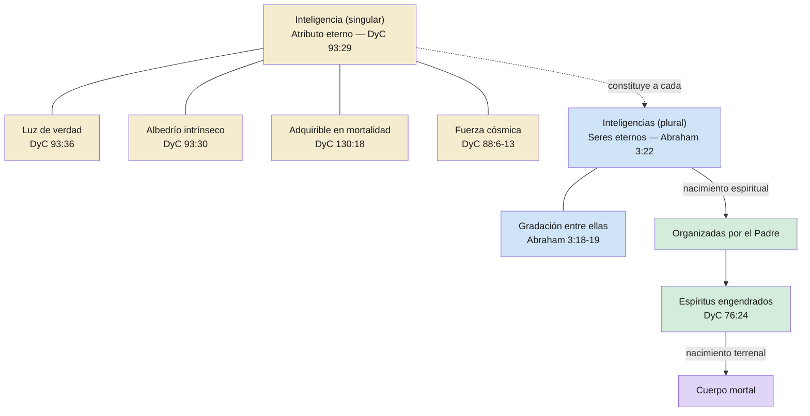

# Inteligencia e inteligencias

**Territorio:** La distinción escritural entre «inteligencia» (singular — atributo eterno, luz de verdad) e «inteligencias» (plural — seres organizados, espíritus preterrenales). Un solo término con significados radicalmente distintos según el número gramatical.

**Pregunta central:** ¿Qué distingue a la «inteligencia» de las «inteligencias» en las escrituras?

---

## 1. Panorama

Las escrituras usan la palabra «inteligencia» en al menos tres sentidos distintos. La Guía para el Estudio de las Escrituras los enumera explícitamente:

1. **La luz de la verdad** — atributo cósmico que da luz y vida a todas las cosas, que siempre ha existido (DyC 93:29, 36).
2. **Los hijos espirituales de Dios** — seres organizados, los espíritus preterrenales (Abraham 3:22).
3. **El elemento espiritual** que existía antes de que fuéramos engendrados como hijos espirituales — la sustancia eterna previa al nacimiento espiritual.

El primer sentido es un atributo; el segundo y tercero son entidades. Confundirlos lleva a errores doctrinales serios: afirmar que las inteligencias «fueron creadas» (el plural sí fue organizado) o que la inteligencia «puede destruirse» (el singular no fue creada ni hecha, ni puede serlo).

Este dossier separa los tres significados, documenta las escrituras que los sustentan, y recoge las voces proféticas y académicas que han intentado clarificar la distinción.

---

## 2. Escrituras clave

### 2.1 Inteligencia como atributo eterno (singular)

La revelación define la inteligencia como sinónimo de «luz de verdad» y la declara increada — con la formulación más fuerte de eternidad en todas las escrituras:

> **DyC 93:29**
> «También el hombre fue en el principio con Dios. La inteligencia, o sea, la luz de verdad, no fue creada ni hecha, ni tampoco lo puede ser.»

El versículo siguiente añade que esta inteligencia es «independiente para obrar por sí misma» — vinculando la inteligencia directamente con el albedrío como propiedad intrínseca:

> **DyC 93:30**
> «Toda verdad es independiente para obrar por sí misma en aquella esfera en que Dios la ha colocado, así como toda inteligencia; de otra manera, no hay existencia.»

La gloria de Dios se define explícitamente como inteligencia en su sentido de atributo:

> **DyC 93:36**
> «La gloria de Dios es la inteligencia, o en otras palabras, luz y verdad.»

La inteligencia no es solo eterna en origen, sino adquirible y acumulable. Lo que se logre aquí se conserva más allá de la muerte:

> **DyC 130:18-19**
> «Cualquier principio de inteligencia que logremos en esta vida se levantará con nosotros en la resurrección; y si en esta vida una persona adquiere más conocimiento e inteligencia que otra, por medio de su diligencia y obediencia, hasta ese grado le llevará la ventaja en el mundo venidero.»

La inteligencia como fuerza cósmica que permea la creación — luz, vida, ley:

> **DyC 88:6-7, 11-13**
> «Quien ascendió a lo alto, como también descendió debajo de todo, por lo que comprendió todas las cosas, a fin de que estuviese en todas las cosas y a través de todas las cosas, la luz de la verdad, la cual verdad brilla. Esta es la luz de Cristo. [...] Y la luz que brilla, que os alumbra, viene por medio de aquel que ilumina vuestros ojos, y es la misma luz que vivifica vuestro entendimiento, la cual procede de la presencia de Dios para llenar la inmensidad del espacio, la luz que existe en todas las cosas, que da vida a todas las cosas, que es la ley por la cual se gobiernan todas las cosas.»

Un versículo que opera en la frontera entre atributo y entidad — ¿es la inteligencia que se allega a la inteligencia un atributo que atrae a otro atributo, o un ser que atrae a otro ser?

> **DyC 88:40**
> «Porque la inteligencia se allega a la inteligencia; la sabiduría recibe a la sabiduría; la verdad abraza a la verdad; la virtud ama a la virtud; la luz se allega a la luz.»

### 2.2 Inteligencias como seres organizados (plural)

Abraham ve directamente a las inteligencias como seres, y el texto las equipara progresivamente con «almas» y «espíritus»:

> **Abraham 3:22-23**
> «Y el Señor me había mostrado a mí, Abraham, las inteligencias que fueron organizadas antes que existiera el mundo; y entre todas estas había muchas de las nobles y grandes; y vio Dios que estas almas eran buenas, y estaba en medio de ellas, y dijo: A estos haré mis gobernantes; pues estaba entre aquellos que eran espíritus, y vio que eran buenos; y me dijo: Abraham, tú eres uno de ellos; fuiste escogido antes de nacer.»

Dios declara su supremacía sobre todas las inteligencias — usando el término como sinónimo de los seres que ha mostrado a Abraham:

> **Abraham 3:21**
> «Yo habito en medio de todos ellos; por tanto, he descendido ahora para darte a conocer las obras que mis manos han hecho, por lo que mi sabiduría los sobrepuja a todos ellos, pues reino arriba en los cielos y abajo en la tierra, con toda sabiduría y prudencia, sobre todas las inteligencias que tus ojos han visto desde el principio; yo descendí en el principio en medio de todas las inteligencias que has visto.»

### 2.3 Gradación entre inteligencias

Las inteligencias no son iguales en capacidad. Abraham establece una jerarquía que culmina en Dios:

> **Abraham 3:18-19**
> «De ahí que él hizo la estrella mayor. Así también, si hay dos espíritus, y uno es más inteligente que el otro, sin embargo estos dos espíritus, a pesar de ser uno más inteligente que el otro, no tienen principio; existieron antes, no tendrán fin, existirán después, porque son gnolaum o eternos. Y el Señor me dijo: Estos dos hechos existen: Hay dos espíritus, y uno es más inteligente que el otro; habrá otro más inteligente que ellos; yo soy el Señor tu Dios, soy más inteligente que todos ellos.»

### 2.4 De inteligencia a espíritu: la secuencia

El versículo 38 de DyC 93 introduce una pieza clave: los espíritus fueron «inocentes en el principio» — es decir, hubo un punto de inicio para el espíritu, aunque no para la inteligencia que lo constituye:

> **DyC 93:38**
> «Todos los espíritus de los hombres fueron inocentes en el principio; y habiéndolo redimido Dios de la caída, el hombre llegó a quedar de nuevo en su estado de infancia, inocente delante de Dios.»

Moisés registra que Enoc vio los «espíritus que Dios había creado» — usando «crear» para los espíritus, no para la inteligencia que los precede:

> **Moisés 6:36**
> «Y vio los espíritus que Dios había creado; y también vio cosas que el ojo natural no percibe.»

Y DyC 76:24 confirma que los habitantes del mundo son «engendrados hijos e hijas para Dios» por medio de Cristo — un acto generativo, no una existencia autónoma:

> **DyC 76:24**
> «Por él, por medio de él y de él los mundos son y fueron creados, y sus habitantes son engendrados hijos e hijas para Dios.»

---

## 3. Voces proféticas

### La definición tripartita oficial

La Guía para el Estudio de las Escrituras ofrece la definición más autorizada y accesible de los tres significados:

> «El término tiene varios significados, tres de los cuales son los siguientes: (1) La luz de la verdad que da luz y vida a todas las cosas del universo, la cual siempre ha existido. (2) El vocablo inteligencias también puede referirse a los hijos espirituales de Dios. (3) En las Escrituras también se menciona la inteligencia como el elemento espiritual que existía antes de que fuéramos engendrados como hijos espirituales.»
> — **Guía para el Estudio de las Escrituras**, «Inteligencia, inteligencias»

### José Smith: la inteligencia es eterna y autoexistente

En el Discurso King Follett, José Smith establece la posición fundacional — la inteligencia no tiene principio, y la idea de que Dios la creó «disminuye al hombre»:

> «El alma, la mente del hombre, el espíritu inmortal, ¿de dónde vino? Todos los hombres doctos y doctores en teología dicen que Dios lo creó en el principio, pero no es así; la idea misma disminuye al hombre en mi estima. [...] ¿Es lógico decir que la inteligencia de los espíritus es inmortal y sin embargo tuvo un principio? La inteligencia de los espíritus no tuvo principio, ni tampoco tendrá fin. [...] La inteligencia es eterna y existe por un principio autoexistente.»
> — **José Smith**, Discurso King Follett, citado en *Manual de Instituto: Doctrina y Convenios*, sección 93

### José Smith: Dios organizó, no creó de la nada

En el mismo sermón, José Smith usa ambos sentidos — inteligencia como sustancia eterna e inteligencias como seres con grados distintos:

> «Dios mismo, al hallarse en medio de espíritus y gloria, por ser más inteligente, consideró oportuno instituir leyes por las cuales los demás pudieran tener el privilegio de avanzar como él. [...] Tiene el poder para instituir leyes que instruyan a las inteligencias más débiles, para que puedan ser exaltadas con él.»
> — **José Smith**, Discurso King Follett, citado en B. H. Roberts, *The Seventy's Course in Theology*, Fourth Year, cap. 2

### Joseph Fielding Smith: inteligencia + espíritu = identidad espiritual

El presidente Smith ofrece la formulación más precisa de la relación entre inteligencia y espíritu — son componentes distintos de un ser compuesto:

> «Algunos de nuestros escritores han procurado explicar qué es una inteligencia, pero hacerlo es inútil, pues nunca se nos ha dado una visión de este asunto más allá de lo que el Señor ha revelado fragmentariamente. Sabemos, sin embargo, que hay algo llamado inteligencia que siempre ha existido. Es la parte verdaderamente eterna del hombre, que no fue creada ni hecha. Esta inteligencia combinada con el espíritu constituye una identidad o individuo espiritual.»
> — **Presidente Joseph Fielding Smith**, *The Progress of Man*, citado en *Manual de Instituto: Doctrina y Convenios*, sección 93

### Marion G. Romney: inteligencias autoexistentes organizadas en espíritus

El élder Romney describe el proceso: las inteligencias autoexistentes son organizadas en seres espirituales individuales mediante un nacimiento espiritual:

> «Los espíritus de los hombres "son engendrados hijos e hijas para Dios" (DyC 76:24). A través de ese proceso de nacimiento, las inteligencias autoexistentes fueron organizadas en seres espirituales individuales.»
> — **Élder Marion G. Romney**, citado en *Manual de Instituto: Doctrina y Convenios*, sección 93

### Spencer W. Kimball: Dios tomó las inteligencias y les dio cuerpos espirituales

El presidente Kimball resume la secuencia con claridad pastoral:

> «Dios ha tomado estas inteligencias, les ha dado cuerpos espirituales y les ha dado instrucciones y preparación. Luego procedió a crear un mundo para ellas y las envió como espíritus a obtener un cuerpo mortal.»
> — **Presidente Spencer W. Kimball**, «Nuestro gran potencial», Conferencia General, abril 1977

---

## 4. Voces académicas y otros autores

### B. H. Roberts: la distinción sistemática

Roberts ofrece el tratamiento más riguroso de la distinción en toda la literatura de la Restauración. Define con precisión quirúrgica la diferencia:

> «La diferencia, entonces, entre "espíritus" e "inteligencias", como se usan aquí, es esta: los espíritus son inteligencias increadas que habitan cuerpos espirituales; mientras que las "inteligencias", pura y simplemente, son entidades inteligentes pero sin cuerpo, ni espiritual ni de carne y huesos. Son entidades increadas y autoexistentes.»
> — **B. H. Roberts**, *The Seventy's Course in Theology*, Second Year, cap. 1

Roberts propone un modelo de cuatro estados (en lugar de tres) que hace explícita la etapa previa al espíritu:

1. Inteligencias autoexistentes, increadas e inengendradas, coeternas con Dios
2. Inteligencias engendradas de Dios — espíritus
3. Espíritus engendrados como hombres y mujeres
4. Seres resucitados — espíritus inmortales en cuerpos imperecederos

### B. H. Roberts: las cualidades de la inteligencia

En el Fourth Year, Roberts enumera las propiedades de la inteligencia como entidad: conciencia, generalización, percepción de principios a priori, razón, imaginación y volición. Y aclara que la igualdad en eternidad no implica igualdad en grado:

> «Aunque las inteligencias son iguales en eternidad de existencia, no se sigue que sean iguales en grado de inteligencia [...]. Difieren también en cualidad moral, en grandeza y nobleza.»
> — **B. H. Roberts**, *The Seventy's Course in Theology*, Fourth Year, caps. 1, 3

### Roberts: el espíritu es el «tabernáculo» de la inteligencia

Roberts usa la imagen de la habitación para clarificar la relación: el cuerpo espiritual es la casa de la inteligencia increada, así como el cuerpo mortal es la casa del espíritu:

> «"Este cuerpo que ahora veis es el cuerpo de mi espíritu" — la casa, el tabernáculo de esa inteligencia increada que había sido engendrada del Padre como espíritu.»
> — **B. H. Roberts**, *The Seventy's Course in Theology*, Fourth Year, cap. 3

### James E. Talmage: tres acepciones del término

Talmage identifica los tres sentidos de la palabra en uso corriente y escritural:

> «La palabra se usa comúnmente para denotar (1) la capacidad mental de conocer y comprender; (2) el conocimiento mismo, o lo que se conoce y comprende; y (3) la persona que conoce y comprende. El contexto del pasaje muestra que la inteligencia referida allí como atributo de la Deidad es luz y verdad espiritual.»
> — **James E. Talmage**, *The Vitality of Mormonism*, cap. 78: «The Glory of God Is Intelligence»

---

## 5. Diagrama

**Leyenda:** Dorado = inteligencia como atributo · Azul = inteligencias como seres · Verde = proceso de organización · Púrpura = estado mortal

---

## 6. Conexiones

| Dossier / Producto | Relación |
|---|---|
| **dp00** — Vida preterrenal (panorama) | Este dossier profundiza el candidato anotado en dp00 |
| **dp01** — Hijos espirituales | dp01 trata la filiación; dp05 trata qué existía ANTES de esa filiación |
| **dp03** — El albedrío | DyC 93:30 vincula inteligencia con independencia para obrar — el albedrío es propiedad intrínseca de la inteligencia |
| **Forma T 01** — Hijos espirituales | Cubre DyC 93:29 y Abraham 3:22 sin distinguir los sentidos |
| **Forma T 05** — Albedrío | DyC 93:30 aparece en ambas; dp05 explica por qué la inteligencia es condición del albedrío |
| *Futuro:* Luz de Cristo | DyC 88:6-13 conecta inteligencia/luz de verdad con la luz de Cristo — territorio contiguo |

---

## 7. Lagunas y preguntas abiertas

- **Mecanismo del nacimiento espiritual.** Joseph Fielding Smith dice que «inteligencia combinada con el espíritu constituye una identidad espiritual», pero no detalla cómo ocurre esa combinación. Moisés 6:36 dice que Dios «creó» espíritus; DyC 76:24 dice que son «engendrados». ¿Es un acto instantáneo o un proceso? La revelación no lo especifica.
- **DyC 88:40 — ¿atributo o ser?** «La inteligencia se allega a la inteligencia» puede leerse como atributo que atrae atributo (lectura paralela: «la sabiduría recibe a la sabiduría») o como ser que atrae a ser. El contexto favorece la lectura de atributo, pero la ambigüedad es genuina.
- **Gnolaum.** Abraham 3:18 introduce el término «gnolaum» como sinónimo de eterno. No aparece en ningún otro lugar de las escrituras. Su origen y significado exacto (¿egipcio? ¿hebreo? ¿revelación pura?) permanecen sin determinar.
- **¿Tiene la inteligencia individualidad antes de ser organizada?** Roberts dice que sí — entidades autoexistentes con grados distintos. La Guía para el Estudio habla de «elemento espiritual» (sentido 3), que es más impersonal. La revelación no lo resuelve definitivamente.
- **Relación entre inteligencia y la luz de Cristo.** DyC 93:29 define inteligencia como «luz de verdad»; DyC 88:6-7 define la luz de Cristo como «la luz de la verdad». ¿Son la misma cosa vista desde ángulos distintos? Talmage las conecta; la revelación no las identifica explícitamente.

---

**Fuentes citadas**

- Sagradas Escrituras: DyC 76:24; DyC 88:6-7, 11-13, 40-41; DyC 93:29-31, 36, 38; DyC 130:18-19; Abraham 3:18-19, 21-23; Moisés 6:36
- Guía para el Estudio de las Escrituras, «Inteligencia, inteligencias»
- Kimball, Spencer W. «Nuestro gran potencial». Conferencia General, abril 1977.
- Roberts, B. H. *The Seventy's Course in Theology*, Second Year, capítulo 1; Fourth Year, capítulos 1-4.
- Romney, Marion G. Citado en *Manual de Instituto: Doctrina y Convenios*, sección 93.
- Smith, Joseph Fielding. *The Progress of Man*. Citado en *Manual de Instituto: Doctrina y Convenios*, sección 93.
- Smith, José. Discurso King Follett. Citado en *Manual de Instituto: Doctrina y Convenios*, sección 93, y en B. H. Roberts, *The Seventy's Course in Theology*, Fourth Year.
- Talmage, James E. *The Vitality of Mormonism*, capítulo 78.
