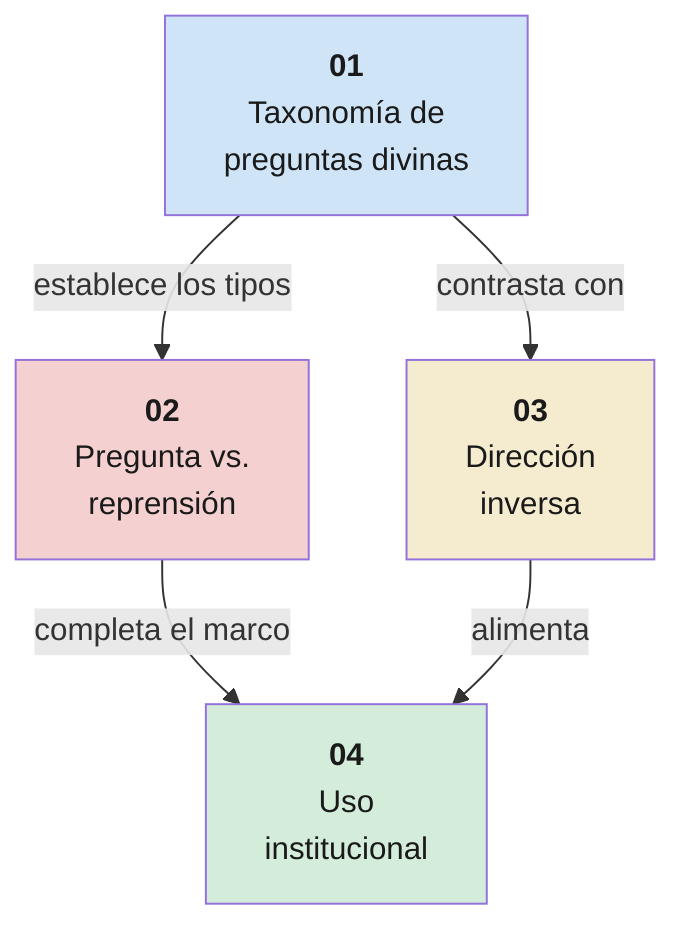

# Preguntas pedagógicas divinas — panorama

**Territorio:** El uso deliberado de la pregunta como método de enseñanza divino a lo largo de todas las escrituras y su adopción institucional en la Iglesia. Este dossier panorámico orienta y conecta los cuatro dossiers específicos que cubren el territorio en profundidad.

---

## Estructura del territorio

El territorio se divide en cuatro subtemas, cada uno con su propio dossier:

| # | Dossier | Territorio | Pregunta central |
|---|---------|------------|------------------|
| 01 | [Taxonomía de preguntas divinas](0009-dp01-taxonomia-preguntas.md) | Los tipos de pregunta que Dios usa en las escrituras | ¿Cuántos tipos distintos de pregunta usa el Señor y con qué propósito pedagógico cada uno? |
| 02 | [Pregunta vs. reprensión directa](0009-dp02-pregunta-vs-represion.md) | Los dos registros de la comunicación divina | ¿Cuándo pregunta el Señor y cuándo reprende directamente? ¿Qué determina cada registro? |
| 03 | [Dirección inversa: el hombre pregunta a Dios](0009-dp03-direccion-inversa.md) | Las tres modalidades de pregunta ascendente | ¿Qué sucede cuando el ser humano dirige preguntas a Dios y qué tipos de respuesta obtiene? |
| 04 | [Uso institucional y pedagógico](0009-dp04-uso-institucional.md) | Manuales, conferencia general, pedagogía restauracionista | ¿Cómo ha codificado la Iglesia el método de preguntas del Salvador para la enseñanza moderna? |

## Secuencia narrativa

- **dp01** es la base: cataloga exhaustivamente los tipos de pregunta. Sin él, los demás dossiers carecen de vocabulario compartido.
- **dp02** añade la segunda columna del análisis: el Señor no solo pregunta, también reprende directamente, y las condiciones que activan cada registro son doctrinalmente significativas.
- **dp03** invierte la dirección: aquí es el hombre quien pregunta a Dios, con tres modalidades distintas (angustia, asombro, estudio).
- **dp04** cierra el arco mostrando cómo la Iglesia ha institucionalizado este patrón para la enseñanza contemporánea.

## Mapa de pasajes por dossier

### dp01 — Taxonomía

| Tipo de pregunta | Pasajes clave |
|-----------------|---------------|
| Confesión / autoconvicción | Génesis 3:9-13; 4:9-10 |
| Autoexamen | Alma 5:14-30 (~40 preguntas) |
| Reposicionamiento | 1 Reyes 19:9-13; Génesis 16:8 |
| Razonamiento moral | Jonás 4:4-11; Juan 8:7 |
| Corrección de fe | Marcos 9:21-24; Génesis 18:14 |
| Declaración de identidad/fe | Mateo 16:13-17; Juan 21:15-17 |
| Toma de conciencia | Lucas 8:45; Lucas 24:17-19 |
| Confrontación ética | DyC 50:13-16 |
| Comprensión progresiva | Alma 18:18-36 (13+ preguntas) |
| Reductio ad absurdum | Job 38:1-15 |
| Invitación a actuar | Abraham 3:27; 3 Nefi 17:7 |
| Pregunta retórica (apostólica) | Romanos 8:31-35 |
| Contrapregunta (parábola) | Lucas 10:25-37 |

### dp02 — Pregunta vs. reprensión

| Registro | Pasajes clave |
|----------|---------------|
| Pregunta (patrón dominante) | Todos los de dp01 |
| Reprensión directa | Mateo 23:13-36 (siete ayes); Mateo 21:12-13 (templo); Mateo 16:23 (Satanás); DyC 3:1-11; DyC 93:47-50; DyC 95:1-4 |

### dp03 — Dirección inversa

| Modalidad | Pasajes clave |
|-----------|---------------|
| Angustia | DyC 121:1-6 (cárcel de Liberty) |
| Asombro | Moisés 7:28-37 (Enoc ve llorar a Dios) |
| Estudio | DyC 77:1-15 (formato P/R único) |
| Desafío de identidad | Moisés 1:12-15 (Moisés a Satanás) |

### dp04 — Uso institucional

| Fuente | Material clave |
|--------|---------------|
| *Enseñar a la manera del Salvador* (2022) | Caps. 10-11, 13: preguntas como método central |
| Conferencia general | Ballard (oct 2001), Holland (oct 2012), Osguthorpe (oct 2012), Newman (abr 2021), Browning (oct 2024), McConkie (oct 2010), Judd (oct 2007), Soares (abr 2019) |
| Manual misional histórico | *Missionary Guide* (1988, en corpus EN), cap. 7 «Find Out»: ancestro del método de preguntas misional |
| Manual institucional | *Teaching No Greater Call* (en corpus, cap. 16 central), *Predicad Mi Evangelio* 2023 (en corpus, cap. 10 central) |
| Académicos SUD | Packer, *Teach Ye Diligently* (pendiente de corpus) |

## Dossiers contiguos

| Territorio | Relación | Nota |
|------------|----------|------|
| 0001 — Vida preterrenal | contiene ejemplo | Abraham 3:27 — la pregunta de invitación a actuar en el concilio |
| (Futuro) Parábolas del Salvador | se solapa parcialmente | Lucas 10 usa la pregunta como marco para la parábola; las parábolas merecen territorio propio |
| (Futuro) Revelación personal | complementa | dp03 (dirección inversa) conecta con cómo se busca y recibe revelación |
| (Futuro) Pedagogía del hogar | aplica | dp04 (uso institucional) se extiende al hogar como aula |

## Lagunas del panorámico

- *Teaching No Greater Call* ya en corpus (bilingüe). *Missionary Guide* (1988) ya en corpus (EN, 17 caps). Material pendiente: *Teach Ye Diligently* (Packer), artículos Ensign/RSC sobre preguntas, *Uniform System for Teaching the Gospel* (1986, charlas misionales con tipos de pregunta en el margen).
- Preguntas pedagógicas en el Antiguo Testamento profético (Isaías, Jeremías, Ezequiel) — requieren investigación adicional.
- El papel de las preguntas en las ordenanzas del templo — no documentable públicamente, pero doctrinalmente significativo.
- Análisis cuantitativo: ¿cuántas preguntas registra cada volumen canónico? Una contabilización exhaustiva podría revelar patrones adicionales.

---

**Fuentes citadas**

- Escrituras: Génesis, 1 Reyes, Jonás, Job, Mateo, Marcos, Lucas, Juan, Romanos, Alma, 3 Nefi, DyC, Moisés, Abraham
- *Missionary Guide: Training for Missionaries* (1988), caps. 5, 7, 9
- *Enseñar a la manera del Salvador* (2022), caps. 10, 11, 13
- Discursos de conferencia general: Ballard (oct 2001), Holland (oct 2012), Osguthorpe (oct 2009, oct 2012), Newman (abr 2021), Browning (oct 2024), McConkie (oct 2010), Judd (oct 2007), Soares (abr 2019), Richardson (oct 2011), Oaks (oct 1999)
