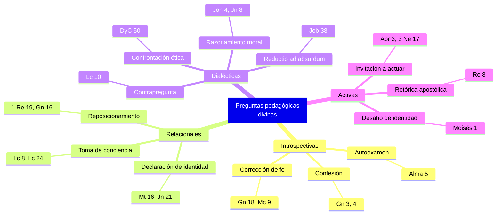

# Taxonomía de preguntas pedagógicas divinas en las escrituras

**Territorio:** Los distintos tipos de pregunta que Dios, Cristo y los profetas usan como herramienta de enseñanza deliberada en los textos canónicos. Este dossier cataloga exhaustivamente cada tipo, con sus pasajes ancla y su función pedagógica.

**Pregunta central:** ¿Cuántos tipos distintos de pregunta usa el Señor y con qué propósito pedagógico cada uno?

---

## 1. Panorama

La pregunta no es un recurso casual en las escrituras: es el método de enseñanza dominante del Señor. Donde un maestro humano afirma, Dios pregunta. Esta elección es deliberada y consistente a lo largo de todos los volúmenes canónicos, desde el primer diálogo registrado en Génesis hasta la aparición del Cristo resucitado en 3 Nefi. El manual *Enseñar a la manera del Salvador* (2022) lo formula explícitamente: «¿Por qué cree que el Salvador enseñaba de esa manera, respondiendo a preguntas con invitaciones a escudriñar, meditar y descubrir?»

Este dossier identifica trece tipos funcionales de pregunta divina. No se trata de una clasificación literaria (retórica, abierta, cerrada) sino de una clasificación pedagógica: ¿qué pretende lograr la pregunta en quien la recibe? La taxonomía surge inductivamente de los textos, no de una teoría previa.

---

## 2. Escrituras clave

### 2.1 Confesión y autoconvicción

La pregunta busca que el interlocutor articule por sí mismo lo que ya sabe pero no ha confrontado. Dios conoce la respuesta antes de preguntar; la pregunta no es para Él, sino para quien responde.

> Y llamó Jehová Dios al hombre y le dijo: ¿Dónde estás?
> Y él respondió: Oí tu voz en el huerto, y tuve miedo, porque estaba desnudo; y me escondí.
> Y le dijo: ¿Quién te ha dicho que estabas desnudo? ¿Has comido del árbol del cual yo te mandé que no comieses?
> Y el hombre respondió: La mujer que me diste por compañera me dio del árbol, y yo comí.
> Entonces Jehová Dios dijo a la mujer: ¿Qué es lo que has hecho? Y dijo la mujer: La serpiente me engañó, y comí. (Génesis 3:9-13)

Cada pregunta obliga a Adán y Eva a verbalizar su condición. «¿Dónde estás?» no es una pregunta de ubicación geográfica sino de ubicación espiritual. La secuencia de tres preguntas forma un embudo: de lo general (¿dónde estás?) a lo específico (¿has comido?).

La misma estructura se repite con Caín, intensificada porque la falta es mayor:

> Y Jehová dijo a Caín: ¿Dónde está Abel, tu hermano? Y él respondió: No sé. ¿Soy yo acaso guarda de mi hermano?
> Y él le dijo: ¿Qué has hecho? La voz de la sangre de tu hermano clama a mí desde la tierra. (Génesis 4:9-10)

A diferencia de Adán, que responde con evasión parcial, Caín miente. La segunda pregunta — «¿Qué has hecho?» — ya no espera confesión; funciona como puente hacia la sentencia. Pero Dios aún pregunta antes de sentenciar.

### 2.2 Autoexamen

La pregunta no busca una respuesta verbal dirigida a Dios, sino que el oyente se examine a sí mismo. A diferencia de la confesión (donde el interlocutor tiene algo que confesar), el autoexamen se dirige a personas que pueden estar en buen estado pero necesitan verificar.

El caso más extenso del canon está en Alma 5, donde Alma lanza aproximadamente cuarenta preguntas consecutivas a los miembros de la iglesia en Zarahemla:

> Y ahora os pregunto, hermanos míos de la iglesia: ¿Habéis nacido espiritualmente de Dios? ¿Habéis recibido su imagen en vuestros rostros? ¿Habéis experimentado este potente cambio en vuestros corazones?
> ¿Ejercéis la fe en la redención de aquel que os creó? ¿Miráis hacia adelante con el ojo de la fe y veis este cuerpo mortal levantado en inmortalidad, y esta corrupción levantada en incorrupción, para presentaros ante Dios y ser juzgados de acuerdo con las obras que se han hecho en el cuerpo mortal?
> Os digo: ¿Podéis imaginaros oír la voz del Señor en aquel día, diciéndoos: Venid a mí, benditos, porque, he aquí, vuestras obras han sido obras de rectitud sobre la faz de la tierra? (Alma 5:14-16)

Las preguntas progresan desde lo doctrinal («¿Habéis nacido espiritualmente?») hasta lo personal y concreto:

> ¿Habéis caminado, conservándoos irreprensibles delante de Dios? Si os tocase morir en este momento, ¿podríais decir, dentro de vosotros, que habéis sido suficientemente humildes? ¿que vuestros vestidos han sido lavados y blanqueados mediante la sangre de Cristo, que vendrá para redimir a su pueblo de sus pecados? (Alma 5:27)

Y de ahí a lo social:

> He aquí, digo: ¿Hay entre vosotros quien no esté despojado de la envidia? Os digo que este no está preparado; y quisiera que se preparase pronto, porque la hora está cerca, y no sabe cuándo llegará el momento; porque tal persona no se halla sin culpa.
> Y además, os digo: ¿Hay entre vosotros quien se burle de su hermano, o que acumule persecuciones sobre él? (Alma 5:29-30)

La estructura es notable: ninguna pregunta tiene respuesta externa. Cada una es un espejo.

### 2.3 Reposicionamiento

La pregunta interrumpe una narrativa de autocompasión o huida para reubicar al interlocutor en su misión original.

El ángel reposiciona a Agar cuando huye de Sarai:

> Y le dijo: Agar, sierva de Sarai, ¿de dónde vienes tú y a dónde vas? Y ella respondió: Huyo de delante de Sarai, mi señora.
> Y le dijo el ángel de Jehová: Vuélvete a tu señora y ponte sumisa bajo su mano. (Génesis 16:8-9)

La pregunta tiene dos partes (de dónde / a dónde), forzando a Agar a articular que no tiene destino — solo huye de algo.

El caso más elaborado es Elías en la cueva de Horeb, donde Dios repite la misma pregunta antes y después de la teofanía:

> Y allí se metió en una cueva, donde pasó la noche. Y vino a él la palabra de Jehová, y le dijo: ¿Qué haces aquí, Elías?
> Y él respondió: He sentido un vivo celo por Jehová Dios de los ejércitos, porque los hijos de Israel han abandonado tu convenio, han derribado tus altares y han matado a espada a tus profetas; y solamente yo he quedado, y me buscan para quitarme la vida. (1 Reyes 19:9-10)

Elías repite verbatim la misma respuesta ambas veces (vv. 10 y 14). Lo que cambia es lo que sucede entre ambas: Dios no estaba en el viento, ni en el terremoto, ni en el fuego, sino en «una voz apacible y delicada» (v. 12). La pregunta repetida, idéntica, funciona como marco para que la teofanía misma responda lo que las palabras de Elías no pueden.

### 2.4 Razonamiento moral

La pregunta guía al interlocutor a descubrir por sí mismo un principio ético que, enunciado directamente, podría rechazar.

Jonás 4 es el caso paradigmático. Dios construye una lección objetiva (la calabacera) y luego usa preguntas para que Jonás conecte los puntos:

> Y Jehová le respondió: ¿Haces tú bien en enojarte tanto? (Jonás 4:4)

Jonás no responde esta primera vez. Dios entonces crea la situación de la calabacera y repregunta:

> Entonces dijo Dios a Jonás: ¿Tanto te enojas por la calabacera? Y él respondió: Mucho me enojo, hasta la muerte.
> Y dijo Jehová: Tuviste tú lástima de la calabacera, en la cual no trabajaste ni tú la hiciste crecer, que en espacio de una noche nació y en espacio de otra noche pereció.
> ¿Y no tendré yo piedad de Nínive, aquella gran ciudad donde hay más de ciento veinte mil personas que no saben discernir entre su mano derecha y su mano izquierda, y muchos animales? (Jonás 4:9-11)

La pregunta final es un argumento *a fortiori*: si tú lloras por una planta que no creaste, ¿no lloraré yo por 120.000 personas que sí creé? El libro termina con la pregunta abierta. No hay respuesta de Jonás — el lector queda como interlocutor.

La mujer tomada en adulterio sigue la misma lógica:

> Y como insistieron en preguntarle, se enderezó y les dijo: El que de entre vosotros esté sin pecado sea el primero en arrojar la piedra contra ella. (Juan 8:7)

Aunque no es una pregunta gramatical, funciona como tal: obliga a cada acusador a evaluar su propia condición moral. La segunda pregunta, dirigida a la mujer, cierra con gracia:

> Mujer, ¿dónde están los que te acusaban? ¿Ninguno te ha condenado?
> Y ella dijo: Ninguno, Señor. Entonces Jesús le dijo: Ni yo te condeno; vete, y no peques más. (Juan 8:10-11)

### 2.5 Corrección de fe

La pregunta confronta una limitación en la fe del interlocutor y la reorienta hacia lo posible.

Cuando Sara ríe ante la promesa de un hijo en su vejez, Dios responde con una pregunta que es al mismo tiempo reproche y enseñanza:

> Entonces Jehová dijo a Abraham: ¿Por qué se ha reído Sara, diciendo: Será cierto que he de dar a luz siendo ya vieja?
> ¿Hay para Dios alguna cosa difícil? Al tiempo señalado volveré a ti, según el tiempo de la vida, y Sara tendrá un hijo. (Génesis 18:13-14)

La segunda pregunta — «¿Hay para Dios alguna cosa difícil?» — no espera respuesta. Es la corrección misma, formulada como pregunta para que Sara la internalice en lugar de recibirla como declaración externa.

El padre del joven endemoniado en Marcos 9 exhibe la misma dinámica:

> Y Jesús preguntó al padre: ¿Cuánto tiempo hace que le sucede esto? Y él dijo: Desde niño.
> Y muchas veces le echa al fuego y al agua para matarle; pero si tú puedes hacer algo, ¡ten misericordia de nosotros y ayúdanos!
> Y Jesús le dijo: Si puedes creer, al que cree todo le es posible.
> Y de inmediato el padre del muchacho clamó, diciendo: Creo; ayuda mi incredulidad. (Marcos 9:21-24)

La primera pregunta («¿Cuánto tiempo?») parece informativa, pero su efecto es hacer que el padre verbalice la desesperación acumulada. La respuesta de Jesús — «Si puedes creer» — devuelve la condición al padre: el obstáculo no es la capacidad de Dios sino la fe de quien pide.

### 2.6 Declaración de identidad y fe

La pregunta está diseñada para provocar una declaración que el interlocutor necesita articular en voz alta.

El ejemplo más conocido es Cesarea de Filipo:

> Y al llegar Jesús a la región de Cesarea de Filipo, preguntó a sus discípulos, diciendo: ¿Quién dicen los hombres que es el Hijo del Hombre?
> Y ellos dijeron: Unos, Juan el Bautista; y otros, Elías; y otros, Jeremías o alguno de los profetas.
> Él les dijo: Y vosotros, ¿quién decís que soy yo?
> Respondió Simón Pedro y dijo: ¡Tú eres el Cristo, el Hijo del Dios viviente!
> Entonces, respondiendo Jesús, le dijo: Bienaventurado eres, Simón hijo de Jonás, porque no te lo reveló carne ni sangre, sino mi Padre que está en los cielos. (Mateo 16:13-17)

La estructura en dos movimientos es pedagógicamente deliberada: primero una pregunta sobre la opinión ajena (segura, sin riesgo), luego el giro personal: «Y vosotros, ¿quién decís que soy yo?» La segunda pregunta no admite refugio en la opinión pública.

La triple pregunta a Pedro después de la resurrección sigue la misma función, intensificada por el contexto de la triple negación:

> Jesús le dijo a Simón Pedro: Simón hijo de Jonás, ¿me amas más que estos? Pedro le contestó: Sí, Señor, tú sabes que te amo. Él le dijo: Apacienta mis corderos.
> Volvió a decirle la segunda vez: Simón hijo de Jonás, ¿me amas? Le respondió: Sí, Señor, tú sabes que te amo. Le dijo: Apacienta mis ovejas.
> Le dijo la tercera vez: Simón hijo de Jonás, ¿me amas? Se entristeció Pedro de que le dijese por tercera vez: ¿Me amas?, y le dijo: Señor, tú sabes todas las cosas; tú sabes que te amo. Jesús le dijo: Apacienta mis ovejas. (Juan 21:15-17)

Cada pregunta produce una declaración y una comisión. Pedro necesita declarar tres veces lo que tres veces negó.

### 2.7 Toma de conciencia

La pregunta hace visible algo que el interlocutor no ha percibido, o que la multitud no ha notado.

> Entonces Jesús dijo: ¿Quién es el que me ha tocado? Y negando todos, dijo Pedro y los que estaban con él: Maestro, la multitud te aprieta y oprime, y preguntas: ¿Quién es el que me ha tocado?
> Y Jesús dijo: Alguien me ha tocado, porque yo he percibido que ha salido poder de mí.
> Entonces, cuando la mujer vio que no había pasado inadvertida, vino temblando y, postrándose delante de él, le declaró delante de todo el pueblo por qué causa le había tocado y cómo al instante había sido sanada.
> Y él le dijo: Hija, tu fe te ha sanado; ve en paz. (Lucas 8:45-48)

Jesús sabía quién le había tocado. La pregunta no busca información: busca que la mujer se haga visible. Su fe era real pero secreta; la pregunta la convierte en testimonio público.

En el camino a Emaús, la misma dinámica opera sobre los discípulos:

> Y les dijo: ¿Qué pláticas son estas que tenéis entre vosotros mientras camináis, estando tristes?
> [...]
> Entonces él les dijo: ¿Qué cosas? (Lucas 24:17, 19)

La primera pregunta abre espacio narrativo; la segunda («¿Qué cosas?») invita a los discípulos a contar los hechos — y al contarlos, a procesar su propio dolor antes de recibir la explicación.

### 2.8 Confrontación ética

La pregunta confronta una desviación práctica, no teórica. A diferencia del razonamiento moral (donde el interlocutor necesita descubrir un principio), la confrontación ética señala una incongruencia entre lo que el interlocutor ya sabe y lo que hace.

> Por tanto, yo, el Señor, os hago esta pregunta: ¿A qué se os ordenó?
> A predicar mi evangelio por el Espíritu, sí, el Consolador que fue enviado para enseñar la verdad.
> Y entonces recibisteis espíritus que no pudisteis comprender, y los recibisteis como si hubieran sido de Dios; ¿y se os puede justificar en esto?
> He aquí, vosotros mismos contestaréis esta pregunta; sin embargo, seré misericordioso con vosotros; el que de entre vosotros es débil será hecho fuerte de aquí en adelante. (DyC 50:13-16)

El patrón es notable: el Señor formula la pregunta, da Él mismo la respuesta correcta («a predicar mi evangelio por el Espíritu»), y luego pregunta si lo que hicieron es justificable. Y la frase clave es «vosotros mismos contestaréis esta pregunta» — la respuesta no viene del cielo; la conciencia del receptor es el juez.

### 2.9 Comprensión progresiva

La pregunta va construyendo el entendimiento paso a paso, adaptando cada nueva pregunta a lo que el interlocutor acaba de demostrar que entiende.

El diálogo entre Ammón y el rey Lamoni es el ejemplo más extenso en toda la escritura restauracionista. Ammón usa más de trece preguntas para llevar a un rey pagano desde la ignorancia total de Dios hasta la conversión:

> Y dijo Ammón: ¿Escucharás mis palabras, si te digo mediante qué poder hago estas cosas? Esto es lo que de ti deseo. (Alma 18:22)

Primero asegura disposición. Luego:

> Y Ammón empezó a hablarle osadamente, y le dijo: ¿Crees que hay un Dios?
> Y él respondió, y le dijo: Ignoro lo que eso significa.
> Y entonces dijo Ammón: ¿Crees tú que existe un Gran Espíritu?
> Y él contestó: Sí.
> Y dijo Ammón: Este es Dios. (Alma 18:24-28)

Ammón detecta que «Dios» no significa nada para Lamoni, pero «Gran Espíritu» sí. Reformula la pregunta usando el vocabulario de su interlocutor. Cada respuesta de Lamoni determina la siguiente pregunta de Ammón:

> Y dijo de nuevo Ammón: ¿Crees que este Gran Espíritu, que es Dios, creó todas las cosas que hay en el cielo y en la tierra?
> Y él dijo: Sí, creo que ha creado todas las cosas que hay sobre la tierra; mas no sé de los cielos.
> Y le dijo Ammón: El cielo es un lugar donde moran Dios y todos sus santos ángeles.
> Y el rey Lamoni dijo: ¿Está por encima de la tierra? (Alma 18:28-31)

La conversación progresa: existencia de Dios → creación → cielo → omnisciencia → envío divino → plan de redención. El resultado final:

> Y sucedió que después que hubo dicho todas estas cosas, y las explicó al rey, este creyó todas sus palabras;
> y empezó a clamar al Señor, diciendo: ¡Oh Señor, ten misericordia! (Alma 18:40-41)

### 2.10 Reductio ad absurdum

La pregunta no espera respuesta — espera silencio. Su propósito es mostrar la insignificancia del interlocutor frente a la realidad que está cuestionando.

Job 38 es el caso puro. Dios habla «desde un torbellino» con una secuencia aplastante de preguntas:

> ¿Quién es ese que oscurece el consejo con palabras sin conocimiento?
> Ahora ciñe como hombre tus lomos; yo te preguntaré, y tú me lo harás saber.
> ¿Dónde estabas tú cuando yo fundaba la tierra? Házmelo saber, si tienes entendimiento.
> ¿Quién dispuso sus medidas, si lo sabes? ¿O quién extendió sobre ella cordel?
> ¿Sobre qué están fundadas sus bases? ¿O quién puso su piedra angular,
> cuando alababan todas las estrellas del alba, y se regocijaban todos los hijos de Dios? (Job 38:2-7)

Las preguntas no buscan autoexamen, confesión ni comprensión progresiva. Buscan humildad: el reconocimiento de que la perspectiva de Job es radicalmente incompleta. Las preguntas continúan durante cuatro capítulos enteros (38-41), recorriendo toda la creación.

### 2.11 Invitación a actuar

La pregunta abre espacio para que el interlocutor ofrezca voluntariamente lo que Dios no impone.

En el concilio preterrenal:

> Y el Señor dijo: ¿A quién enviaré? Y respondió uno semejante al Hijo del Hombre: Heme aquí; envíame. Y otro contestó, y dijo: Heme aquí; envíame a mí. Y el Señor dijo: Enviaré al primero. (Abraham 3:27)

La pregunta no es retórica. Dios espera respuestas y actúa en función de ellas. La estructura «¿A quién enviaré?» → «Heme aquí» reproduce el patrón de Isaías 6:8, donde el mismo formato opera con el profeta.

El Cristo resucitado ante los nefitas usa una invitación disfrazada de pregunta:

> ¿Tenéis enfermos entre vosotros? Traedlos aquí. ¿Tenéis cojos, o ciegos, o lisiados, o mutilados, o leprosos, o atrofiados, o sordos, o quienes estén afligidos de manera alguna? Traedlos aquí y yo los sanaré, porque tengo compasión de vosotros; mis entrañas rebosan de misericordia. (3 Nefi 17:7)

La pregunta no busca información: Cristo ve a la multitud. Es una invitación a actuar — a traer, a participar en la sanación — formulada como pregunta para preservar el albedrío de la respuesta.

### 2.12 Pregunta retórica apostólica

A diferencia de los tipos anteriores (donde Dios o Cristo es quien pregunta), aquí un profeta o apóstol usa preguntas en cascada para generar convicción en la audiencia.

Pablo en Romanos 8 construye un crescendo retórico:

> ¿Pues qué diremos a esto? Si Dios es por nosotros, ¿quién contra nosotros?
> El que no escatimó ni a su propio Hijo, sino que le entregó por todos nosotros, ¿cómo no nos dará también con él todas las cosas?
> ¿Quién acusará a los escogidos de Dios? Dios es el que justifica.
> ¿Quién es el que condenará? Cristo es el que murió; más aun, el que también resucitó, quien además está a la diestra de Dios, el que también intercede por nosotros.
> ¿Quién nos apartará del amor de Cristo? ¿Tribulación, o angustia, o persecución, o hambre, o desnudez, o peligro, o espada? (Romanos 8:31-35)

Cada pregunta contiene su propia respuesta implícita. La acumulación produce certeza progresiva, no duda.

### 2.13 Contrapregunta y parábola

La pregunta responde a otra pregunta, desplazando el marco de la conversación para que el interlocutor descubra la respuesta por sí mismo.

El buen samaritano es el ejemplo canónico. Un intérprete de la ley pregunta «¿qué debo hacer para heredar la vida eterna?» y Jesús devuelve la pregunta:

> Y él le dijo: ¿Qué está escrito en la ley? ¿Cómo lees? (Lucas 10:26)

El intérprete responde correctamente. Luego, queriendo justificarse, hace una segunda pregunta: «¿Y quién es mi prójimo?» (v. 29). En lugar de definir «prójimo», Jesús cuenta la parábola y cierra con una contrapregunta que invierte los términos:

> ¿Quién, pues, de estos tres te parece que fue el prójimo de aquel que cayó en manos de los ladrones?
> Y él dijo: El que tuvo misericordia de él. Entonces Jesús le dijo: Ve y haz tú lo mismo. (Lucas 10:36-37)

La pregunta original era «¿quién es mi prójimo?» (quién merece mi atención). La contrapregunta de Jesús invierte la dirección: no quién merece que yo sea su prójimo, sino quién actúa como prójimo. El marco moral cambia de pasivo a activo.

### 2.14 Desafío de identidad

La pregunta confronta una identidad falsa o una pretensión ilegítima, forzando al oponente a medirse contra la realidad.

Moisés ante Satanás:

> Y sucedió que Moisés miró a Satanás, y le dijo: ¿Quién eres tú? Porque, he aquí, yo soy un hijo de Dios, a semejanza de su Unigénito. ¿Y dónde está tu gloria, para que te adore?
> Porque he aquí, no hubiera podido ver a Dios, a menos que su gloria me hubiera cubierto y hubiera sido transfigurado ante él. Pero yo puedo verte a ti según el hombre natural. ¿No es verdad esto?
> Bendito sea el nombre de mi Dios, porque su Espíritu no se ha apartado de mí por completo, y por otra parte, ¿dónde está tu gloria?, porque para mí es tinieblas. (Moisés 1:13-15)

Moisés lanza cuatro preguntas en tres versículos: «¿Quién eres?», «¿Dónde está tu gloria?», «¿No es verdad esto?», «¿Dónde está tu gloria?» La repetición de la segunda pregunta es deliberada: Satanás no puede responderla.

---

## 3. Voces proféticas

El manual *Enseñar a la manera del Salvador* (2022) formula directamente la pregunta metacognitiva que este dossier investiga:

> «¿Por qué cree que el Salvador enseñaba de esa manera, respondiendo a preguntas con invitaciones a escudriñar, meditar y descubrir?» (*Enseñar a la manera del Salvador*, cap. 10)

El élder David A. Bednar, citado en el mismo manual, eleva la pregunta a la categoría de instrumento del Espíritu:

> «¿Qué preguntas inspiradas puedo hacer que, si ellos están dispuestos a responder, comenzarán a invitar al Espíritu Santo a sus vidas?» (élder David A. Bednar, en *Enseñar a la manera del Salvador*, cap. 11)

El élder M. Russell Ballard identificó las preguntas como una de las «técnicas de enseñanza favoritas» de Jesús:

> «Dos de las técnicas de enseñanza favoritas de Jesús eran hacer preguntas y contar historias, o parábolas.» (élder M. Russell Ballard, «Doctrina de la inclusión», conferencia general, octubre de 2001)

El élder Jeffrey R. Holland analizó la triple pregunta a Pedro como un acto de restauración deliberada:

> Holland conecta las tres preguntas de Juan 21 con las tres negaciones de Juan 18: cada «¿me amas?» sana una negación. (élder Jeffrey R. Holland, «El primer y grande mandamiento», conferencia general, octubre de 2012)

El presidente Dieter F. Uchtdorf afirmó el valor de la pregunta como acto de crecimiento espiritual:

> «Hacer preguntas no es señal de debilidad sino el acto precursor del crecimiento.» (presidente Dieter F. Uchtdorf, citado por Tracy Y. Browning, conferencia general, octubre de 2024)

El élder Ulisses Soares usó la historia del eunuco etíope (Hechos 8) como modelo de la dirección inversa — el hombre que pregunta y recibe enseñanza:

> Soares presentó la pregunta del eunuco («¿Cómo puedo entender, si alguno no me enseña?») como paradigma de la humildad que precede a la comprensión. (élder Ulisses Soares, «¿Cómo puedo entender?», conferencia general, abril de 2019)

El élder Daniel K. Judd usó DyC 50:13 como ejemplo del Señor que pregunta en lugar de declarar:

> Judd presentó la frase «yo, el Señor, os hago esta pregunta» como paradigma de la enseñanza divina: incluso cuando el Señor conoce la respuesta, prefiere preguntar. (élder Daniel K. Judd, «Nutridos por la buena palabra de Dios», conferencia general, octubre de 2007)

---

## 4. Voces académicas y otros autores

*Pendiente.* Los materiales académicos SUD (Packer, *Teach Ye Diligently*; artículos de BYU/RSC) están identificados pero aún no incorporados al corpus. Ver sección 8 (Lagunas).

---

## 5. Diagrama

## 6. Conexiones

| Hacia | Tipo | Nota |
|-------|------|------|
| [dp00 — Panorámico](0009-dp00-preguntas-pedagogicas.md) | pertenece a | Dossier panorámico del territorio |
| [dp02 — Pregunta vs. reprensión](0009-dp02-pregunta-vs-represion.md) | contrasta con | dp01 cataloga los tipos de pregunta; dp02 los contrasta con la reprensión directa |
| [dp03 — Dirección inversa](0009-dp03-direccion-inversa.md) | complementa | dp01 cubre Dios→hombre; dp03 cubre hombre→Dios |
| [dp04 — Uso institucional](0009-dp04-uso-institucional.md) | alimenta | La taxonomía de dp01 es la base que dp04 muestra institucionalizada |
| 0001-dp02 — Concilio y guerra | contiene ejemplo | Abraham 3:27 (invitación a actuar) |
| (Futuro) Parábolas del Salvador | se solapa | Lucas 10 usa contrapregunta como marco para la parábola |

## 7. Ilustraciones

### La secuencia de preguntas en el huerto

> Dios no dijo a Adán «Sé que comiste del fruto». Lo llevó, pregunta a pregunta, a decirlo él mismo. «¿Dónde estás?» «¿Quién te ha dicho que estabas desnudo?» «¿Has comido?» Tres preguntas, cada una más específica que la anterior. No era Dios quien necesitaba saber. Era Adán quien necesitaba decir.

— Síntesis basada en Génesis 3:9-13
**Objetivo:** clarify | **Forma:** narrativa | **Parafraseada:** sí

### El libro que termina en pregunta

> Jonás es el único libro de las escrituras que termina con una pregunta de Dios sin respuesta registrada. «¿Y no tendré yo piedad de Nínive?» El silencio de Jonás no es un error editorial: es la invitación al lector a contestar donde Jonás no pudo.

— Síntesis basada en Jonás 4:11
**Objetivo:** attention | **Forma:** observación literaria | **Parafraseada:** sí

### Cuarenta preguntas sin una sola respuesta externa

> Alma no espera que nadie levante la mano. Sus aproximadamente cuarenta preguntas no tienen destinatario externo: cada oyente es a la vez jurado, testigo y acusado. No hay un «amén» al final — solo el peso de la introspección acumulada.

— Síntesis basada en Alma 5:14-30
**Objetivo:** resonate | **Forma:** reflexión | **Parafraseada:** sí

## 8. Lagunas y preguntas abiertas

- **Material recién incorporado:** *Teaching No Greater Call* ya está en el corpus (bilingüe, ~95 capítulos por idioma). El cap. 16 contiene una taxonomía propia de tipos de pregunta (sí/no, hechos, reflexión, aplicación, meditación silenciosa) que complementa la taxonomía escritural de este dossier. Analizado en dp04.
- **Material pendiente de corpus:** *Teach Ye Diligently* (Packer), artículos de BYU/RSC sobre preguntas pedagógicas, capítulo 31 del manual CES. Chips de descarga fueron creados en la sesión de investigación.
- **Antiguo Testamento profético:** Las preguntas de Isaías, Jeremías y Ezequiel (preguntas proféticas a Israel, no de Dios al individuo) no fueron investigadas exhaustivamente. Podrían constituir un subtipo adicional.
- **Preguntas en las ordenanzas:** El templo usa preguntas como parte integral de las ordenanzas. Por razones de sacralidad no se documentan públicamente, pero su existencia es doctrinalmente significativa.
- **Análisis cuantitativo:** No se intentó un conteo exhaustivo de todas las preguntas divinas en cada volumen canónico. Un análisis así revelaría la distribución de tipos por libro.
- **Tipo híbrido:** Algunos pasajes participan de más de un tipo. La clasificación no es mutuamente excluyente; un pasaje puede servir simultáneamente como confesión y corrección de fe (ej: Génesis 18:13-14 corrige la fe de Sara pero también le pide reconocer su risa).
- **Éter 2:22-25:** El hermano de Jared recibe una pregunta devuelta en lugar de respuesta («¿Qué quieres que haga para que tengáis luz?»). Este pasaje fue mencionado en *Enseñar a la manera del Salvador* cap. 11 pero no fue leído directamente del corpus para este dossier. Debe incorporarse, probablemente como ejemplo de invitación a actuar o comprensión progresiva.

---

**Fuentes citadas**

- Génesis 3:9-13; 4:9-10; 16:8-9; 18:13-14
- 1 Reyes 19:9-15
- Jonás 4:1-11
- Job 38:1-18
- Mateo 16:13-17
- Marcos 9:19-25
- Lucas 8:43-48; 10:25-37; 24:17-25
- Juan 8:3-11; 21:5-17
- Romanos 8:31-38
- Alma 5:14-32; 18:17-41
- 3 Nefi 17:5-9
- DyC 50:12-16; 77:1-8
- Moisés 1:12-15
- Abraham 3:27
- *Enseñar a la manera del Salvador* (2022), caps. 10, 11
- Élder M. Russell Ballard, «Doctrina de la inclusión», conferencia general, octubre de 2001
- Élder Jeffrey R. Holland, «El primer y grande mandamiento», conferencia general, octubre de 2012
- Élder Russell T. Osguthorpe, «Un paso más cerca del Salvador», conferencia general, octubre de 2012
- Presidente Dieter F. Uchtdorf, citado por Tracy Y. Browning, conferencia general, octubre de 2024
- Élder David A. Bednar, en *Enseñar a la manera del Salvador*, cap. 11
- Élder Daniel K. Judd, «Nutridos por la buena palabra de Dios», conferencia general, octubre de 2007
- Élder Ulisses Soares, «¿Cómo puedo entender?», conferencia general, abril de 2019
