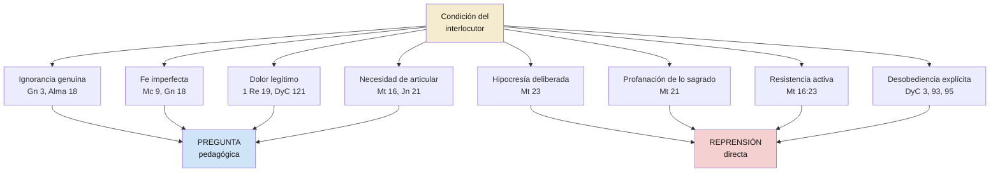

# Pregunta vs. reprensión directa — los dos registros de la comunicación divina

**Territorio:** Las condiciones que determinan cuándo el Señor usa preguntas pedagógicas y cuándo recurre a la reprensión directa. Este dossier contrasta ambos registros y busca las condiciones que activan cada uno.

**Pregunta central:** ¿Cuándo pregunta el Señor y cuándo reprende directamente? ¿Qué determina cada registro?

---

## 1. Panorama

Una investigación exhaustiva de las preguntas pedagógicas en las escrituras revela un hallazgo complementario: el Señor no siempre pregunta. Hay episodios donde abandona la pregunta y recurre a la declaración directa, la denuncia, la expulsión o la reprensión sin mediación. Afirmar que «el Señor no reprende, pregunta» es inexacto — el Señor tiene dos registros, y las condiciones que activan cada uno son doctrinalmente significativas.

La hipótesis que emerge del texto: la pregunta opera cuando hay disposición a aprender (aunque sea imperfecta, como en el padre del endemoniado), o cuando hay ignorancia genuina (como en Lamoni). La reprensión directa opera cuando hay hipocresía deliberada, profanación de lo sagrado o resistencia activa a la verdad ya conocida.

---

## 2. Escrituras clave

### 2.1 El registro de la pregunta: condiciones que lo activan

Los pasajes del registro de pregunta comparten ciertas condiciones en el interlocutor. Revisándolos transversalmente:

**Ignorancia o confusión genuina:** Adán y Eva no comprenden plenamente las consecuencias de su caída (Génesis 3). Lamoni no sabe qué es «Dios» (Alma 18). Los discípulos de Emaús están confundidos y dolidos (Lucas 24).

**Fe imperfecta pero real:** El padre del joven endemoniado cree, pero su fe no es suficiente — «Creo; ayuda mi incredulidad» (Marcos 9:24). Sara ríe, pero no por desafío sino por incredulidad ante lo imposible (Génesis 18).

**Dolor legítimo:** Elías huye por agotamiento, no por rebelión (1 Reyes 19). José Smith clama desde la prisión de Liberty (DyC 121).

**Necesidad de articular lo que ya se sabe:** Pedro necesita declarar tres veces su amor (Juan 21). Los discípulos necesitan ser confrontados con «Y vosotros, ¿quién decís que soy yo?» (Mateo 16).

En todos estos casos, el interlocutor es enseñable. La pregunta es el método del maestro que reconoce esa enseñabilidad.

### 2.2 El registro de la reprensión directa: condiciones que lo activan

**Hipocresía deliberada — los siete ayes (Mateo 23)**

Los escribas y fariseos no son ignorantes: conocen la ley mejor que nadie. Su falta no es falta de fe sino duplicidad — hacen lo opuesto de lo que enseñan. Jesús no los reprende con preguntas sino con declaraciones:

> ¡Ay de vosotros, escribas y fariseos, hipócritas!, porque cerráis el reino de los cielos delante de los hombres; pues ni vosotros entráis ni dejáis entrar a los que están entrando. (Mateo 23:13)

> ¡Ay de vosotros, escribas y fariseos, hipócritas!, porque sois semejantes a sepulcros blanqueados, que por fuera, a la verdad, se muestran hermosos, pero por dentro están llenos de huesos de muertos y de toda inmundicia. (Mateo 23:27)

> ¡Serpientes, generación de víboras! ¿Cómo escaparéis del juicio del infierno? (Mateo 23:33)

Hay preguntas intercaladas en el discurso (vv. 17, 19, 33), pero son retóricas acusatorias, no pedagógicas. No buscan que el interlocutor descubra algo; buscan que la audiencia entienda la gravedad.

Y sin embargo, el discurso termina con un lamento que revela que la reprensión no es abandono:

> ¡Jerusalén, Jerusalén, que matas a los profetas y apedreas a los que son enviados a ti! ¡Cuántas veces quise juntar a tus hijos, como la gallina junta sus polluelos debajo de las alas, y no quisiste! (Mateo 23:37)

**Profanación de lo sagrado — la limpieza del templo (Mateo 21)**

> Y entró Jesús en el templo de Dios y echó fuera a todos los que vendían y compraban en el templo; y volcó las mesas de los cambistas y las sillas de los que vendían palomas;
> y les dijo: Escrito está: Mi casa, casa de oración será llamada, pero vosotros la habéis hecho cueva de ladrones. (Mateo 21:12-13)

No hay pregunta previa. No hay invitación a reflexionar. La acción física (volcar mesas) precede a la declaración verbal. La condición activadora es la profanación de lo que es sagrado — el espacio del templo convertido en mercado.

**Resistencia activa a la verdad conocida — Pedro como tropiezo (Mateo 16)**

> Entonces él, volviéndose, dijo a Pedro: ¡Quítate de delante de mí, Satanás! Me eres tropiezo, porque no entiendes lo que es de Dios, sino lo que es de los hombres. (Mateo 16:23)

Esto ocurre minutos después de la confesión inspirada de Pedro en Cesarea de Filipo (la pregunta pedagógica más famosa del Evangelio). La transición es violenta: del «Bienaventurado eres» al «¡Quítate de delante de mí, Satanás!» en pocos versículos. Pedro no es hipócrita; se opone a la misión del Salvador por amor mal enfocado. Pero la gravedad de la oposición activa la reprensión.

**Desobediencia a mandamientos explícitos — DyC 3 a José Smith**

> He aquí, se te confiaron estas cosas, pero cuán estrictos fueron tus mandamientos; y recuerda también las promesas que te fueron hechas, si no los quebrantabas.
> Y he aquí, con cuánta frecuencia has transgredido los mandamientos y las leyes de Dios, y has seguido las persuasiones de los hombres.
> Pues he aquí, no debiste haber temido al hombre más que a Dios. (DyC 3:5-7)

José recibió mandamientos explícitos. No es ignorante de la voluntad de Dios — la conocía y cedió por temor al hombre. La reprensión es directa, pero incluye la puerta de regreso: «Arrepiéntete, pues, de lo que has hecho contrario al mandamiento que te di, y todavía eres escogido» (v. 10).

**Negligencia en responsabilidades conocidas — DyC 93 y 95**

> Ahora, de cierto le digo a mi siervo José Smith, hijo: No has guardado los mandamientos, y debes ser reprendido ante el Señor;
> es necesario que los de tu familia se arrepientan y abandonen algunas cosas, y que atiendan con mayor diligencia a tus palabras. (DyC 93:47-48)

> De cierto, así dice el Señor a vosotros a quienes amo, y a los que amo también disciplino para que les sean perdonados sus pecados, porque con la disciplina preparo un medio para librarlos de la tentación en todas las cosas, y yo os he amado.
> Es necesario, pues, que seáis disciplinados y quedéis reprendidos delante de mi faz;
> porque habéis cometido un pecado muy grave contra mí, al no haber considerado en todas las cosas el gran mandamiento que os he dado. (DyC 95:1-3)

Estas reprensiones en DyC son particularmente reveladoras porque el marco es explícito: «a los que amo también disciplino» (95:1). La reprensión no es opuesta al amor; es una manifestación distinta del mismo.

### 2.3 El caso intermedio: DyC 50

DyC 50 muestra un episodio donde ambos registros coexisten en la misma revelación. El Señor usa una pregunta («¿A qué se os ordenó?», v. 13) pero el tono es confrontativo. La pregunta tiene respuesta implícita; la pregunta es acusatoria. Y sin embargo, inmediatamente después: «seré misericordioso con vosotros; el que de entre vosotros es débil será hecho fuerte» (v. 16).

Este caso intermedio sugiere que los dos registros no son binarios sino un espectro: la pregunta puede endurecerse hacia la confrontación sin abandonar su forma interrogativa.

---

## 3. Voces proféticas

DyC 95:1 ofrece la declaración doctrinal más directa sobre la reprensión como expresión de amor:

> «A los que amo también disciplino para que les sean perdonados sus pecados, porque con la disciplina preparo un medio para librarlos de la tentación en todas las cosas.» (DyC 95:1)

El élder Daniel K. Judd (conferencia general, octubre de 2007) observó que el Señor prefiere preguntar incluso cuando conoce la respuesta, usando DyC 50:13 como paradigma. Sin embargo, el élder Judd no aborda los contraejemplos de reprensión directa — su observación describe el patrón dominante, no el único.

---

## 4. Voces académicas y otros autores

El presidente Boyd K. Packer abordó parcialmente este contraste en *Teach Ye Diligently* (1975). Su capítulo 11 («Cómo manejar preguntas muy difíciles») introduce el «principio de prerrequisitos»: la pregunta pedagógica solo funciona cuando el interlocutor tiene los cimientos necesarios. Cuando no los tiene — y no está dispuesto a adquirirlos — el maestro no puede satisfacerlo. La formulación del presidente Packer complementa la hipótesis de este dossier: la pregunta opera cuando hay disposición a aprender; la reprensión aparece cuando hay resistencia activa a la verdad conocida. Análisis completo en dp04, sección 4.1.

---

## 5. Diagrama

---

## 6. Conexiones

| Hacia | Tipo | Nota |
|-------|------|------|
| [dp00 — Panorámico](0009-dp00-preguntas-pedagogicas.md) | pertenece a | Dossier panorámico del territorio |
| [dp01 — Taxonomía](0009-dp01-taxonomia-preguntas.md) | complementa | dp01 cataloga los tipos de pregunta; dp02 contrasta con la reprensión |
| [dp03 — Dirección inversa](0009-dp03-direccion-inversa.md) | paralelo | Ambos examinan modalidades comunicativas entre Dios y el hombre |
| [dp04 — Uso institucional](0009-dp04-uso-institucional.md) | alimenta | dp02 muestra cuándo la pregunta NO es el método; dp04 puede abordar cómo la Iglesia enseña la reprensión justa |
| (Futuro) Dossier sobre disciplina eclesiástica | complementa | DyC 95:1 conecta la reprensión con el marco disciplinario más amplio |

## 7. Ilustraciones

### Del «bienaventurado» al «Satanás» en tres versículos

> En Mateo 16, Pedro recibe la más alta bendición del ministerio de Cristo — «Bienaventurado eres, Simón hijo de Jonás, porque no te lo reveló carne ni sangre, sino mi Padre que está en los cielos» — y tres versículos después, la reprensión más dura: «¡Quítate de delante de mí, Satanás!» No cambiaron los sentimientos de Jesús hacia Pedro. Cambió lo que Pedro estaba haciendo: de recibir revelación a obstaculizar la misión. El registro de comunicación del Señor cambia en función de lo que el interlocutor necesita, no de lo que el Señor siente.

— Síntesis basada en Mateo 16:17, 23
**Objetivo:** clarify | **Forma:** contraste narrativo | **Parafraseada:** sí

### La gallina y los polluelos

> El discurso de los siete ayes — el más duro de los Evangelios — no termina en condenación. Termina en lamento: «¡Cuántas veces quise juntar a tus hijos, como la gallina junta sus polluelos debajo de las alas, y no quisiste!» La reprensión más severa registrada en el Nuevo Testamento contiene, en su último aliento, la imagen más tierna del deseo de Dios por sus hijos.

— Síntesis basada en Mateo 23:37
**Objetivo:** resonate | **Forma:** reflexión | **Parafraseada:** sí

### «A los que amo también disciplino»

> DyC 95 abre con una declaración que desarma toda resistencia a la corrección: «A los que amo también disciplino». La reprensión no es la alternativa al amor; es otra de sus formas. El Señor no reprende a los que le son indiferentes — reprende a «vosotros a quienes amo».

— Síntesis basada en DyC 95:1
**Objetivo:** prove | **Forma:** reflexión doctrinal | **Parafraseada:** sí

## 8. Lagunas y preguntas abiertas

- **Patrón cuantitativo:** No se hizo un conteo exhaustivo de episodios de pregunta vs. reprensión. La impresión cualitativa es que las preguntas son mucho más frecuentes, pero un análisis cuantitativo lo confirmaría.
- **Reprensión en el Libro de Mormón:** Los casos de reprensión directa del Señor (no de profetas) en el Libro de Mormón no fueron investigados exhaustivamente. Los discursos de Jesucristo en 3 Nefi merecen un análisis separado.
- **¿Hay reprensión en la Perla de Gran Precio?** No se identificaron casos claros de reprensión directa de Dios en Moisés o Abraham. Esto podría indicar que estos textos privilegian el registro de pregunta, o simplemente que el corpus es más breve.
- **El papel de los profetas como voz de reprensión:** ¿Delega Dios la reprensión en sus profetas cuando el interlocutor directo es un pueblo? Los profetas del Antiguo Testamento (Isaías, Jeremías, Amós) usan extensamente la reprensión — ¿es un tercer patrón distinto?
- **Material incorporado:** *Teach Ye Diligently* (presidente Packer, EN, 18 caps) ya en corpus. Cap. 11 aborda parcialmente este contraste via el «principio de prerrequisitos». Análisis en dp04 §4.1.

---

**Fuentes citadas**

- Génesis 3:9-13; 18:13-14
- 1 Reyes 19:9-14
- Mateo 16:13-17, 22-23; 21:12-13; 23:13-39
- Marcos 9:21-24
- Lucas 24:17-25
- Juan 21:15-17
- Alma 18:22-41
- 3 Nefi 17:7
- DyC 3:1-11; 50:13-16; 93:47-50; 95:1-6; 121:1-7
- Élder Daniel K. Judd, «Nutridos por la buena palabra de Dios», conferencia general, octubre de 2007
- Presidente Boyd K. Packer, *Teach Ye Diligently* (1975), cap. 11
