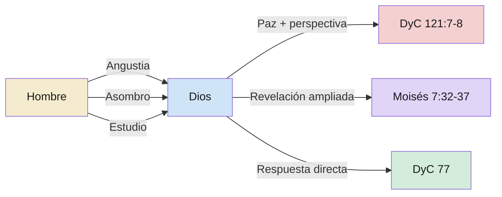

# Dirección inversa — el hombre pregunta a Dios

**Territorio:** Los episodios en las escrituras donde la dirección de la pregunta se invierte: en lugar de Dios preguntando al hombre, es el hombre quien dirige preguntas a Dios. Las tres modalidades de esta pregunta ascendente y las respuestas que obtiene.

**Pregunta central:** ¿Qué sucede cuando el ser humano dirige preguntas a Dios y qué tipos de respuesta obtiene?

---

## 1. Panorama

Los dossiers dp01 y dp02 analizan la comunicación descendente: Dios pregunta al hombre. Pero las escrituras registran también el movimiento inverso: el hombre que, desde su condición mortal, dirige preguntas a Dios. Estos episodios no son pedagógicos en el mismo sentido — el hombre no busca enseñar a Dios — pero son doctrinalmente significativos porque revelan qué tipo de preguntas Dios está dispuesto a responder y cómo responde según la modalidad de la pregunta.

Se identifican tres modalidades principales de pregunta ascendente, más un caso único sin paralelo.

---

## 2. Escrituras clave

### 2.1 Modalidad de angustia — el clamor sin respuesta inmediata

La pregunta surge del sufrimiento extremo. No es una pregunta intelectual sino existencial: ¿dónde está Dios cuando más se le necesita?

DyC 121 es el caso paradigmático. José Smith, encerrado en la cárcel de Liberty durante meses, clama al Señor con preguntas que son simultáneamente oración e imprecación:

> Oh Dios, ¿en dónde estás? ¿Y dónde está el pabellón que cubre tu morada oculta?
> ¿Hasta cuándo se detendrá tu mano, y tu ojo, sí, tu ojo puro, contemplará desde los cielos eternos los agravios de tu pueblo y de tus siervos, y penetrarán sus lamentos en tus oídos?
> Sí, oh Señor, ¿hasta cuándo sufrirán estas injurias y opresiones ilícitas, antes que tu corazón se ablande y tus entrañas se llenen de compasión por ellos? (DyC 121:1-3)

Tres preguntas, cada una más urgente. «¿En dónde estás?» recuerda a Génesis 3:9, pero invertida: allí es Dios quien busca al hombre; aquí es el hombre quien busca a Dios. «¿Hasta cuándo?» es la pregunta sálmica por excelencia (Salmos 13:1-2, 74:10, 89:46).

La respuesta de Dios no llega como contra-pregunta ni como explicación, sino como declaración de paz y perspectiva:

> Hijo mío, paz a tu alma; tu adversidad y tus aflicciones no serán más que por un breve momento;
> y entonces, si lo sobrellevas bien, Dios te exaltará; triunfarás sobre todos tus enemigos. (DyC 121:7-8)

La respuesta no contesta las preguntas formuladas. No dice dónde estaba Dios ni cuánto durará el sufrimiento. Da algo distinto: contexto temporal («un breve momento») y promesa condicional («si lo sobrellevas bien»).

Job exhibe la misma modalidad. Sus preguntas durante los capítulos 3-31 son clamor de angustia, y cuando Dios finalmente responde (cap. 38), no responde ninguna pregunta de Job. Responde con preguntas propias — el reductio ad absurdum analizado en dp01. La respuesta a la angustia de Job es perspectiva, no explicación.

### 2.2 Modalidad de asombro — la pregunta nacida de la reverencia

La pregunta no surge del dolor sino de la confrontación con algo incomprensible en la naturaleza de Dios.

Enoc ve llorar a Dios y queda perplejo:

> Y dijo Enoc al Señor: ¿Cómo es posible que tú llores, si eres santo, y de eternidad en eternidad?
> Y si fuera posible que el hombre pudiese contar las partículas de la tierra, sí, de millones de tierras como esta, no sería ni el principio del número de tus creaciones; y tus cortinas aún están desplegadas; y tú todavía estás allí, y tu seno está allí; y también eres justo; eres misericordioso y benévolo para siempre;
> y de todas tus creaciones has tomado a Sion a tu propio seno, de eternidad en eternidad; y nada sino paz, justicia y verdad es la habitación de tu trono; y la misericordia irá delante de tu faz y no tendrá fin; ¿cómo es posible que llores? (Moisés 7:29-31)

La pregunta de Enoc contiene su propia teología: enumera los atributos de Dios (santidad, eternidad, justicia, misericordia) como argumento de que un ser así no debería llorar. La pregunta es lógica — y precisamente por eso la respuesta la desarma.

La respuesta de Dios es una de las revelaciones más profundas del canon restauracionista:

> El Señor dijo a Enoc: He allí a estos, tus hermanos; son la obra de mis propias manos, y les di su conocimiento el día en que los creé; y en el Jardín de Edén le di al hombre su albedrío;
> y a tus hermanos he dicho, y también he dado mandamiento, que se amen el uno al otro, y que me prefieran a mí, su Padre, mas he aquí, no tienen afecto y aborrecen su propia sangre. (Moisés 7:32-33)

> Por consiguiente, puedo extender mis manos y abarcar todas las creaciones que he hecho; y mi ojo las puede traspasar también, y de entre toda la obra de mis manos jamás ha habido tan grande iniquidad como entre tus hermanos.
> Mas he aquí, sus pecados caerán sobre la cabeza de sus padres. Satanás será su padre, y miseria su destino; y todos los cielos llorarán sobre ellos, sí, toda la obra de mis manos; por tanto, ¿no han de llorar los cielos, viendo que estos han de sufrir? (Moisés 7:36-37)

Dios responde la pregunta de Enoc con una pregunta propia: «¿No han de llorar los cielos?» El llanto de Dios se revela como la consecuencia lógica del amor infinito confrontado con la iniquidad voluntaria. La pregunta de asombro recibe una respuesta que amplía la comprensión del que pregunta.

### 2.3 Modalidad de estudio — la pregunta deliberada que busca revelación

La pregunta no surge del sufrimiento ni del asombro sino de la investigación deliberada. El interlocutor se sienta, estudia y formula preguntas.

DyC 77 es el caso único en las escrituras: un formato literal de Pregunta/Respuesta. José Smith estudió el Apocalipsis de Juan y formuló quince preguntas. Dios respondió cada una directamente:

> Pregunta.– ¿Qué es el mar de vidrio del que habla Juan en el capítulo 4, versículo 6, del Apocalipsis?
> Respuesta.– Es la tierra en su estado santificado, inmortal y eterno. (DyC 77:1)

> P.– ¿Qué hemos de entender por los veinticuatro ancianos de los que habla Juan?
> R.– Hemos de entender que estos ancianos que Juan vio habían sido fieles en la obra del ministerio, y habían muerto. Pertenecían a las siete iglesias y estaban entonces en el paraíso de Dios. (DyC 77:5)

> P.– ¿Qué hemos de entender por el libro que Juan vio, sellado por fuera con siete sellos?
> R.– Que contiene la voluntad, los misterios y las obras revelados de Dios; las cosas ocultas de su economía concernientes a esta tierra durante los siete mil años de su permanencia, o sea, su duración temporal. (DyC 77:6)

> P.– ¿Qué se da a entender por los dos testigos, en el capítulo 11 del Apocalipsis?
> R.– Son dos profetas que le serán levantados a la nación judía en los postreros días. (DyC 77:15)

Este formato no tiene paralelo en ningún otro texto canónico. No es narrativo, no es profético, no es poético. Es didáctico puro: pregunta formulada → respuesta directa. Las quince preguntas son específicas, concretas y sobre un texto previo. La respuesta no devuelve la pregunta, no usa parábolas, no genera introspección. Simplemente responde.

Esto sugiere que la modalidad de estudio recibe un tipo de respuesta distinto: cuando la pregunta es genuinamente intelectual (no retórica, no emocional) y surge de la investigación del texto sagrado, Dios responde en el mismo registro — directo y factual.

### 2.4 Modalidad de desafío de identidad (caso especial)

Moisés dirige preguntas no a Dios sino a un impostor. La dirección técnicamente es horizontal (profeta → ser espiritual), pero la dinámica es inversa a la de dp01 tipo 2.14: en lugar de que la pregunta venga de arriba, viene de abajo.

> Y sucedió que Moisés miró a Satanás, y le dijo: ¿Quién eres tú? Porque, he aquí, yo soy un hijo de Dios, a semejanza de su Unigénito. ¿Y dónde está tu gloria, para que te adore? (Moisés 1:13)

> ¿No es verdad esto? (Moisés 1:14)

> Y por otra parte, ¿dónde está tu gloria?, porque para mí es tinieblas. (Moisés 1:15)

Las preguntas de Moisés funcionan como escudo: cada una reafirma su propia identidad («yo soy un hijo de Dios») mientras expone la impostura de Satanás. La capacidad de hacer estas preguntas depende de la experiencia previa de Moisés con Dios (v. 11): solo porque vio la gloria verdadera puede reconocer la ausencia de gloria en Satanás.

---

## 3. Voces proféticas

El élder Ulisses Soares usó la historia del eunuco etíope como paradigma de la pregunta ascendente humilde:

> El eunuco preguntó a Felipe: «¿Cómo puedo entender, si alguno no me enseña?» (Hechos 8:31). Soares presenta esta disposición a preguntar como la condición previa a la comprensión. (Élder Ulisses Soares, «¿Cómo puedo entender?», conferencia general, abril de 2019)

El presidente Dieter F. Uchtdorf validó la pregunta como acto de crecimiento:

> «Hacer preguntas no es señal de debilidad sino el acto precursor del crecimiento.» (Presidente Dieter F. Uchtdorf, citado por Tracy Y. Browning, conferencia general, octubre de 2024)

El élder David A. Bednar, en *Enseñar a la manera del Salvador* cap. 11, señaló el caso del hermano de Jared (Éter 2:22-25) como ejemplo de Dios devolviendo la pregunta: en lugar de dar una solución, el Señor preguntó «¿Qué quieres que haga para que tengáis luz?» — invitando al hombre a participar en la solución.

---

## 4. Voces académicas y otros autores

*Pendiente.* Material sobre la teología de la oración interrogativa y la tradición de la «queja» (lament) en los Salmos no fue investigado.

---

## 5. Diagrama

| Modalidad | Condición | Tipo de respuesta | Ejemplo |
|-----------|-----------|-------------------|---------|
| Angustia | Sufrimiento extremo, impotencia | Paz, perspectiva temporal, promesa condicional | DyC 121, Job |
| Asombro | Confrontación con lo incomprensible de Dios | Revelación que amplía la comprensión | Moisés 7 |
| Estudio | Investigación deliberada de textos sagrados | Respuesta directa y factual | DyC 77 |

---

## 6. Conexiones

| Hacia | Tipo | Nota |
|-------|------|------|
| [dp00 — Panorámico](0009-dp00-preguntas-pedagogicas.md) | pertenece a | Dossier panorámico del territorio |
| [dp01 — Taxonomía](0009-dp01-taxonomia-preguntas.md) | invierte | dp01 cubre Dios→hombre; dp03 cubre hombre→Dios |
| [dp02 — Pregunta vs. reprensión](0009-dp02-pregunta-vs-represion.md) | paralelo | DyC 121 muestra la pregunta de angustia; DyC 3 muestra la reprensión por la misma falta (temer al hombre) |
| [dp04 — Uso institucional](0009-dp04-uso-institucional.md) | alimenta | La modalidad de estudio (DyC 77) conecta con la enseñanza institucional de cómo estudiar las escrituras |
| 0001-dp05 — Inteligencia e inteligencias | contiene concepto | DyC 93:29 fue recibido en respuesta a preguntas de estudio de José |
| (Futuro) Revelación personal | complementa | Las tres modalidades son tres formas de buscar revelación |
| (Futuro) Salmos y tradición de la queja | precede | Los «¿hasta cuándo?» de DyC 121 pertenecen a una tradición bíblica extensa |

## 7. Ilustraciones

### La pregunta invertida del Edén

> «¿Dónde estás?» preguntó Dios a Adán. «¿En dónde estás?» preguntó José a Dios desde la cárcel de Liberty. La misma pregunta, la misma angustia — pero invertida. En el Edén, Dios busca al hombre que se esconde. En Liberty, el hombre busca al Dios que parece esconderse. Ambas preguntas revelan lo mismo: la distancia que duele es la que separa de quien se ama.

— Síntesis basada en Génesis 3:9 y DyC 121:1
**Objetivo:** resonate | **Forma:** paralelismo | **Parafraseada:** sí

### El único FAQ de las escrituras

> DyC 77 es el único capítulo de la escritura canónica con formato literal de «Pregunta.– Respuesta.–». José Smith no tuvo una visión ni un ángel: tuvo un estudio de escrituras y formuló preguntas. Quince preguntas, quince respuestas. Sin parábolas, sin teofanías, sin torbellinos. Solo un hombre con una Biblia y la disposición de preguntar.

— Síntesis basada en DyC 77
**Objetivo:** attention | **Forma:** observación formal | **Parafraseada:** sí

### Enoc y la pregunta que desarma a la teología

> Enoc tenía una teología perfectamente coherente: Dios es santo, eterno, omnipotente, misericordioso. Y sin embargo, Dios lloraba. En lugar de descartar lo que veía para proteger su teología, Enoc hizo la pregunta: «¿Cómo es posible que tú llores?» La respuesta amplió su teología en lugar de contradecirla: un Dios que ama infinitamente puede llorar por quienes rechazan ese amor. Enoc aprendió que la omnipotencia no elimina el dolor; el albedrío ajeno lo genera.

— Síntesis basada en Moisés 7:29-37
**Objetivo:** clarify | **Forma:** narrativa | **Parafraseada:** sí

## 8. Lagunas y preguntas abiertas

- **Tradición sálmica de la queja:** Los Salmos contienen docenas de «¿hasta cuándo?» (13, 35, 74, 79, 80, 89, 94). Este dossier no los investigó exhaustivamente. Podrían constituir un cuarto tipo de pregunta ascendente (pregunta litúrgica colectiva).
- **Éter 2:22-25 (hermano de Jared):** Un caso donde la pregunta de estudio/necesidad es devuelta por Dios como invitación a actuar. No fue leído directamente del corpus. Merece incorporación como caso intermedio entre la modalidad de estudio y la invitación a actuar (dp01).
- **Abinadi ante el rey Noé (Mosíah 12-16):** Abinadi formula preguntas ascendentes (hacia las autoridades corruptas) que podrían constituir una modalidad adicional: pregunta como desafío profético.
- **La Primera Visión como pregunta:** Santiago 1:5 → José en la arboleda. La pregunta más consecuente de la Restauración fue una pregunta ascendente motivada por estudio. No se trató en detalle porque es un episodio histórico más que canónico (aunque JS-H es canónico).

---

**Fuentes citadas**

- Génesis 3:9
- Job 38-41
- Moisés 1:12-15; 7:28-37
- Abraham 3:27
- DyC 77:1-15; 121:1-10
- Éter 2:22-25 (referencia, no leído directamente)
- Élder Ulisses Soares, «¿Cómo puedo entender?», conferencia general, abril de 2019
- Presidente Dieter F. Uchtdorf, citado por Tracy Y. Browning, conferencia general, octubre de 2024
- Élder David A. Bednar, en *Enseñar a la manera del Salvador*, cap. 11
