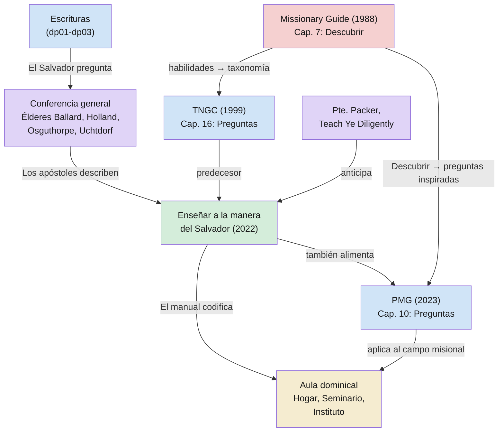

# Uso institucional y pedagógico de las preguntas

**Territorio:** La codificación institucional del método de preguntas del Salvador en los manuales de la Iglesia, los discursos de conferencia general y la literatura pedagógica SUD.

**Pregunta central:** ¿Cómo ha codificado la Iglesia el método de preguntas del Salvador para la enseñanza moderna?

---

## 1. Panorama

Los dossiers dp01-dp03 documentan el uso de preguntas en las escrituras canónicas. Este dossier examina cómo la Iglesia ha tomado ese patrón escritural y lo ha convertido en instrucción institucional. El arco va de las escrituras al aula: primero el Salvador pregunta, luego los apóstoles modernos describen esa práctica, y finalmente los manuales la codifican como método pedagógico para todo maestro y padre.

El documento central es *Enseñar a la manera del Salvador* (2022), que dedica capítulos enteros a la pregunta como método. Pero la línea institucional viene de mucho más atrás: el *Missionary Guide* de 1988 ya codificaba la pregunta como habilidad misional central bajo el nombre «Descubrir» (*Find Out*), dentro del marco del patrón de compromiso. La cadena pedagógica completa abarca cuatro décadas:

```
Missionary Guide (1988) — habilidades: «Descubrir» (escuchar + preguntar)
  → Teaching, No Greater Call (1999) — taxonomía de preguntas para maestros
    → Enseñar a la manera del Salvador (2022) — preguntas como método del Salvador
      → Predicad Mi Evangelio (2023) — «preguntas inspiradas» para misioneros
```

Conferencias generales de las últimas dos décadas complementan esta línea con un corpus significativo de instrucción apostólica sobre el papel de las preguntas.

---

## 2. Escrituras clave

### 2.1 DyC 50:12 — El Señor razona como el hombre razona

La base escritural para la pedagogía de preguntas en la Restauración se encuentra en una declaración metacognitiva del Señor:

> Ahora bien, cuando el hombre razona, es comprendido por el hombre, porque razona como hombre; así también yo, el Señor, razonaré con vosotros para que comprendáis. (DyC 50:12)

El versículo establece que Dios adapta su método comunicativo al receptor. Razona «como hombre» para ser comprendido. Este principio sostiene toda la pedagogía institucional de la Iglesia: la enseñanza eficaz requiere adaptación al aprendiz.

### 2.2 DyC 88:118 — Estudio y fe

> «Tanto por el estudio como por la fe.» (DyC 88:118)

Esta fórmula binaria (estudio + fe) fundamenta la instrucción del manual sobre aprendizaje activo: la fe requiere actuar, no solo escuchar.

### 2.3 Éter 2:22-25 — La pregunta devuelta

El hermano de Jared pregunta cómo tendrán luz en los barcos. El Señor, en lugar de responder, devuelve la pregunta: «¿Qué quieres que haga para que tengáis luz?» (Éter 2:23). *Enseñar a la manera del Salvador* cap. 11 cita este episodio como modelo de cómo ayudar a los aprendices a asumir responsabilidad por su propio aprendizaje.

---

## 3. Voces proféticas

### 3.1 *Enseñar a la manera del Salvador* (2022) — el manual central

El manual formula la pregunta metacognitiva que este territorio investiga:

> «¿Por qué cree que el Salvador enseñaba de esa manera, respondiendo a preguntas con invitaciones a escudriñar, meditar y descubrir? Parte de la respuesta es que el Señor valora el esfuerzo que implica la búsqueda de la verdad. "[B]uscad, y hallaréis", nos ha invitado una y otra vez.» (*Enseñar a la manera del Salvador*, cap. 10)

El manual no solo describe el método sino que lo practica: cada sección termina con «Preguntas para reflexionar» — preguntas de autoexamen para el maestro. La estructura del manual encarna su propio mensaje.

El capítulo 11 eleva la pregunta a instrumento del Espíritu, citando al élder David A. Bednar:

> «Nuestro objetivo no ha de ser: "¿Qué les digo?". Más bien las preguntas que debemos hacernos son: "¿Qué invitación a actuar puedo hacerles? ¿Qué preguntas inspiradas puedo hacer que, si ellos están dispuestos a responder, comenzarán a invitar al Espíritu Santo a sus vidas?"» (Élder David A. Bednar, citado en *Enseñar a la manera del Salvador*, cap. 11)

El capítulo 10 ofrece preguntas prácticas para maestros: «¿Cómo puede ayudarle esto con algo que le suceda en este momento?», «¿Por qué es importante para usted saber esto?», «¿Qué diferencia podría marcar en su vida?» Estas son preguntas de relevancia personal — buscan que el aprendiz conecte la doctrina con su vida.

El capítulo 13 extiende el principio a contextos específicos. Para niños: «Cuando los niños hagan preguntas, considérelas como oportunidades, no como distracciones.» Para adultos: «Preguntarles a qué principios del Evangelio les gustaría dedicar un tiempo para aprender juntos.»

### 3.2 *Missionary Guide: Training for Missionaries* (1988) — el eslabón perdido

El *Missionary Guide* — conocido coloquialmente como «el manual rosa» — fue el compañero pedagógico de las seis charlas misionales de 1986 (*A Uniform System for Teaching the Gospel*). Mientras las charlas contenían el mensaje doctrinal, este manual enseñaba las **habilidades** para transmitirlo. Su capítulo 7, «Descubrir» (*Find Out*), es el ancestro directo de las «preguntas inspiradas» de *Predicad Mi Evangelio* (2023).

El marco central del manual es el **patrón de compromiso** (*commitment pattern*): Preparar → Invitar → Dar seguimiento. «Descubrir» — averiguar lo que el interlocutor piensa, siente y cree — es una de las habilidades de preparación:

> «Descubrir es una parte importante de la etapa de preparación. Demuestra que te importa sinceramente la otra persona.» (*Missionary Guide*, 1988, cap. 7, traducción propia)

El sistema completo operaba como un tándem: las seis charlas misionales (*A Uniform System for Teaching the Gospel*) marcaban en su margen derecho los momentos de «Descubrir», clasificando las preguntas en tres tipos funcionales: **de comprensión** (¿entiende el principio?), **de aceptación** (¿lo cree?) y **de compromiso** (¿actuará en consecuencia?). El *Missionary Guide* era el manual de entrenamiento que enseñaba *cómo* hacer esas preguntas. El capítulo 7 explícitamente remite a «cuando se indique en la columna derecha de las charlas» — es decir, las charlas mandaban *cuándo* preguntar y el manual enseñaba *cómo*.

Las preguntas no se limitaban al cap. 7: permeaban todo el modelo de compromiso. El capítulo 5 («Establecer relaciones de confianza») las usaba para conocer al investigador — familia, trabajo, intereses — como base de la relación. El cap. 9 («Resolver preocupaciones») las usaba para descubrir las verdaderas preocupaciones antes de intentar resolverlas. Es decir, preguntar era una competencia transversal del modelo, no una habilidad aislada.

El cap. 7 estructura esas competencias en tres habilidades: (1) escuchar, (2) hacer preguntas apropiadas, y (3) hacer preguntas adicionales. Para cada una, el manual ofrece tablas de contraste «Less Effective / Effective» que anticipan exactamente el formato que PMG 2023 heredaría 35 años después:

| Menos efectiva | Efectiva |
|----------------|----------|
| «¿Entiende que nuestros pecados nos impedirán volver a Dios?» | «¿Cuál es el resultado del pecado?» |
| «Usted entiende lo que le hemos dicho sobre José Smith, ¿verdad?» | «¿Qué piensa del profeta José Smith?» |
| «Ya que nos dijo que cree en Jesucristo, ¿cómo se siente acerca del hecho de que Él nos ama lo suficiente como para enviarnos un profeta como José Smith?» | «¿Cómo se siente acerca de José Smith como profeta de Dios?» |

Las preguntas «menos efectivas» comparten tres defectos: (1) permiten solo un «sí» o «no», (2) manipulan al investigador hacia la respuesta deseada, o (3) son demasiado largas y compuestas. Las «efectivas» son simples, directas, y buscan genuinamente los sentimientos del interlocutor.

El manual codifica tres principios para las preguntas:

1. **Mantener una relación igualitaria** — «Haz preguntas que mantengan una relación igualitaria entre tú y el investigador.»
2. **No manipular** — «No hagas preguntas diseñadas para que el investigador te dé la respuesta que quieres.»
3. **Simples y directas** — «Haz preguntas simples y directas. Deben ser específicas y relacionarse con el principio que se está discutiendo.»

Un converso citado en el capítulo ofrece el testimonio más elocuente del método:

> «Parecían genuinamente interesados en mí. Tenían un mensaje, pero no se limitaban a decírmelo. Siempre querían saber cómo me sentía respecto a lo que me enseñaban, y siempre estaban dispuestos a escuchar mis preguntas.» (*Missionary Guide*, 1988, cap. 7, traducción propia)

La sección «Hacer preguntas adicionales» enseña una habilidad que TNGC llamará después «preguntas complementarias» y que el manual de 2022 llamará «preguntas de seguimiento»: cuando el investigador da señales no verbales de confusión o duda, el misionero debe detenerse y preguntar hasta entender el verdadero sentimiento. El manual incluye un diálogo modelo extenso (Elder Jones y Mr. Bennett) donde el misionero hace cinco preguntas adicionales antes de descubrir la verdadera preocupación del investigador.

**Significado histórico:** El RSC de BYU documentó que el comité que diseñó *Preach My Gospel* (2004) concluyó que «no había evidencia» de que las habilidades enseñadas en el *Missionary Guide* se correlacionaran con bautismos. Esto motivó el cambio filosófico de PMG: de habilidades a conversión, de técnicas a Espíritu. Sin embargo, la habilidad de preguntar sobrevivió la transición: el capítulo «Descubrir» migró conceptualmente a «Haga preguntas inspiradas» en PMG cap. 10. Lo que cambió no fue el *qué* (preguntar) sino el *para qué*: de descubrir información a invitar al Espíritu.

### 3.3 *La enseñanza: No hay llamamiento más grande* (TNGC, 1999)

Este manual, predecesor de *Enseñar a la manera del Salvador*, dedica el capítulo 16 íntegramente a «La enseñanza por medio de las preguntas». Abre con una declaración directa sobre el modelo del Salvador:

> «Jesucristo, Maestro de Maestros, solía con frecuencia hacer preguntas para que la gente entonces meditara y aplicara los principios que enseñaba (por ejemplo, véase Mateo 16:13–15; Lucas 7:41–42; 3 Nefi 27:27). Sus preguntas incitaban a la gente a pensar, a hacer un examen de conciencia y a comprometerse.» (*TNGC*, cap. 16)

El manual establece su propia taxonomía de tipos de pregunta, orientada a la práctica del maestro en el aula:

1. **Preguntas de sí/no** — «Tienen una aplicación limitada [...]. Úselas solamente para establecer un cometido o para determinar si alguien está o no de acuerdo.»
2. **Preguntas sobre hechos o datos** — Establecen los hechos básicos, pero «no requieren pensar mucho y aun podrían desalentar a aquellos que no conocen las respuestas.»
3. **Preguntas que provocan mayor reflexión** — «Podrían comenzar con las palabras qué, cómo o por qué. No pueden contestarse con un simple sí o no y por lo general tienen más de una respuesta correcta.»
4. **Preguntas de aplicación** — «¿Cómo se ha cumplido en la vida de ustedes esta promesa del Señor?»
5. **Preguntas de meditación silenciosa** — «Ocasionalmente podría hacer preguntas que conduzcan a los alumnos a la meditación en silencio en vez de que respondan abiertamente.»

El manual también codifica principios pedagógicos sobre las preguntas:
- **Conceder tiempo:** «No responda a su propia pregunta; concédales tiempo para que piensen bien la respuesta.»
- **Preguntas complementarias:** «Las preguntas complementarias pueden ayudar a los alumnos a meditar más cuidadosamente.»
- **Evitar controversia:** «Tenga especial cuidado de no hacer preguntas que promuevan altercados o que destaquen temas sensacionales.»
- **Responder con respeto a errores:** «Responda con respeto y cortesía a las contestaciones incorrectas.»

El capítulo 13 del mismo manual contiene una cita de la hermana Virginia H. Pearce que precede y anticipa la formulación del élder Bednar:

> «Un buen maestro no piensa: "¿Qué haré hoy en clase?", sino, "¿Qué harán mis alumnos hoy en clase?" No piensa: "¿Qué enseñaré hoy?", sino, "¿Cómo podré hacer que mis alumnos se den cuenta de lo que tienen que saber?"» (Hermana Virginia H. Pearce, citada en *TNGC*, cap. 13)

Y el capítulo 15 («Dispóngase a escuchar») establece que escuchar es el complemento necesario de preguntar: «El escuchar con atención es una manifestación de amor y con frecuencia requiere sacrificio. Cuando verdaderamente escuchamos a otras personas, por lo general debemos refrenarnos de lo que queremos decir para entonces permitir que otros puedan expresarse.»

### 3.4 *Predicad Mi Evangelio* (2023) — el manual misional

PMG dedica una sección del capítulo 10 («Enseñe para edificar la fe en Jesucristo») específicamente a las preguntas. Abre con la conexión directa al Salvador:

> «El Salvador hacía preguntas que invitaban a las personas a pensar y a interiorizar las verdades que enseñaba. Sus preguntas fomentaban la introspección y el compromiso.» (*Predicad Mi Evangelio*, 2023, cap. 10)

El manual lista las «preguntas inspiradas» como uno de los rasgos centrales de la enseñanza del Salvador: «Él amaba al Padre y a aquellos a quienes enseñaba. Oraba constantemente. Enseñaba de las Escrituras. Se preparaba espiritualmente. Hacía preguntas inspiradas. Invitaba a las personas a actuar con fe.»

PMG codifica el método con orientación práctica misionera:

- **Preguntas inspiradas:** «Las preguntas correctas en el momento adecuado pueden ayudar a las personas a aprender el Evangelio y a sentir el Espíritu.»
- **Preguntas inefectivas a evitar:** las que tienen respuestas obvias, las que abarcan más de una idea, las que podrían avergonzar si no se sabe la respuesta, las excesivas, las entrometidas.
- **Ejemplos concretos de contraste:** «¿Quién fue el primer profeta?» (inefectiva, la persona podría no saberlo) vs. «¿Cómo influiría en su vida el saber que Dios llama a profetas hoy en día?» (inspirada, sobre los propios pensamientos y sentimientos).

El material de preparación misional (`missionary-preparation/017-ask-inspired-questions.txt`) refuerza el punto: «Las buenas preguntas pueden invitar al Espíritu y ayudar a las personas a aprender.»

La convergencia entre los cuatro manuales (*Missionary Guide* → TNGC → *Enseñar a la manera del Salvador* → PMG) muestra una línea institucional de cuatro décadas: la pregunta no es una técnica opcional sino el método central que la Iglesia enseña a sus maestros y misioneros. Lo que evoluciona es la teología del método: de «habilidad proselitista» (1988) a «medio para invitar al Espíritu» (2004-2023).

### 3.5 Conferencia general — las voces apostólicas

**Élder M. Russell Ballard** (octubre de 2001) identificó las preguntas y las parábolas como las dos «técnicas de enseñanza favoritas» de Jesús:

> «Dos de las técnicas de enseñanza favoritas de Jesús eran hacer preguntas y contar historias, o parábolas.» (Élder M. Russell Ballard, «Doctrina de la inclusión», conferencia general, octubre de 2001)

**Élder Jeffrey R. Holland** (octubre de 2012) analizó la triple pregunta de Juan 21 como acto restaurador — tres preguntas para sanar tres negaciones. El élder Holland presenta «¿me amas?» no como interrogación sino como rehabilitación: cada pregunta abre espacio para que Pedro reafirme lo que negó (élder Jeffrey R. Holland, «El primer y grande mandamiento», conferencia general, octubre de 2012).

**Élder Russell T. Osguthorpe** (octubre de 2012) describió al Salvador como alguien que «siempre prestaba atención a sus preguntas» — las de los aprendices, no solo las suyas. El élder Osguthorpe señaló que el Salvador no solo formulaba preguntas sino que tomaba en serio las preguntas que otros le hacían, tratándolas como puertas de acceso a la verdad, no como interrupciones (élder Russell T. Osguthorpe, «Un paso más cerca del Salvador», conferencia general, octubre de 2012).

**Hermana Jan E. Newman** (abril de 2021) modeló la pregunta sobre la pregunta: enseñó sobre la importancia de las preguntas usando preguntas.

**Presidente Dieter F. Uchtdorf**, citado por Tracy Y. Browning (octubre de 2024):

> «Hacer preguntas no es señal de debilidad sino el acto precursor del crecimiento.» (Presidente Dieter F. Uchtdorf)

Esta declaración es doctrinalmente significativa porque valida la pregunta como acto de fe, no de duda. Contrasta directamente con la cultura popular (dentro y fuera de la Iglesia) que a veces equipara preguntar con dudar.

**Élder David M. McConkie** (octubre de 2010) relató la historia del maestro de carpintería del presidente Boyd K. Packer — un profesor danés cuyo método era preguntar en lugar de instruir. El élder McConkie usó esta historia para ilustrar que el Espíritu Santo enseña del mismo modo que un buen maestro mortal: guiando mediante preguntas en lugar de depositar respuestas (élder David M. McConkie, «El aprendizaje y la enseñanza del Evangelio», conferencia general, octubre de 2010).

**Élder Daniel K. Judd** (octubre de 2007) usó DyC 50:13 como paradigma. El élder Judd presentó la frase «yo, el Señor, os hago esta pregunta» como evidencia de que incluso el Señor omnisciente prefiere preguntar. Si Dios pregunta, nosotros deberíamos enseñar del mismo modo (élder Daniel K. Judd, «Nutridos por la buena palabra de Dios», conferencia general, octubre de 2007).

**Élder Dallin H. Oaks** (octubre de 1999) presentó el programa *Enseñar: No Hay Mayor Llamamiento* como esfuerzo institucional para mejorar la enseñanza. El élder Oaks enfatizó que la calidad de la enseñanza determina la calidad de la conversión (élder Dallin H. Oaks, «La enseñanza del Evangelio», conferencia general, octubre de 1999).

**Élder Ulisses Soares** (abril de 2019) usó al eunuco etíope como modelo del aprendiz que pregunta. Citando Hechos 8:31 — «¿Cómo puedo entender, si alguno no me enseña?» — el élder Soares presentó la disposición a preguntar como condición previa a la comprensión (élder Ulisses Soares, «¿Cómo puedo entender?», conferencia general, abril de 2019).

**Élder Russell T. Osguthorpe** (octubre de 2009) formuló preguntas de autoexamen para maestros — preguntas sobre la enseñanza misma. El élder Osguthorpe invitó a los maestros a preguntarse: ¿estoy ayudando a salvar vidas, o solo cubriendo material? (élder Russell T. Osguthorpe, «La enseñanza ayuda a salvar vidas», conferencia general, octubre de 2009).

**Élder Matthew O. Richardson** (octubre de 2011) describió la enseñanza familiar como imitación del Espíritu Santo. El élder Richardson señaló que los padres deben enseñar como el Espíritu: guiando, recordando, revelando — no dictando (élder Matthew O. Richardson, «El enseñar de acuerdo con el Espíritu», conferencia general, octubre de 2011).

---

## 4. Voces académicas y otros autores

### 4.1 Presidente Boyd K. Packer — *Teach Ye Diligently* (1975)

El presidente Packer dedicó dos capítulos completos de *Teach Ye Diligently* al tema de las preguntas: el capítulo 10 («La pregunta») y el capítulo 11 («Cómo manejar preguntas muy difíciles»). El capítulo 4 («Jesucristo como maestro») establece el fundamento: Jesús era, ante todo, un maestro — así lo llaman sesenta de las noventa veces que se dirigen a Él en los Evangelios.

El capítulo 10 es la contribución más significativa del presidente Packer a este territorio. Abre con una observación penetrante sobre el método del Salvador:

> «Hay algo interesante y significativo en la forma en que Él manejaba las preguntas y las respuestas. Hacía muchas preguntas. Respondía muy pocas de ellas.» (*Teach Ye Diligently*, cap. 10, traducción propia)

El presidente Packer desarrolla la técnica de responder con preguntas citando el ejemplo del tributo al César (Mateo 22:17-22) y la parábola del buen samaritano (Lucas 10:30-37). En ambos casos, señala que fueron los oyentes quienes terminaron respondiendo su propia pregunta — el Salvador los guió hasta la respuesta, no se la entregó.

De ahí extrae su consejo más memorable para maestros:

> «Cuando un alumno haga una pregunta, ¡tenga cuidado de no contestarla! O más enfáticamente: tenga cuidado de que no sea el maestro quien la conteste.» (*Teach Ye Diligently*, cap. 10, traducción propia)

El presidente Packer también codifica principios prácticos que anticipan lo que TNGC y *Enseñar a la manera del Salvador* formalizarían después:

- **Rescatar al alumno:** Cuando alguien da una respuesta incorrecta, el maestro debe asumir la responsabilidad: «Lo siento, no hice la pregunta con claridad.» Nunca ridiculizar ni permitir que la clase se ría.
- **Reformular la pregunta:** En lugar de «Juan, ¿quién fue el cuarto presidente de la Iglesia?» (que libera a todos excepto a Juan de pensar), preguntar primero y nombrar después: «¿Quién fue el cuarto presidente de la Iglesia?» — pausa — y luego señalar a alguien.
- **Preguntas de opinión:** Las mejores preguntas para enseñar valores morales comienzan con «En tu opinión, ¿por qué...?» — porque no pueden tener respuesta incorrecta y liberan al alumno del miedo a equivocarse.

El capítulo 11 aborda las preguntas difíciles con el «principio de prerrequisitos»: no tiene sentido intentar responder preguntas doctrinales avanzadas a quien no tiene los cimientos de fe, arrepentimiento y bautismo. Del presidente Henry D. Moyle aprendió otra lección: «Si el entrevistador no hace las preguntas correctas, yo doy las respuestas a las preguntas que debería haber hecho.»

La historia del maestro danés de carpintería, citada por el élder McConkie en conferencia general (octubre de 2010), proviene de esta misma obra.

### 4.2 Asahel D. Woodruff — *Teaching the Gospel* (1962)

Citado en TNGC cap. 13 a través de la hermana Virginia H. Pearce: «Recae sobre el alumno la responsabilidad de aprender. Por lo tanto, es a él a quien se debe poner en acción. Si el maestro es la estrella del espectáculo, si sólo habla él y se encarga de todo, es por seguro que está interfiriendo con el aprendizaje de los miembros de la clase.» Esta obra precursora de la pedagogía SUD no está en el corpus.

### 4.3 Artículos académicos SUD (pendientes de corpus)

- «Asking Questions First» — artículo del *Ensign* (enero 2002)
- «How to Ask Questions That Invite Revelation» — artículo del Religious Studies Center, BYU (2004)
- Capítulo 31 del manual CES

Estos materiales fueron identificados durante la investigación pero no están disponibles en el corpus. Chips de descarga fueron creados para su incorporación futura.

---

## 5. Diagrama



---

## 6. Conexiones

| Hacia | Tipo | Nota |
|-------|------|------|
| [dp00 — Panorámico](0009-dp00-preguntas-pedagogicas.md) | pertenece a | Dossier panorámico del territorio |
| [dp01 — Taxonomía](0009-dp01-taxonomia-preguntas.md) | se basa en | La taxonomía escritural es la base que dp04 muestra institucionalizada |
| [dp02 — Pregunta vs. reprensión](0009-dp02-pregunta-vs-represion.md) | complementa | dp04 no aborda la reprensión; la Iglesia institucionaliza primariamente el registro de pregunta |
| [dp03 — Dirección inversa](0009-dp03-direccion-inversa.md) | se basa en | Los élderes Soares y Uchtdorf validan la pregunta ascendente del aprendiz |
| (Futuro) Pedagogía del hogar | aplica | Cap. 13 del manual extiende las preguntas al hogar y la crianza |
| *Predicad Mi Evangelio* (2023) | aplica | Cap. 10: preguntas inspiradas como método misional central |
| *Missionary Guide* (1988) | predecesor | Cap. 7 «Descubrir»: ancestro directo de las preguntas inspiradas de PMG |
| *Uniform System for Teaching the Gospel* (1986) | pendiente | Las charlas misionales con los tres tipos de pregunta marcados en el margen |

## 7. Ilustraciones

### La pregunta que no pregunta qué decir

> El élder David A. Bednar invirtió la pregunta del maestro. En lugar de «¿Qué les digo?», propuso: «¿Qué preguntas inspiradas puedo hacer?» La diferencia es abismal: la primera pregunta busca contenido para depositar; la segunda busca llaves para abrir. El maestro que pregunta «¿qué les digo?» se ve a sí mismo como depósito; el que pregunta «¿qué preguntas puedo hacer?» se ve como guía.

— Basado en élder David A. Bednar, citado en *Enseñar a la manera del Salvador*, cap. 11
**Objetivo:** clarify | **Forma:** contraste conceptual | **Parafraseada:** sí

### El manual que practica lo que enseña

> *Enseñar a la manera del Salvador* termina cada sección con «Preguntas para reflexionar». Un manual que enseña a preguntar podría haber terminado con «Principios para recordar» o «Conclusiones». En cambio, termina con preguntas. El medio es el mensaje: si el Salvador enseñaba preguntando, un manual sobre enseñar como el Salvador también debería preguntar.

— Observación estructural sobre *Enseñar a la manera del Salvador* (2022)
**Objetivo:** attention | **Forma:** observación formal | **Parafraseada:** sí

### La pregunta que no manipula

> El *Missionary Guide* de 1988 puso lado a lado dos preguntas: «Ya que nos dijo que cree en Jesucristo, ¿cómo se siente acerca del hecho de que Él nos ama lo suficiente como para enviarnos un profeta como José Smith?» versus «¿Cómo se siente acerca de José Smith como profeta de Dios?» La primera suena religiosa y elaborada — pero en realidad arrincona al investigador: usa su propia fe como palanca para forzar una respuesta. La segunda es limpia, directa, y deja al interlocutor libre de decir lo que genuinamente siente. El manual no enseñaba a ser más persuasivo; enseñaba a ser más honesto.

— Basado en *Missionary Guide: Training for Missionaries* (1988), cap. 7 «Descubrir»
**Objetivo:** clarify | **Forma:** contraste textual | **Parafraseada:** sí

### De «descubrir» a «preguntas inspiradas»

> En 1988, la Iglesia enseñaba a los misioneros a preguntar para *descubrir información* — lo llamó «Descubrir». En 2023, les enseña a preguntar para *invitar al Espíritu* — lo llama «preguntas inspiradas». La habilidad sobrevivió treinta y cinco años de revisiones institucionales. Lo que cambió fue el marco teológico: la pregunta dejó de ser una técnica de comunicación y se convirtió en un acto de ministerio. El misionero de 1988 preguntaba para saber qué decir a continuación. El misionero de 2023 pregunta para que el Espíritu enseñe a través de la respuesta.

— Observación comparativa entre *Missionary Guide* (1988) y *Predicad Mi Evangelio* (2023)
**Objetivo:** clarify | **Forma:** contraste histórico | **Parafraseada:** sí

### El carpintero danés

> El presidente Boyd K. Packer tuvo un maestro de carpintería, un danés, que nunca daba la respuesta. Cuando un estudiante se acercaba con una pieza mal cortada, el maestro no señalaba el error: preguntaba. «¿Qué ves aquí?» «¿Está recto?» El estudiante encontraba el error solo. El presidente Packer, que llegaría a ser presidente del Quórum de los Doce, aprendió más de un carpintero que de muchos profesores — y el método era idéntico al del Salvador.

— Basado en élder David M. McConkie, conferencia general, octubre de 2010, relatando historia de Boyd K. Packer
**Objetivo:** resonate | **Forma:** anécdota | **Parafraseada:** sí

## 8. Lagunas y preguntas abiertas

- **Material pendiente de corpus:** Artículos del *Ensign* (2002) y RSC (2004), capítulo 31 del manual CES. Chips de descarga creados.
- **Material ya en corpus:** *Teach Ye Diligently* (presidente Packer, EN, 18 caps), *Missionary Guide* (1988, EN, 17 caps), *Teaching No Greater Call* (bilingüe, ~95 caps/idioma), *Predicad Mi Evangelio* (2023, bilingüe), *Enseñar a la manera del Salvador* (2022, bilingüe).
- **Charlas misionales de 1986 (*Uniform System*):** No están en el corpus. Contenían las marcas en el margen derecho que clasificaban las preguntas en tres tipos (comprensión, aceptación, compromiso). El *Missionary Guide* las referencia pero no las reproduce. Obtener este material completaría el eslabón faltante.
- ***Predicad Mi Evangelio* — lecciones específicas:** El cap. 10 fue analizado, pero las lecciones individuales (caps. 3.1-3.4) también contienen preguntas diseñadas para los investigadores. No se analizaron en detalle.
- **Contraste con la tradición pedagógica secular:** El enfoque de preguntas del Salvador se alinea con la mayéutica socrática y con la pedagogía constructivista moderna. Este dossier no exploró esas conexiones, que podrían enriquecer la sección 4 (Voces académicas).
- **Capacitación de maestros en la práctica:** ¿Cuánto de lo que el manual enseña se implementa efectivamente en las clases dominicales? La brecha entre instrucción y práctica es un tema educativo significativo que está fuera del alcance doctrinal de este dossier.

---

**Fuentes citadas**

- DyC 50:12-13; 88:118
- Éter 2:22-25
- *Missionary Guide: Training for Missionaries* (1988), caps. 5, 7, 9
- *La enseñanza: No hay llamamiento más grande* (1999), caps. 13, 15, 16
- *Enseñar a la manera del Salvador* (2022), caps. 10, 11, 13
- *Predicad Mi Evangelio* (2023), cap. 10
- Presidente Boyd K. Packer, *Teach Ye Diligently* (1975), caps. 4, 10, 11
- *Preparación misional* (2023), práctica de habilidades 4: «Hacer preguntas inspiradas»
- Élder M. Russell Ballard, «Doctrina de la inclusión», conferencia general, octubre de 2001
- Élder Jeffrey R. Holland, «El primer y grande mandamiento», conferencia general, octubre de 2012
- Élder Russell T. Osguthorpe, «Un paso más cerca del Salvador», conferencia general, octubre de 2012
- Élder Russell T. Osguthorpe, «La enseñanza ayuda a salvar vidas», conferencia general, octubre de 2009
- Hermana Jan E. Newman, «Enseñar a la manera del Salvador», conferencia general, abril de 2021
- Presidente Dieter F. Uchtdorf, citado por Tracy Y. Browning, conferencia general, octubre de 2024
- Élder David A. Bednar, citado en *Enseñar a la manera del Salvador*, cap. 11
- Élder David M. McConkie, «El aprendizaje y la enseñanza del Evangelio», conferencia general, octubre de 2010
- Élder Daniel K. Judd, «Nutridos por la buena palabra de Dios», conferencia general, octubre de 2007
- Élder Dallin H. Oaks, «La enseñanza del Evangelio», conferencia general, octubre de 1999
- Élder Ulisses Soares, «¿Cómo puedo entender?», conferencia general, abril de 2019
- Élder Matthew O. Richardson, «El enseñar de acuerdo con el Espíritu», conferencia general, octubre de 2011
- Hermana Virginia H. Pearce, citada en *TNGC*, cap. 13
- Asahel D. Woodruff, *Teaching the Gospel* (1962), citado en *TNGC*, cap. 13
