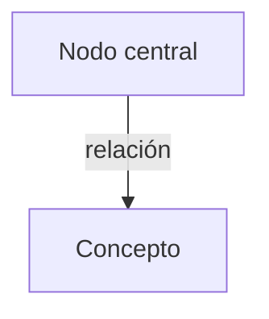

# [Territorio doctrinal]

**Territorio:** [Qué región doctrinal cubre este dossier — 1-2 oraciones.]

---

## 1. Panorama

[Párrafo breve que oriente al lector: qué abarca el dossier, por qué importa, cómo se conecta con el plan mayor.]

## 2. Escrituras clave

### [Subtema A]

[Intro que oriente al lector — qué va a encontrar y por qué importa:]

> **[Referencia]**
> Texto completo del pasaje.

### [Subtema B]

[Intro contextual:]

> **[Referencia]**
> Texto completo del pasaje.

## 3. Voces proféticas

[Intro que presente al autor y el punto que hace:]

> «Cita textual de la autoridad.»
> — **[Nombre y título]**, *[Fuente]* ([año])

## 4. Voces académicas y otros autores

[Intro contextual:]

> «Cita textual del libro o artículo.»
> — **[Autor]**, *[Título del libro]* ([año])

## 5. Diagrama

## 6. Conexiones

| Hacia | Tipo | Nota |
|-------|------|------|
| [Otro dossier o Forma T] | profundiza / precede / contrasta | [Breve explicación] |

## 7. Lagunas y preguntas abiertas

- [Qué falta por investigar, controversias no resueltas, material pendiente de incorporar.]

---

**Fuentes citadas**

- [Lista bibliográfica completa]
