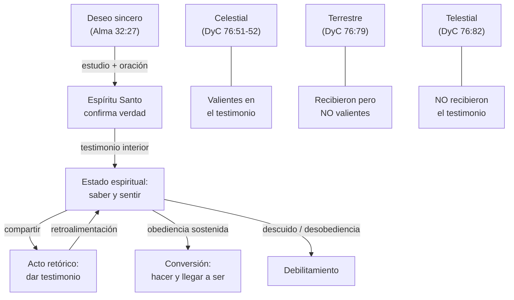

# El testimonio

**Territorio:** Qué es un testimonio, cómo se obtiene, cómo crece o se pierde, sus consecuencias eternas, y su rol como acto retórico y obligación de convenio.

---

## 1. Panorama

El testimonio es, simultáneamente, un estado espiritual interior y un acto público de declaración. Es la confirmación que el Espíritu Santo da al alma de que ciertas verdades eternas son verdaderas. Pero también es el acto de compartir esa confirmación, y la Iglesia enseña que ambas dimensiones se retroalimentan: dar testimonio fortalece el testimonio. Este dossier recopila las definiciones oficiales, las escrituras ancla, las voces proféticas que han enseñado sobre el tema, y las distinciones teológicas clave que permiten enseñar con precisión.

## 2. Escrituras clave

### Obtener testimonio

> **Moroni 10:4-5**
> Y cuando recibáis estas cosas, quisiera exhortaros a que preguntéis a Dios, el Padre Eterno, en el nombre de Cristo, si no son verdaderas estas cosas; y si pedís con un corazón sincero, con verdadera intención, teniendo fe en Cristo, él os manifestará la verdad de ellas por el poder del Espíritu Santo; y por el poder del Espíritu Santo podréis conocer la verdad de todas las cosas.

> **Juan 7:17**
> El que quiera hacer la voluntad de Dios conocerá si la doctrina es de Dios o si yo hablo por mi propia cuenta.

> **Alma 5:45-46**
> ¿No suponéis que sé de estas cosas yo mismo? He aquí, os testifico que yo sé que estas cosas de que he hablado son verdaderas. Y ¿cómo suponéis que yo sé de su certeza? He aquí, os digo que el Santo Espíritu de Dios me las hace saber. He aquí, he ayunado y orado muchos días para poder saber estas cosas de mí mismo. Y ahora sé de mí mismo que son verdaderas; porque el Señor Dios me las ha manifestado por su Santo Espíritu.

### Ser valientes en el testimonio

> **Doctrina y Convenios 76:79**
> Estos son los que no son valientes en el testimonio de Jesús; por consiguiente, no obtienen la corona en el reino de nuestro Dios.

> **Doctrina y Convenios 76:51-52**
> Son aquellos que recibieron el testimonio de Jesús, y creyeron en su nombre, y fueron bautizados según la manera de su sepultura, siendo sepultados en el agua en su nombre [...] para que, guardando los mandamientos, fuesen lavados y limpiados de todos sus pecados.

### Obligación de testificar

> **Mosíah 18:9**
> [...] estar dispuestos a llevar las cargas los unos de los otros [...] y estar como testigos de Dios en todo tiempo, y en todas las cosas y en todo lugar en que estuvieseis, aun hasta la muerte.

### El Espíritu como fuente

> **Romanos 8:16**
> El Espíritu mismo da testimonio a nuestro espíritu, de que somos hijos de Dios.

> **1 Corintios 12:3**
> Nadie puede llamar a Jesús Señor, sino por el Espíritu Santo.

> **Doctrina y Convenios 46:13**
> A algunos les es dado por el Espíritu Santo saber que Jesucristo es el Hijo de Dios, y que fue crucificado por los pecados del mundo.

## 3. Voces proféticas

### Definiciones oficiales

El manual *Leales a la fe* ofrece la definición más concisa y autoritativa:

> «Un testimonio es una confirmación espiritual que da el Espíritu Santo.»
> — **Leales a la fe** (*True to the Faith*, 2004)

La Guía de las Escrituras amplía levemente:

> «Conocimiento y confirmación espiritual que da el Espíritu Santo. Un testimonio también puede ser una declaración oficial o legal de lo que una persona percibe que es verdad.»
> — **Guía de las Escrituras** (GEE), entrada "Testimonio"

*Predicad Mi Evangelio* acepta explícitamente tanto conocimiento como creencia:

> «A testimony is a spiritual witness given by the Holy Ghost. To share your testimony is to give a simple, direct declaration of knowledge or belief about a gospel truth.»
> — **Predicad Mi Evangelio**, cap. 10 (2023)

### Cómo se obtiene y crece

El presidente Boyd K. Packer enseñó el principio circular de que dar testimonio lo fortalece:

> «Un testimonio se encuentra al darlo.»
> — **Presidente Boyd K. Packer**, "The Candle of the Lord" (*Ensign*, enero 1983)

El élder Carlos A. Godoy enseñó que para muchos, el testimonio no llega como un evento dramático sino como acumulación gradual:

> «Para algunos, el testimonio puede venir a través de un momento dramático de claridad espiritual. Para muchos otros, como fue mi caso, llega como un proceso — una acumulación de pequeñas experiencias espirituales.»
> — **Élder Carlos A. Godoy**, "Testimony as a Process" (conferencia general, octubre 2008)

El élder Kevin G. Brown articuló tres modos en que llega el testimonio:

> «Como un foco en un cuarto oscuro, puede llegar dramática y repentinamente. Puede llegar como el amanecer, gradual y a lo largo del tiempo. Puede llegar como rayos de luz, exposición intermitente a inteligencia pura.»
> — **Élder Kevin G. Brown**, "The Eternal Gift of Testimony" (conferencia general, abril 2025)

### Cómo se pierde

El presidente Russell M. Nelson advirtió sobre la velocidad con que un testimonio descuidado se debilita:

> «Con una rapidez aterradora, un testimonio que no se nutre diariamente "con la buena palabra de Dios" puede desmoronarse.»
> — **Presidente Russell M. Nelson** (citado por el élder Brown, conferencia general, abril 2025)

El presidente Wilford Woodruff describió el caso de Oliver Cowdery como arquetipo de pérdida:

> «Nunca escuché a un hombre dar un testimonio más fuerte que el suyo cuando estaba bajo la influencia del Espíritu. Pero en el momento en que dejó el reino de Dios, en ese instante su poder cayó. [...] Fue despojado de su fuerza, como Sansón en el regazo de Dalila.»
> — **Presidente Wilford Woodruff**, *Enseñanzas de los Presidentes de la Iglesia: Wilford Woodruff*, cap. 10

### Consecuencia eterna

El élder D. Todd Christofferson enseñó que el grado de respuesta al testimonio determina el reino de gloria:

> «La sección 76 de Doctrina y Convenios revela que la diferencia crucial entre quienes heredan el reino celestial y quienes heredan el terrestre no es si recibieron un testimonio de Jesús — ambos lo recibieron — sino si fueron valientes en ese testimonio.»
> — **Élder D. Todd Christofferson**, "The Testimony of Jesus" (conferencia general, abril 2024)

### Testimonio vs. conversión

El presidente Dallin H. Oaks articuló la distinción clave:

> «El testimonio es saber y sentir; la conversión es hacer y llegar a ser.»
> — **Presidente Dallin H. Oaks** (citado en múltiples discursos de conferencia general)

### La supremacía del testimonio espiritual

El presidente Joseph Fielding Smith enseñó que el testimonio del Espíritu Santo supera toda evidencia empírica:

> «Cuando un hombre tiene la manifestación del Espíritu Santo, deja una impresión indeleble en su alma, que no se borra fácilmente. Es Espíritu que habla a espíritu, y viene con fuerza convincente. Una manifestación de un ángel, o incluso del Hijo de Dios mismo, impresionaría la vista y la mente, y eventualmente se desvanecería, pero las impresiones del Espíritu Santo penetran más profundamente en el alma y son más difíciles de borrar.»
> — **Presidente Joseph Fielding Smith**, citado en *Principios del Evangelio*, cap. 7

## 4. Voces académicas y otros autores

### Raíz bíblica del concepto

La *International Standard Bible Encyclopedia* (ISBE) aporta el substrato legal-forense:

> «La palabra 'witness' (*martus*) tiene uso principalmente forense. Los acuerdos legales importantes requerían la atestación de testigos [...]. La ley mosaica insistía en la necesidad absoluta de testigos en todos los casos judiciales. No solo en casos criminales, sino en todos los casos, era necesario tener al menos dos testigos para sostener una acusación.»
> — **Paul Levertoff**, "Witness", *International Standard Bible Encyclopedia*

Nota: la evolución de *martus* (testigo) a *mártir* (Hechos 22:20; Apocalipsis 2:13) muestra que en la tradición cristiana primitiva, testificar implicaba riesgo hasta la muerte — sellar el testimonio con la sangre.

### El testimonio concurrente del Espíritu

> «Al hombre que cree en el Hijo de Dios [...] el Espíritu, tanto en la Palabra escrita como en su conversación secreta con el creyente en la vida de fe, le asegura del amor paternal hacia él [...]. Hay así un testimonio concurrente: el espíritu del creyente dice, "Tú eres mi Padre"; el Espíritu dice al espíritu del creyente, "Tú eres Su hijo".»
> — **Handley Dunelm**, "Witness of the Spirit", *International Standard Bible Encyclopedia*

## 5. Diagrama

## 6. Conexiones

| Hacia | Tipo | Nota |
|-------|------|------|
| Espíritu Santo (dossier futuro) | precede | El Espíritu Santo es la fuente exclusiva del testimonio |
| Fe en Jesucristo (Forma T) | precede | La fe es prerrequisito; el testimonio la confirma y profundiza |
| Bautismo (senda de los convenios) | sigue | El testimonio conduce al convenio bautismal |
| Ilustración (concepto retórico) | complementa | El testimonio es una forma específica de ilustración en discursos |
| DyC 76 — Reinos de gloria | profundiza | La valentía en el testimonio determina el reino |

## 7. Ilustraciones

### Oliver Cowdery: el testimonio perdido

> Oliver Cowdery vio ángeles, sostuvo las planchas, fue testigo de la restauración del sacerdocio. Nunca negó su testimonio del Libro de Mormón, ni siquiera fuera de la Iglesia. Pero al alejarse del reino, perdió el poder espiritual que lo acompañaba. Wilford Woodruff lo comparó con Sansón: despojado de su fuerza al alejarse de la fuente.

— **Presidente Wilford Woodruff**, *Enseñanzas de los Presidentes de la Iglesia*, cap. 10
**Objetivo:** prove | **Forma:** historica | **Tono:** solemnidad | **Parafraseada:** sí | **Personajes:** Oliver Cowdery, Wilford Woodruff | **Escrituras:** Jueces 16

### Alma: el profeta que necesitó ayunar

> Alma había visto un ángel. Había contemplado a Dios sentado en Su trono. Sin embargo, cuando quiso testificar con certeza, no se apoyó en esas experiencias visuales sino en algo más profundo: ayunó y oró "muchos días" para que el Espíritu Santo le confirmara la verdad personalmente (Alma 5:45-46). Si el profeta que vio a Dios necesitó el testimonio del Espíritu, todo discípulo lo necesita.

— Basado en Alma 5:45-46
**Objetivo:** prove | **Forma:** historica | **Tono:** reverencia | **Parafraseada:** sí | **Personajes:** Alma | **Escrituras:** Alma 5:45-46

### Las tres formas de llegar (Brown)

> El testimonio puede llegar como un foco — súbito y dramático. Puede llegar como un amanecer — gradual, casi imperceptible hasta que el cielo está lleno de luz. O puede llegar como rayos intermitentes — destellos breves de inteligencia pura que, acumulados, forman certeza.

— **Élder Kevin G. Brown**, "The Eternal Gift of Testimony" (conferencia general, abril 2025)
**Objetivo:** clarify | **Forma:** analogia | **Tono:** esperanza | **Parafraseada:** sí | **Personajes:** Kevin G. Brown | **Escrituras:** —

### Lamán y Lemuel: ver no es testificar

> Lamán y Lemuel vieron ángeles, escucharon la voz del Señor, presenciaron milagros. Pero nunca tuvieron testimonio, porque la evidencia sensorial no sustituye la confirmación del Espíritu Santo. Vieron con los ojos pero no sintieron con el corazón.

— Basado en 1 Nefi 3-4, 17
**Objetivo:** prove | **Forma:** contraste | **Tono:** solemnidad | **Parafraseada:** sí | **Personajes:** Lamán, Lemuel | **Escrituras:** 1 Nefi 3-4, 1 Nefi 17

## 8. Lagunas y preguntas abiertas

- El discurso de Packer "The Candle of the Lord" (Ensign, enero 1983) no está en el corpus como discurso individual de conferencia — fue un discurso a educadores del SEI. Considerar agregarlo al corpus.
- Falta explorar la relación entre testimonio y dones espirituales (DyC 46:13-14): "a algunos les es dado saber... a otros les es dado creer en sus palabras" — ¿son dos niveles de testimonio?
- El Manual General 29.2.2 sobre la reunión de ayuno y testimonio merece sección propia si se genera un discurso sobre el tema.
- Relación testimonio-conversión: Oaks distingue "saber y sentir" de "hacer y llegar a ser" — esto podría alimentar una Forma T sobre conversión vs. testimonio.

---

**Fuentes citadas**

- *Leales a la fe: Una referencia del Evangelio* (2004), entrada "Testimonio"
- *Guía de las Escrituras* (GEE), entrada "Testimonio"
- *Predicad Mi Evangelio* (2023), cap. 10
- *Principios del Evangelio* (2009), cap. 7
- *Enseñanzas de los Presidentes de la Iglesia: Wilford Woodruff* (2004), cap. 10
- Boyd K. Packer, "The Candle of the Lord", *Ensign*, enero 1983
- Carlos A. Godoy, "Testimony as a Process", conferencia general, octubre 2008
- Gary E. Stevenson, "Nourishing and Bearing Your Testimony", conferencia general, octubre 2022
- D. Todd Christofferson, "The Testimony of Jesus", conferencia general, abril 2024
- Kevin G. Brown, "The Eternal Gift of Testimony", conferencia general, abril 2025
- Joseph B. Wirthlin, "Pure Testimony", conferencia general, octubre 2000
- Paul Levertoff, "Witness", *International Standard Bible Encyclopedia*
- Handley Dunelm, "Witness of the Spirit", *International Standard Bible Encyclopedia*
